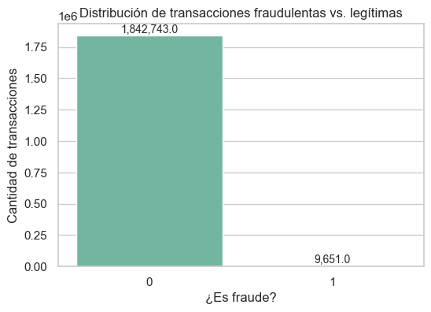
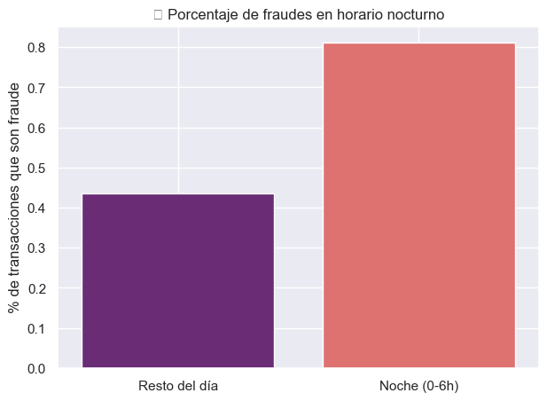

```python
#!/usr/bin/env python3
```

# High-Amount Fraud Detection Based on Client Behavior


## Cargar el dataset y preparar el entorno


### Librerías + Config inicial


```python
import warnings

import matplotlib.pyplot as plt
import numpy as np
import pandas as pd
import seaborn as sns

warnings.filterwarnings("ignore")
sns.set_theme(style="whitegrid")

# Mostrar más columnas en outputs
pd.set_option("display.max_columns", 100)
```

### Cargar dataset


```python
# Ruta del archivo
data_path = "feature_engineering_work/dataset_feature_engineering.csv"

# Cargar el dataset
df = pd.read_csv(data_path)

# Ver las primeras filas
df.head()
```


<div>
<style scoped>
    .dataframe tbody tr th:only-of-type {
        vertical-align: middle;
    }

    .dataframe tbody tr th {
        vertical-align: top;
    }

    .dataframe thead th {
        text-align: right;
    }
</style>
<table border="1" class="dataframe">
  <thead>
    <tr style="text-align: right;">
      <th></th>
      <th>cc_num</th>
      <th>merchant</th>
      <th>category</th>
      <th>amt</th>
      <th>first</th>
      <th>last</th>
      <th>gender</th>
      <th>street</th>
      <th>city</th>
      <th>state</th>
      <th>zip</th>
      <th>lat</th>
      <th>long</th>
      <th>city_pop</th>
      <th>job</th>
      <th>dob</th>
      <th>trans_num</th>
      <th>unix_time</th>
      <th>merch_lat</th>
      <th>merch_long</th>
      <th>is_fraud</th>
      <th>amt_month</th>
      <th>amt_year</th>
      <th>amt_month_shopping_net_spend</th>
      <th>count_month_shopping_net</th>
      <th>first_time_at_merchant</th>
      <th>dist_between_client_and_merch</th>
      <th>trans_month</th>
      <th>trans_day</th>
      <th>hour</th>
      <th>year</th>
      <th>times_shopped_at_merchant</th>
      <th>times_shopped_at_merchant_year</th>
      <th>times_shopped_at_merchant_month</th>
      <th>times_shopped_at_merchant_day</th>
    </tr>
  </thead>
  <tbody>
    <tr>
      <th>0</th>
      <td>2703186189652095</td>
      <td>fraud_Rippin, Kub and Mann</td>
      <td>misc_net</td>
      <td>4.97</td>
      <td>Jennifer</td>
      <td>Banks</td>
      <td>F</td>
      <td>561 Perry Cove</td>
      <td>Moravian Falls</td>
      <td>NC</td>
      <td>28654</td>
      <td>36.0788</td>
      <td>-81.1781</td>
      <td>3495</td>
      <td>Psychologist, counselling</td>
      <td>1988-03-09</td>
      <td>0b242abb623afc578575680df30655b9</td>
      <td>1325376018</td>
      <td>36.011293</td>
      <td>-82.048315</td>
      <td>0</td>
      <td>4.97</td>
      <td>4.97</td>
      <td>0.0</td>
      <td>0.0</td>
      <td>True</td>
      <td>78.773821</td>
      <td>1</td>
      <td>1</td>
      <td>0</td>
      <td>2019</td>
      <td>5</td>
      <td>4</td>
      <td>2</td>
      <td>1</td>
    </tr>
    <tr>
      <th>1</th>
      <td>630423337322</td>
      <td>fraud_Heller, Gutmann and Zieme</td>
      <td>grocery_pos</td>
      <td>107.23</td>
      <td>Stephanie</td>
      <td>Gill</td>
      <td>F</td>
      <td>43039 Riley Greens Suite 393</td>
      <td>Orient</td>
      <td>WA</td>
      <td>99160</td>
      <td>48.8878</td>
      <td>-118.2105</td>
      <td>149</td>
      <td>Special educational needs teacher</td>
      <td>1978-06-21</td>
      <td>1f76529f8574734946361c461b024d99</td>
      <td>1325376044</td>
      <td>49.159047</td>
      <td>-118.186462</td>
      <td>0</td>
      <td>107.23</td>
      <td>107.23</td>
      <td>0.0</td>
      <td>0.0</td>
      <td>True</td>
      <td>30.216618</td>
      <td>1</td>
      <td>1</td>
      <td>0</td>
      <td>2019</td>
      <td>4</td>
      <td>4</td>
      <td>1</td>
      <td>1</td>
    </tr>
    <tr>
      <th>2</th>
      <td>38859492057661</td>
      <td>fraud_Lind-Buckridge</td>
      <td>entertainment</td>
      <td>220.11</td>
      <td>Edward</td>
      <td>Sanchez</td>
      <td>M</td>
      <td>594 White Dale Suite 530</td>
      <td>Malad City</td>
      <td>ID</td>
      <td>83252</td>
      <td>42.1808</td>
      <td>-112.2620</td>
      <td>4154</td>
      <td>Nature conservation officer</td>
      <td>1962-01-19</td>
      <td>a1a22d70485983eac12b5b88dad1cf95</td>
      <td>1325376051</td>
      <td>43.150704</td>
      <td>-112.154481</td>
      <td>0</td>
      <td>220.11</td>
      <td>220.11</td>
      <td>0.0</td>
      <td>0.0</td>
      <td>True</td>
      <td>108.102912</td>
      <td>1</td>
      <td>1</td>
      <td>0</td>
      <td>2019</td>
      <td>4</td>
      <td>3</td>
      <td>1</td>
      <td>1</td>
    </tr>
    <tr>
      <th>3</th>
      <td>3534093764340240</td>
      <td>fraud_Kutch, Hermiston and Farrell</td>
      <td>gas_transport</td>
      <td>45.00</td>
      <td>Jeremy</td>
      <td>White</td>
      <td>M</td>
      <td>9443 Cynthia Court Apt. 038</td>
      <td>Boulder</td>
      <td>MT</td>
      <td>59632</td>
      <td>46.2306</td>
      <td>-112.1138</td>
      <td>1939</td>
      <td>Patent attorney</td>
      <td>1967-01-12</td>
      <td>6b849c168bdad6f867558c3793159a81</td>
      <td>1325376076</td>
      <td>47.034331</td>
      <td>-112.561071</td>
      <td>0</td>
      <td>45.00</td>
      <td>45.00</td>
      <td>0.0</td>
      <td>0.0</td>
      <td>True</td>
      <td>95.685115</td>
      <td>1</td>
      <td>1</td>
      <td>0</td>
      <td>2019</td>
      <td>1</td>
      <td>1</td>
      <td>1</td>
      <td>1</td>
    </tr>
    <tr>
      <th>4</th>
      <td>375534208663984</td>
      <td>fraud_Keeling-Crist</td>
      <td>misc_pos</td>
      <td>41.96</td>
      <td>Tyler</td>
      <td>Garcia</td>
      <td>M</td>
      <td>408 Bradley Rest</td>
      <td>Doe Hill</td>
      <td>VA</td>
      <td>24433</td>
      <td>38.4207</td>
      <td>-79.4629</td>
      <td>99</td>
      <td>Dance movement psychotherapist</td>
      <td>1986-03-28</td>
      <td>a41d7549acf90789359a9aa5346dcb46</td>
      <td>1325376186</td>
      <td>38.674999</td>
      <td>-78.632459</td>
      <td>0</td>
      <td>41.96</td>
      <td>41.96</td>
      <td>0.0</td>
      <td>0.0</td>
      <td>True</td>
      <td>77.702395</td>
      <td>1</td>
      <td>1</td>
      <td>0</td>
      <td>2019</td>
      <td>6</td>
      <td>1</td>
      <td>1</td>
      <td>1</td>
    </tr>
  </tbody>
</table>
</div>


## 2 - Exploratory Data Analysis (EDA)


### 1. Shape, types and basic info


```python
print("Dimensiones del dataset:", df.shape)
print("\nTipos de datos:")
print(df.dtypes)
print("\nResumen de info del dataset:")
df.info()
```

    Dimensiones del dataset: (1852394, 35)
    
    Tipos de datos:
    cc_num                               int64
    merchant                            object
    category                            object
    amt                                float64
    first                               object
    last                                object
    gender                              object
    street                              object
    city                                object
    state                               object
    zip                                  int64
    lat                                float64
    long                               float64
    city_pop                             int64
    job                                 object
    dob                                 object
    trans_num                           object
    unix_time                            int64
    merch_lat                          float64
    merch_long                         float64
    is_fraud                             int64
    amt_month                          float64
    amt_year                           float64
    amt_month_shopping_net_spend       float64
    count_month_shopping_net           float64
    first_time_at_merchant                bool
    dist_between_client_and_merch      float64
    trans_month                          int64
    trans_day                            int64
    hour                                 int64
    year                                 int64
    times_shopped_at_merchant            int64
    times_shopped_at_merchant_year       int64
    times_shopped_at_merchant_month      int64
    times_shopped_at_merchant_day        int64
    dtype: object
    
    Resumen de info del dataset:
    <class 'pandas.core.frame.DataFrame'>
    RangeIndex: 1852394 entries, 0 to 1852393
    Data columns (total 35 columns):
     #   Column                           Dtype  
    ---  ------                           -----  
     0   cc_num                           int64  
     1   merchant                         object 
     2   category                         object 
     3   amt                              float64
     4   first                            object 
     5   last                             object 
     6   gender                           object 
     7   street                           object 
     8   city                             object 
     9   state                            object 
     10  zip                              int64  
     11  lat                              float64
     12  long                             float64
     13  city_pop                         int64  
     14  job                              object 
     15  dob                              object 
     16  trans_num                        object 
     17  unix_time                        int64  
     18  merch_lat                        float64
     19  merch_long                       float64
     20  is_fraud                         int64  
     21  amt_month                        float64
     22  amt_year                         float64
     23  amt_month_shopping_net_spend     float64
     24  count_month_shopping_net         float64
     25  first_time_at_merchant           bool   
     26  dist_between_client_and_merch    float64
     27  trans_month                      int64  
     28  trans_day                        int64  
     29  hour                             int64  
     30  year                             int64  
     31  times_shopped_at_merchant        int64  
     32  times_shopped_at_merchant_year   int64  
     33  times_shopped_at_merchant_month  int64  
     34  times_shopped_at_merchant_day    int64  
    dtypes: bool(1), float64(10), int64(13), object(11)
    memory usage: 482.3+ MB


### 2. Descripción estadística y columnas


```python
print("\nDescripción estadística:")
print(df.describe())

print("\nListado de columnas:")
print(df.columns.tolist())
```

    
    Descripción estadística:
                 cc_num           amt           zip           lat          long  \
    count  1.852394e+06  1.852394e+06  1.852394e+06  1.852394e+06  1.852394e+06   
    mean   4.173860e+17  7.006357e+01  4.881326e+04  3.853931e+01 -9.022783e+01   
    std    1.309115e+18  1.592540e+02  2.688185e+04  5.071470e+00  1.374789e+01   
    min    6.041621e+10  1.000000e+00  1.257000e+03  2.002710e+01 -1.656723e+02   
    25%    1.800429e+14  9.640000e+00  2.623700e+04  3.466890e+01 -9.679800e+01   
    50%    3.521417e+15  4.745000e+01  4.817400e+04  3.935430e+01 -8.747690e+01   
    75%    4.642255e+15  8.310000e+01  7.204200e+04  4.194040e+01 -8.015800e+01   
    max    4.992346e+18  2.894890e+04  9.992100e+04  6.669330e+01 -6.795030e+01   
    
               city_pop     unix_time     merch_lat    merch_long      is_fraud  \
    count  1.852394e+06  1.852394e+06  1.852394e+06  1.852394e+06  1.852394e+06   
    mean   8.864367e+04  1.358674e+09  3.853898e+01 -9.022794e+01  5.210015e-03   
    std    3.014876e+05  1.819508e+07  5.105604e+00  1.375969e+01  7.199217e-02   
    min    2.300000e+01  1.325376e+09  1.902742e+01 -1.666716e+02  0.000000e+00   
    25%    7.410000e+02  1.343017e+09  3.474012e+01 -9.689944e+01  0.000000e+00   
    50%    2.443000e+03  1.357089e+09  3.936890e+01 -8.744069e+01  0.000000e+00   
    75%    2.032800e+04  1.374581e+09  4.195626e+01 -8.024511e+01  0.000000e+00   
    max    2.906700e+06  1.388534e+09  6.751027e+01 -6.695090e+01  1.000000e+00   
    
              amt_month      amt_year  amt_month_shopping_net_spend  \
    count  1.852394e+06  1.852394e+06                  1.852394e+06   
    mean   4.153689e+03  4.530560e+04                  3.762028e+02   
    std    3.909005e+03  3.586752e+04                  7.253531e+02   
    min    1.000000e+00  1.020000e+00                  0.000000e+00   
    25%    1.344790e+03  1.734142e+04                  9.020000e+00   
    50%    3.071990e+03  3.743910e+04                  7.589000e+01   
    75%    5.738470e+03  6.472088e+04                  4.259800e+02   
    max    4.326189e+04  2.190868e+05                  1.204718e+04   
    
           count_month_shopping_net  dist_between_client_and_merch   trans_month  \
    count              1.852394e+06                   1.852394e+06  1.852394e+06   
    mean               4.567241e+00                   7.610956e+01  7.152067e+00   
    std                4.575502e+00                   2.909273e+01  3.424954e+00   
    min                0.000000e+00                   2.227351e-02  1.000000e+00   
    25%                1.000000e+00                   5.534198e+01  4.000000e+00   
    50%                3.000000e+00                   7.824823e+01  7.000000e+00   
    75%                7.000000e+00                   9.847204e+01  1.000000e+01   
    max                4.800000e+01                   1.518682e+02  1.200000e+01   
    
              trans_day          hour          year  times_shopped_at_merchant  \
    count  1.852394e+06  1.852394e+06  1.852394e+06               1.852394e+06   
    mean   2.967456e+00  1.280612e+01  2.019501e+03               5.298079e+00   
    std    2.197983e+00  6.815753e+00  4.999996e-01               3.094345e+00   
    min    0.000000e+00  0.000000e+00  2.019000e+03               1.000000e+00   
    25%    1.000000e+00  7.000000e+00  2.019000e+03               3.000000e+00   
    50%    3.000000e+00  1.400000e+01  2.020000e+03               5.000000e+00   
    75%    5.000000e+00  1.900000e+01  2.020000e+03               7.000000e+00   
    max    6.000000e+00  2.300000e+01  2.020000e+03               2.800000e+01   
    
           times_shopped_at_merchant_year  times_shopped_at_merchant_month  \
    count                    1.852394e+06                     1.852394e+06   
    mean                     3.150459e+00                     1.389109e+00   
    std                      1.865369e+00                     6.722559e-01   
    min                      1.000000e+00                     1.000000e+00   
    25%                      2.000000e+00                     1.000000e+00   
    50%                      3.000000e+00                     1.000000e+00   
    75%                      4.000000e+00                     2.000000e+00   
    max                      1.700000e+01                     9.000000e+00   
    
           times_shopped_at_merchant_day  
    count                   1.852394e+06  
    mean                    1.655442e+00  
    std                     9.025901e-01  
    min                     1.000000e+00  
    25%                     1.000000e+00  
    50%                     1.000000e+00  
    75%                     2.000000e+00  
    max                     9.000000e+00  
    
    Listado de columnas:
    ['cc_num', 'merchant', 'category', 'amt', 'first', 'last', 'gender', 'street', 'city', 'state', 'zip', 'lat', 'long', 'city_pop', 'job', 'dob', 'trans_num', 'unix_time', 'merch_lat', 'merch_long', 'is_fraud', 'amt_month', 'amt_year', 'amt_month_shopping_net_spend', 'count_month_shopping_net', 'first_time_at_merchant', 'dist_between_client_and_merch', 'trans_month', 'trans_day', 'hour', 'year', 'times_shopped_at_merchant', 'times_shopped_at_merchant_year', 'times_shopped_at_merchant_month', 'times_shopped_at_merchant_day']


### 3. Valores nulos y duplicados


```python
print("Valores nulos por columna:\n", df.isnull().sum())

print("\nValores únicos por columna:\n", df.nunique())
```

    Valores nulos por columna:
     cc_num                             0
    merchant                           0
    category                           0
    amt                                0
    first                              0
    last                               0
    gender                             0
    street                             0
    city                               0
    state                              0
    zip                                0
    lat                                0
    long                               0
    city_pop                           0
    job                                0
    dob                                0
    trans_num                          0
    unix_time                          0
    merch_lat                          0
    merch_long                         0
    is_fraud                           0
    amt_month                          0
    amt_year                           0
    amt_month_shopping_net_spend       0
    count_month_shopping_net           0
    first_time_at_merchant             0
    dist_between_client_and_merch      0
    trans_month                        0
    trans_day                          0
    hour                               0
    year                               0
    times_shopped_at_merchant          0
    times_shopped_at_merchant_year     0
    times_shopped_at_merchant_month    0
    times_shopped_at_merchant_day      0
    dtype: int64
    
    Valores únicos por columna:
     cc_num                                 999
    merchant                               693
    category                                14
    amt                                  60616
    first                                  355
    last                                   486
    gender                                   2
    street                                 999
    city                                   906
    state                                   51
    zip                                    985
    lat                                    983
    long                                   983
    city_pop                               891
    job                                    497
    dob                                    984
    trans_num                          1852394
    unix_time                          1819583
    merch_lat                          1754157
    merch_long                         1809753
    is_fraud                                 2
    amt_month                           896534
    amt_year                           1694572
    amt_month_shopping_net_spend         73861
    count_month_shopping_net                49
    first_time_at_merchant                   2
    dist_between_client_and_merch      1852394
    trans_month                             12
    trans_day                                7
    hour                                    24
    year                                     2
    times_shopped_at_merchant               25
    times_shopped_at_merchant_year          17
    times_shopped_at_merchant_month          9
    times_shopped_at_merchant_day            9
    dtype: int64


### 4. Distribución de la variable objetivo (is_fraud)


```python
print(df["is_fraud"].value_counts())
```

    is_fraud
    0    1842743
    1       9651
    Name: count, dtype: int64


```python
plt.figure(figsize=(6, 4))
ax = sns.countplot(x="is_fraud", data=df, palette="Set2", order=[0, 1])
plt.title("Distribución de transacciones fraudulentas vs. legítimas")
plt.xlabel("¿Es fraude?")
plt.ylabel("Cantidad de transacciones")

# Agregar los números encima de cada barra
for p in ax.patches:
    height = p.get_height()
    ax.annotate(
        f"{height:,}",
        (p.get_x() + p.get_width() / 2.0, height),
        ha="center",
        va="bottom",
        fontsize=10,
    )

plt.show()
```


    

    


### 5. Distribución de montos de transacción


```python
# Calcular los percentiles para dividir en 4 grupos de 25%
p0 = df["amt"].quantile(0.00)
p25 = df["amt"].quantile(0.25)
p50 = df["amt"].quantile(0.50)
p75 = df["amt"].quantile(0.75)
p100 = df["amt"].quantile(1.00)

# Crear los rangos y sus títulos
amt_ranges = [
    (df[(df["amt"] >= p0) & (df["amt"] <= p25)], f"P0 - P25 (${p0:.2f} - ${p25:.2f})"),
    (
        df[(df["amt"] > p25) & (df["amt"] <= p50)],
        f"P25 - P50 (${p25:.2f} - ${p50:.2f})",
    ),
    (
        df[(df["amt"] > p50) & (df["amt"] <= p75)],
        f"P50 - P75 (${p50:.2f} - ${p75:.2f})",
    ),
    (
        df[(df["amt"] > p75) & (df["amt"] <= p100)],
        f"P75 - P100 (${p75:.2f} - ${p100:.2f})",
    ),
]

# Plot
plt.figure(figsize=(16, 12))

for idx, (subset, title) in enumerate(amt_ranges, 1):
    plt.subplot(2, 2, idx)
    sns.histplot(subset["amt"], bins=50, kde=True, color="skyblue")
    plt.title(title)
    plt.xlabel("Monto")
    plt.ylabel("Frecuencia")

plt.tight_layout()
plt.show()
```


    

    


### 6. Relación entre monto y fraude


```python
plt.figure(figsize=(10, 5))
sns.boxplot(x="is_fraud", y="amt", data=df, palette="pastel")
plt.title("Distribución del monto por clase de fraude")
plt.xlabel("¿Es fraude?")
plt.ylabel("Monto")
plt.yscale("log")  # escala log para manejar outliers
plt.show()
```


    

    


### 7. Correlaciones entre variables numéricas


```python
plt.figure(figsize=(16, 12))

# Seleccionar solo las columnas numéricas
numeric_df = df.select_dtypes(include=[np.number])

# Generar el heatmap con las columnas numéricas
sns.heatmap(numeric_df.corr(), cmap="coolwarm", annot=True, fmt=".2f", linewidths=0.5)
plt.title("Mapa de calor de correlaciones")
plt.show()
```


    

    


### 8. Análisis por cliente (cc_num)


```python
import ipywidgets as widgets
import matplotlib.pyplot as plt
import seaborn as sns
from IPython.display import clear_output

# Crear columna auxiliar con nombre completo en mayúsculas
df["client_name"] = df["first"].str.upper() + " " + df["last"].str.upper()

# Crear opciones del dropdown: "cc_num - NOMBRE"
client_options = [
    (f"{row.cc_num} - {row.client_name}", row.cc_num)
    for row in df[["cc_num", "client_name"]].drop_duplicates().itertuples(index=False)
]

# Widget Dropdown
client_dropdown = widgets.Dropdown(
    options=client_options, description="Cliente:", disabled=False
)


# Función para mostrar análisis del cliente seleccionado
def analyze_client(cc_num_selected):
    clear_output(wait=True)
    # ❌ No mostrar el dropdown manualmente
    # display(client_dropdown)

    client_df = df[df["cc_num"] == cc_num_selected]

    print(f"🔍 Análisis para cliente: {cc_num_selected}")
    print(f"Nombre: {client_df['client_name'].iloc[0]}")
    print(f"Total de transacciones: {len(client_df)}")
    print(f"Transacciones fraudulentas: {client_df['is_fraud'].sum()}")

    # Estadísticas del monto
    print("\n📊 Estadísticas del monto (amt):")
    print(client_df["amt"].describe())

    # Gráficas para variables numéricas
    numerical_columns = client_df.select_dtypes(include=["int64", "float64"]).columns
    numerical_columns = [col for col in numerical_columns if col != "cc_num"]

    sns.set_style("darkgrid")
    plt.figure(figsize=(14, len(numerical_columns) * 3))

    for idx, feature in enumerate(numerical_columns, 1):
        plt.subplot(len(numerical_columns), 2, idx)
        sns.histplot(client_df[feature], kde=True)
        plt.title(f"{feature} | Skewness: {round(client_df[feature].skew(), 2)}")

    plt.tight_layout()
    plt.show()


# Asociar función al widget
widgets.interact(analyze_client, cc_num_selected=client_dropdown)
```


    interactive(children=(Dropdown(description='Cliente:', options=(('2703186189652095 - JENNIFER BANKS', 27031861…


    <function __main__.analyze_client(cc_num_selected)>


```python
import ipywidgets as widgets
import pandas as pd
import plotly.express as px

# Crear opciones para el dropdown: "cc_num - NOMBRE"
client_options = [
    (f"{row.cc_num} - {row.client_name}", row.cc_num)
    for row in df[["cc_num", "client_name"]].drop_duplicates().itertuples(index=False)
]

# Dropdown del cliente
client_dropdown = widgets.Dropdown(
    options=client_options, description="Cliente:", disabled=False
)


# Función para mostrar mapa interactivo
def show_client_map(cc_num_selected):
    # Filtrar transacciones del cliente
    client_df = df[df["cc_num"] == cc_num_selected].copy()

    if client_df.empty:
        print("No hay transacciones para este cliente.")
        return

    # Última ubicación del cliente
    client_lat = client_df["lat"].iloc[0]
    client_lon = client_df["long"].iloc[0]

    # Comercios únicos en los que el cliente ha comprado
    merchants_df = client_df[["merchant", "merch_lat", "merch_long"]].drop_duplicates()
    merchants_df = merchants_df.rename(
        columns={"merch_lat": "lat", "merch_long": "lon"}
    )
    merchants_df["tipo"] = "Comercio"
    merchants_df["tooltip"] = merchants_df["merchant"].apply(lambda m: f"Merchant: {m}")

    # Punto del cliente
    client_point = pd.DataFrame(
        [
            {
                "lat": client_lat,
                "lon": client_lon,
                "merchant": "Cliente",
                "tipo": "Cliente",
                "tooltip": "Ubicación del Cliente",
            }
        ]
    )

    # Unir data
    map_df = pd.concat([merchants_df, client_point], ignore_index=True)

    # Crear mapa interactivo
    fig = px.scatter_mapbox(
        map_df,
        lat="lat",
        lon="lon",
        color="tipo",
        hover_name="tooltip",
        zoom=10,
        center={"lat": client_lat, "lon": client_lon},
        mapbox_style="carto-positron",
        height=500,
    )

    fig.update_layout(title="📍 Ubicaciones del Cliente y Comercios")
    fig.show()


widgets.interact(show_client_map, cc_num_selected=client_dropdown)
```


    interactive(children=(Dropdown(description='Cliente:', options=(('2703186189652095 - JENNIFER BANKS', 27031861…


    <function __main__.show_client_map(cc_num_selected)>


```python
import ipywidgets as widgets
from IPython.display import display

# Total de comercios únicos en todo el dataset
total_merchants = df["merchant"].nunique()

# Crear opciones para el dropdown del cliente
client_options = [
    (f"{row.cc_num} - {row.client_name}", row.cc_num)
    for row in df[["cc_num", "client_name"]].drop_duplicates().itertuples(index=False)
]

client_dropdown_merchants = widgets.Dropdown(
    options=client_options, description="Cliente:", disabled=False
)

# Output widget
merchant_output = widgets.Output()


# Función para mostrar el resumen
def merchant_coverage(change):
    with merchant_output:
        merchant_output.clear_output(wait=True)
        cc_num_selected = change["new"]

        # Filtrar transacciones del cliente
        client_df = df[df["cc_num"] == cc_num_selected]

        # Comercios únicos donde ha comprado este cliente
        client_merchants = client_df["merchant"].nunique()
        uncovered_merchants = total_merchants - client_merchants

        print(f"🛒 Comercios únicos en el dataset: {total_merchants}")
        print(
            f"🙋‍♂️ Comercios visitados por el cliente {cc_num_selected}: {client_merchants}"
        )
        print(f"❌ Comercios donde NO ha comprado: {uncovered_merchants}")


# Asociar la función al dropdown
client_dropdown_merchants.observe(merchant_coverage, names="value")

# Mostrar widgets
display(client_dropdown_merchants, merchant_output)
```


    Dropdown(description='Cliente:', options=(('2703186189652095 - JENNIFER BANKS', 2703186189652095), ('630423337…


    Output()


### 9. Análisis histórico por comercio (merchant)


```python
import ipywidgets as widgets
import matplotlib.pyplot as plt
import pandas as pd
import seaborn as sns

# Asegurar que la columna merchant está en string
df["merchant"] = df["merchant"].astype(str)

# Crear opciones del dropdown
merchant_options = sorted(df["merchant"].unique().tolist())
merchant_dropdown = widgets.Dropdown(
    options=merchant_options, description="Comercio:", disabled=False
)


# Función para analizar un comercio específico
def analyze_merchant(merchant_selected):
    clear_output(wait=True)

    merch_df = df[df["merchant"] == merchant_selected].copy()

    if merch_df.empty:
        print("No hay datos para este comercio.")
        return

    merch_df["trans_month"] = pd.to_numeric(merch_df["trans_month"], errors="coerce")
    merch_df["year"] = pd.to_numeric(merch_df["year"], errors="coerce")

    # Crear columna para agrupar por año y mes
    merch_df["year_month"] = pd.to_datetime(
        dict(year=merch_df.year, month=merch_df.trans_month, day=1)
    )

    # Agregaciones por mes
    monthly_summary = (
        merch_df.groupby("year_month")
        .agg({"amt": ["sum", "mean"], "trans_num": "count"})
        .reset_index()
    )

    monthly_summary.columns = ["year_month", "Total Amt", "Avg Amt", "Trans Count"]
    monthly_summary["year_month_str"] = monthly_summary["year_month"].dt.strftime(
        "%Y-%m"
    )

    # Plot
    fig, axes = plt.subplots(3, 1, figsize=(16, 12), sharex=False)

    sns.lineplot(
        data=monthly_summary,
        x="year_month",
        y="Total Amt",
        ax=axes[0],
        marker="o",
        color="steelblue",
    )
    axes[0].set_title(f"💰 Total gastado en {merchant_selected} por mes")

    sns.lineplot(
        data=monthly_summary,
        x="year_month",
        y="Avg Amt",
        ax=axes[1],
        marker="o",
        color="seagreen",
    )
    axes[1].set_title("📊 Promedio de gasto por transacción (mensual)")

    sns.barplot(
        data=monthly_summary,
        x="year_month_str",
        y="Trans Count",
        ax=axes[2],
        color="lightcoral",
    )
    axes[2].set_title("🔢 Número de transacciones por mes")
    axes[2].tick_params(axis="x", rotation=45)

    plt.tight_layout()
    plt.show()


# Asignar función al widget
widgets.interact(analyze_merchant, merchant_selected=merchant_dropdown)
```


    interactive(children=(Dropdown(description='Comercio:', options=('fraud_Abbott-Rogahn', 'fraud_Abbott-Steuber'…


    <function __main__.analyze_merchant(merchant_selected)>


### Análisis por código postal (zip)


```python
# Agrupar por código postal
zip_summary = (
    df.groupby("zip")
    .agg(total_transacciones=("is_fraud", "count"), fraudes=("is_fraud", "sum"))
    .reset_index()
)

zip_summary["porcentaje_fraude"] = (
    zip_summary["fraudes"] / zip_summary["total_transacciones"]
) * 100

# Ordenar por cantidad de fraudes
top_zip_abs = zip_summary.sort_values("fraudes", ascending=False).head(10)

# ZIPs con al menos 100 transacciones para evitar ruido en % de fraude
top_zip_pct = zip_summary[zip_summary["total_transacciones"] >= 100]
top_zip_pct = top_zip_pct.sort_values("porcentaje_fraude", ascending=False).head(10)

# === Plot 1: ZIPs con más fraudes absolutos ===
plt.figure(figsize=(12, 5))
sns.barplot(x="zip", y="fraudes", data=top_zip_abs, palette="flare")
plt.title("🔒 Top 10 ZIPs con más fraudes")
plt.xlabel("Código Postal (ZIP)")
plt.ylabel("Cantidad de fraudes")
plt.xticks(rotation=45)
plt.tight_layout()
plt.show()

# === Plot 2: ZIPs con mayor % de fraude (min 100 transacciones) ===
plt.figure(figsize=(12, 5))
sns.barplot(x="zip", y="porcentaje_fraude", data=top_zip_pct, palette="crest")
plt.title("📊 Top 10 ZIPs con mayor % de fraude (mín. 100 transacciones)")
plt.xlabel("Código Postal (ZIP)")
plt.ylabel("% de transacciones que son fraude")
plt.xticks(rotation=45)
plt.tight_layout()
plt.show()
```


    

    


    

    


### Análisis de montos de transacciones fraudulentas


```python
# Filtrar solo las transacciones fraudulentas
fraud_df = df[df["is_fraud"] == 1]

# Ver resumen básico
print(f"Total de fraudes: {len(fraud_df)}")
print(f"Monto mínimo: ${fraud_df['amt'].min():.2f}")
print(f"Monto máximo: ${fraud_df['amt'].max():.2f}")
print(f"Monto promedio: ${fraud_df['amt'].mean():.2f}")

# Histograma de montos fraudulentos
plt.figure(figsize=(12, 6))
sns.histplot(fraud_df["amt"], bins=50, kde=True, color="crimson")
plt.title("💸 Distribución de montos en transacciones fraudulentas")
plt.xlabel("Monto ($)")
plt.ylabel("Cantidad de fraudes")
plt.xlim(
    0, fraud_df["amt"].quantile(0.99)
)  # Limitar a percentil 99 para mejor visualización
plt.grid(True)
plt.show()
```

    Total de fraudes: 9651
    Monto mínimo: $1.06
    Monto máximo: $1376.04
    Monto promedio: $530.66


    

    


## 3 - Limpieza de datos


### 1. Conversión de fechas


```python
# Convertir fecha de nacimiento
df["dob"] = pd.to_datetime(df["dob"], errors="coerce")

# Convertir unix_time a datetime
df["transaction_datetime"] = pd.to_datetime(df["unix_time"], unit="s", errors="coerce")

# Calcular edad al momento de la transacción
df["age_at_transaction"] = df["transaction_datetime"].dt.year - df["dob"].dt.year

# Verificar
print(df[["dob", "transaction_datetime", "age_at_transaction"]].head())
```

             dob transaction_datetime  age_at_transaction
    0 1988-03-09  2012-01-01 00:00:18                  24
    1 1978-06-21  2012-01-01 00:00:44                  34
    2 1962-01-19  2012-01-01 00:00:51                  50
    3 1967-01-12  2012-01-01 00:01:16                  45
    4 1986-03-28  2012-01-01 00:03:06                  26


### 2. Conversión de columnas a categoría


```python
categorical_cols = ["merchant", "category", "gender", "state"]

for col in categorical_cols:
    df[col] = df[col].astype("category")

# Verificar tipos
print(df[categorical_cols].dtypes)
```

    merchant    category
    category    category
    gender      category
    state       category
    dtype: object


### 3. Variables temporales desde transaction_datetime.


```python
# Día de la semana (0=lunes, 6=domingo)
df["day_of_week"] = df["transaction_datetime"].dt.dayofweek

# Nombre del día (ej. Monday)
df["day_name"] = df["transaction_datetime"].dt.day_name()

# ¿Es fin de semana?
df["is_weekend"] = df["day_of_week"].isin([5, 6])

# ¿Es de noche? (ej. entre 0:00 y 6:00)
df["is_night"] = df["hour"].between(0, 6)

# ¿Es horario comercial típico? (9am a 6pm)
df["is_business_hours"] = df["hour"].between(9, 18)

# Verificamos que se hayan creado correctamente
df[
    [
        "transaction_datetime",
        "hour",
        "day_of_week",
        "day_name",
        "is_weekend",
        "is_night",
        "is_business_hours",
    ]
].head()
```


<div>
<style scoped>
    .dataframe tbody tr th:only-of-type {
        vertical-align: middle;
    }

    .dataframe tbody tr th {
        vertical-align: top;
    }

    .dataframe thead th {
        text-align: right;
    }
</style>
<table border="1" class="dataframe">
  <thead>
    <tr style="text-align: right;">
      <th></th>
      <th>transaction_datetime</th>
      <th>hour</th>
      <th>day_of_week</th>
      <th>day_name</th>
      <th>is_weekend</th>
      <th>is_night</th>
      <th>is_business_hours</th>
    </tr>
  </thead>
  <tbody>
    <tr>
      <th>0</th>
      <td>2012-01-01 00:00:18</td>
      <td>0</td>
      <td>6</td>
      <td>Sunday</td>
      <td>True</td>
      <td>True</td>
      <td>False</td>
    </tr>
    <tr>
      <th>1</th>
      <td>2012-01-01 00:00:44</td>
      <td>0</td>
      <td>6</td>
      <td>Sunday</td>
      <td>True</td>
      <td>True</td>
      <td>False</td>
    </tr>
    <tr>
      <th>2</th>
      <td>2012-01-01 00:00:51</td>
      <td>0</td>
      <td>6</td>
      <td>Sunday</td>
      <td>True</td>
      <td>True</td>
      <td>False</td>
    </tr>
    <tr>
      <th>3</th>
      <td>2012-01-01 00:01:16</td>
      <td>0</td>
      <td>6</td>
      <td>Sunday</td>
      <td>True</td>
      <td>True</td>
      <td>False</td>
    </tr>
    <tr>
      <th>4</th>
      <td>2012-01-01 00:03:06</td>
      <td>0</td>
      <td>6</td>
      <td>Sunday</td>
      <td>True</td>
      <td>True</td>
      <td>False</td>
    </tr>
  </tbody>
</table>
</div>


#### % de fraudes por día de la semana


```python
# Agrupar por día y calcular % de fraude
fraude_por_dia = (
    df.groupby("day_name")
    .agg(total=("is_fraud", "count"), fraudes=("is_fraud", "sum"))
    .reset_index()
)
fraude_por_dia["% fraude"] = (fraude_por_dia["fraudes"] / fraude_por_dia["total"]) * 100

# Ordenar por día de la semana
orden_dias = [
    "Monday",
    "Tuesday",
    "Wednesday",
    "Thursday",
    "Friday",
    "Saturday",
    "Sunday",
]
fraude_por_dia["day_name"] = pd.Categorical(
    fraude_por_dia["day_name"], categories=orden_dias, ordered=True
)
fraude_por_dia = fraude_por_dia.sort_values("day_name")

# Plot
plt.figure(figsize=(10, 5))
sns.barplot(x="day_name", y="% fraude", data=fraude_por_dia, palette="coolwarm")
plt.title("📅 Porcentaje de fraudes por día de la semana")
plt.xlabel("Día")
plt.ylabel("% de transacciones que son fraude")
plt.grid(True)
plt.show()
```


    

    


#### % de fraudes en horario nocturno (is_night)


```python
night_stats = (
    df.groupby("is_night")
    .agg(total=("is_fraud", "count"), fraudes=("is_fraud", "sum"))
    .reset_index()
)
night_stats["% fraude"] = (night_stats["fraudes"] / night_stats["total"]) * 100
night_stats["Periodo"] = night_stats["is_night"].map(
    {True: "Noche (0-6h)", False: "Resto del día"}
)

# Plot
plt.figure(figsize=(7, 5))
sns.barplot(x="Periodo", y="% fraude", data=night_stats, palette="magma")
plt.title("🌙 Porcentaje de fraudes en horario nocturno")
plt.xlabel("")
plt.ylabel("% de transacciones que son fraude")
plt.grid(True)
plt.show()
```


    

    


#### % de fraudes en fin de semana vs. días hábiles


```python
weekend_stats = (
    df.groupby("is_weekend")
    .agg(total=("is_fraud", "count"), fraudes=("is_fraud", "sum"))
    .reset_index()
)
weekend_stats["% fraude"] = (weekend_stats["fraudes"] / weekend_stats["total"]) * 100
weekend_stats["Día"] = weekend_stats["is_weekend"].map(
    {True: "Fin de semana", False: "Entre semana"}
)

# Plot
plt.figure(figsize=(7, 5))
sns.barplot(x="Día", y="% fraude", data=weekend_stats, palette="pastel")
plt.title("🗓️ Porcentaje de fraudes en fin de semana vs. entre semana")
plt.xlabel("")
plt.ylabel("% de transacciones que son fraude")
plt.grid(True)
plt.show()
```


    

    


### 4. Otras recomendaciones


```python
# Strip de espacios en blanco
df["category"] = df["category"].str.strip()
```


```python
# Verificar si hay duplicados por trans_num
print("Duplicados por transacción:", df["trans_num"].duplicated().sum())
```

    Duplicados por transacción: 0


## 4. Ingeniería de Características (Feature Engineering)


### 1. Z-score del monto respecto al historial del cliente


```python
# Calcular media y std por cliente
cliente_stats = df.groupby("cc_num")["amt"].agg(["mean", "std"]).reset_index()
cliente_stats = cliente_stats.rename(
    columns={"mean": "client_amt_mean", "std": "client_amt_std"}
)

# Unir con el dataframe original
df = df.merge(cliente_stats, on="cc_num", how="left")

# Calcular Z-score por cliente
df["amt_zscore_client"] = (df["amt"] - df["client_amt_mean"]) / df["client_amt_std"]

# Revisar ejemplo
df[["cc_num", "amt", "client_amt_mean", "client_amt_std", "amt_zscore_client"]].head()
```


<div>
<style scoped>
    .dataframe tbody tr th:only-of-type {
        vertical-align: middle;
    }

    .dataframe tbody tr th {
        vertical-align: top;
    }

    .dataframe thead th {
        text-align: right;
    }
</style>
<table border="1" class="dataframe">
  <thead>
    <tr style="text-align: right;">
      <th></th>
      <th>cc_num</th>
      <th>amt</th>
      <th>client_amt_mean</th>
      <th>client_amt_std</th>
      <th>amt_zscore_client</th>
    </tr>
  </thead>
  <tbody>
    <tr>
      <th>0</th>
      <td>2703186189652095</td>
      <td>4.97</td>
      <td>89.408743</td>
      <td>127.530101</td>
      <td>-0.662108</td>
    </tr>
    <tr>
      <th>1</th>
      <td>630423337322</td>
      <td>107.23</td>
      <td>56.078113</td>
      <td>159.201852</td>
      <td>0.321302</td>
    </tr>
    <tr>
      <th>2</th>
      <td>38859492057661</td>
      <td>220.11</td>
      <td>69.924272</td>
      <td>116.688602</td>
      <td>1.287064</td>
    </tr>
    <tr>
      <th>3</th>
      <td>3534093764340240</td>
      <td>45.00</td>
      <td>80.090040</td>
      <td>280.077880</td>
      <td>-0.125287</td>
    </tr>
    <tr>
      <th>4</th>
      <td>375534208663984</td>
      <td>41.96</td>
      <td>95.341146</td>
      <td>94.322842</td>
      <td>-0.565941</td>
    </tr>
  </tbody>
</table>
</div>


### 2 – Usar first_time_at_merchant como feature de riesgo

¿El fraude ocurre más cuando es la primera vez en un comercio?


```python
merchant_visit_stats = (
    df.groupby("first_time_at_merchant")
    .agg(total=("is_fraud", "count"), fraudes=("is_fraud", "sum"))
    .reset_index()
)
merchant_visit_stats["% fraude"] = (
    merchant_visit_stats["fraudes"] / merchant_visit_stats["total"]
) * 100
merchant_visit_stats["Primera vez"] = merchant_visit_stats[
    "first_time_at_merchant"
].map({True: "Sí", False: "No"})

# Plot
plt.figure(figsize=(6, 5))
sns.barplot(x="Primera vez", y="% fraude", data=merchant_visit_stats, palette="cool")
plt.title("🛍️ Porcentaje de fraudes según si es la primera visita al comercio")
plt.xlabel("¿Primera vez en el comercio?")
plt.ylabel("% de transacciones que son fraude")
plt.grid(True)
plt.show()
```


    

    


## 5. Preparación para modelado


### 5.1 Separar features numéricos y categóricos


```python
# Lista de variables a excluir
vars_excluir = [
    "is_fraud",
    "trans_num",
    "transaction_datetime",
    "first",
    "last",
    "client_name",
    "dob",
]

# Variables numéricas
numeric_features = (
    df.select_dtypes(include=["int64", "float64"])
    .drop(columns=vars_excluir, errors="ignore")
    .columns.tolist()
)

# Variables categóricas
categorical_features = (
    df.select_dtypes(include=["category", "object", "bool"])
    .drop(columns=vars_excluir, errors="ignore")
    .columns.tolist()
)

print("🔢 Variables numéricas:", numeric_features)
print("\n🔤 Variables categóricas:", categorical_features)
```

    🔢 Variables numéricas: ['cc_num', 'amt', 'zip', 'lat', 'long', 'city_pop', 'unix_time', 'merch_lat', 'merch_long', 'amt_month', 'amt_year', 'amt_month_shopping_net_spend', 'count_month_shopping_net', 'dist_between_client_and_merch', 'trans_month', 'trans_day', 'hour', 'year', 'times_shopped_at_merchant', 'times_shopped_at_merchant_year', 'times_shopped_at_merchant_month', 'times_shopped_at_merchant_day', 'client_amt_mean', 'client_amt_std', 'amt_zscore_client']
    
    🔤 Variables categóricas: ['merchant', 'category', 'gender', 'street', 'city', 'state', 'job', 'first_time_at_merchant', 'day_name', 'is_weekend', 'is_night', 'is_business_hours']


### 5.2 Normalización / Transformación de variables numéricas


```python
from sklearn.preprocessing import MinMaxScaler

scaler = MinMaxScaler()
df_scaled = df.copy()

df_scaled[numeric_features] = scaler.fit_transform(df[numeric_features])

print("✅ Escalado completo de variables numéricas")
```

    ✅ Escalado completo de variables numéricas


### 5.3 Codificación de variables categóricas


```python
# Codificar variables categóricas usando One-Hot Encoding o Label Encoding
from sklearn.preprocessing import LabelEncoder

df_encoded = df_scaled.copy()

# Encoding simple (Label Encoding) para LightGBM (que puede manejarlo directamente)
label_encoders = {}
for col in categorical_features:
    le = LabelEncoder()
    df_encoded[col] = le.fit_transform(df_encoded[col].astype(str))
    label_encoders[col] = le

print("🔠 Variables categóricas codificadas con LabelEncoder")
```

    🔠 Variables categóricas codificadas con LabelEncoder


## 6. Modelo base con LightGBM


### 6.1 Separación en conjunto de entrenamiento y prueba


```python
from sklearn.model_selection import train_test_split

# Split temporal: entrenamiento antes del último trimestre del último año, prueba en último trimestre
target = "is_fraud"
features = numeric_features + categorical_features

# Determinar el último año válido y definir meses del último trimestre
df_encoded["year"] = df_encoded["transaction_datetime"].dt.year
df_encoded["month"] = df_encoded["transaction_datetime"].dt.month
last_year = df_encoded["year"].max()

# Conjunto de entrenamiento: todos los datos antes de octubre del último año
train_df = df_encoded[
    ~((df_encoded["year"] == last_year) & (df_encoded["month"] >= 10))
]

# Conjunto de prueba: último trimestre (octubre–diciembre) del último año
test_df = df_encoded[(df_encoded["year"] == last_year) & (df_encoded["month"] >= 10)]

# Undersampling del 30% solo en no fraudes del conjunto de entrenamiento
fraud_train = train_df[train_df[target] == 1]
nonfraud_train = train_df[train_df[target] == 0].sample(frac=0.3, random_state=42)
train_balanced = pd.concat([fraud_train, nonfraud_train])

# Definir X_train, y_train, X_test, y_test
X_train = train_balanced[features]
y_train = train_balanced[target]
X_test = test_df[features]
y_test = test_df[target]

print("✅ División temporal completada")
print(f"Entrenamiento: {X_train.shape}, Prueba: {X_test.shape}")
```

    ✅ División temporal completada
    Entrenamiento: (477362, 37), Prueba: (281521, 37)


### 6.2 Entrenamiento de modelo base con métricas estándar


```python
from lightgbm import LGBMClassifier, early_stopping, log_evaluation

model = LGBMClassifier(
    objective="binary",
    boosting_type="gbdt",
    n_estimators=1000,
    scale_pos_weight=20,  # (y == 0).sum() / (y == 1).sum(),
    random_state=42,
)

model.fit(
    X_train,
    y_train,
    eval_set=[(X_test, y_test)],
    eval_metric="auc",
    callbacks=[early_stopping(stopping_rounds=50), log_evaluation(period=100)],
)
```

    [LightGBM] [Info] Number of positive: 8715, number of negative: 468647
    [LightGBM] [Info] Auto-choosing row-wise multi-threading, the overhead of testing was 0.016255 seconds.
    You can set `force_row_wise=true` to remove the overhead.
    And if memory is not enough, you can set `force_col_wise=true`.
    [LightGBM] [Info] Total Bins 5303
    [LightGBM] [Info] Number of data points in the train set: 477362, number of used features: 37
    [LightGBM] [Info] [binary:BoostFromScore]: pavg=0.018257 -> initscore=-3.984804
    [LightGBM] [Info] Start training from score -3.984804
    Training until validation scores don't improve for 50 rounds
    [100]	valid_0's auc: 0.99765	valid_0's binary_logloss: 0.0127123
    Early stopping, best iteration is:
    [66]	valid_0's auc: 0.997795	valid_0's binary_logloss: 0.0187803


<style>#sk-container-id-1 {
  /* Definition of color scheme common for light and dark mode */
  --sklearn-color-text: #000;
  --sklearn-color-text-muted: #666;
  --sklearn-color-line: gray;
  /* Definition of color scheme for unfitted estimators */
  --sklearn-color-unfitted-level-0: #fff5e6;
  --sklearn-color-unfitted-level-1: #f6e4d2;
  --sklearn-color-unfitted-level-2: #ffe0b3;
  --sklearn-color-unfitted-level-3: chocolate;
  /* Definition of color scheme for fitted estimators */
  --sklearn-color-fitted-level-0: #f0f8ff;
  --sklearn-color-fitted-level-1: #d4ebff;
  --sklearn-color-fitted-level-2: #b3dbfd;
  --sklearn-color-fitted-level-3: cornflowerblue;

  /* Specific color for light theme */
  --sklearn-color-text-on-default-background: var(--sg-text-color, var(--theme-code-foreground, var(--jp-content-font-color1, black)));
  --sklearn-color-background: var(--sg-background-color, var(--theme-background, var(--jp-layout-color0, white)));
  --sklearn-color-border-box: var(--sg-text-color, var(--theme-code-foreground, var(--jp-content-font-color1, black)));
  --sklearn-color-icon: #696969;

  @media (prefers-color-scheme: dark) {
    /* Redefinition of color scheme for dark theme */
    --sklearn-color-text-on-default-background: var(--sg-text-color, var(--theme-code-foreground, var(--jp-content-font-color1, white)));
    --sklearn-color-background: var(--sg-background-color, var(--theme-background, var(--jp-layout-color0, #111)));
    --sklearn-color-border-box: var(--sg-text-color, var(--theme-code-foreground, var(--jp-content-font-color1, white)));
    --sklearn-color-icon: #878787;
  }
}

#sk-container-id-1 {
  color: var(--sklearn-color-text);
}

#sk-container-id-1 pre {
  padding: 0;
}

#sk-container-id-1 input.sk-hidden--visually {
  border: 0;
  clip: rect(1px 1px 1px 1px);
  clip: rect(1px, 1px, 1px, 1px);
  height: 1px;
  margin: -1px;
  overflow: hidden;
  padding: 0;
  position: absolute;
  width: 1px;
}

#sk-container-id-1 div.sk-dashed-wrapped {
  border: 1px dashed var(--sklearn-color-line);
  margin: 0 0.4em 0.5em 0.4em;
  box-sizing: border-box;
  padding-bottom: 0.4em;
  background-color: var(--sklearn-color-background);
}

#sk-container-id-1 div.sk-container {
  /* jupyter's `normalize.less` sets `[hidden] { display: none; }`
     but bootstrap.min.css set `[hidden] { display: none !important; }`
     so we also need the `!important` here to be able to override the
     default hidden behavior on the sphinx rendered scikit-learn.org.
     See: https://github.com/scikit-learn/scikit-learn/issues/21755 */
  display: inline-block !important;
  position: relative;
}

#sk-container-id-1 div.sk-text-repr-fallback {
  display: none;
}

div.sk-parallel-item,
div.sk-serial,
div.sk-item {
  /* draw centered vertical line to link estimators */
  background-image: linear-gradient(var(--sklearn-color-text-on-default-background), var(--sklearn-color-text-on-default-background));
  background-size: 2px 100%;
  background-repeat: no-repeat;
  background-position: center center;
}

/* Parallel-specific style estimator block */

#sk-container-id-1 div.sk-parallel-item::after {
  content: "";
  width: 100%;
  border-bottom: 2px solid var(--sklearn-color-text-on-default-background);
  flex-grow: 1;
}

#sk-container-id-1 div.sk-parallel {
  display: flex;
  align-items: stretch;
  justify-content: center;
  background-color: var(--sklearn-color-background);
  position: relative;
}

#sk-container-id-1 div.sk-parallel-item {
  display: flex;
  flex-direction: column;
}

#sk-container-id-1 div.sk-parallel-item:first-child::after {
  align-self: flex-end;
  width: 50%;
}

#sk-container-id-1 div.sk-parallel-item:last-child::after {
  align-self: flex-start;
  width: 50%;
}

#sk-container-id-1 div.sk-parallel-item:only-child::after {
  width: 0;
}

/* Serial-specific style estimator block */

#sk-container-id-1 div.sk-serial {
  display: flex;
  flex-direction: column;
  align-items: center;
  background-color: var(--sklearn-color-background);
  padding-right: 1em;
  padding-left: 1em;
}


/* Toggleable style: style used for estimator/Pipeline/ColumnTransformer box that is
clickable and can be expanded/collapsed.
- Pipeline and ColumnTransformer use this feature and define the default style
- Estimators will overwrite some part of the style using the `sk-estimator` class
*/

/* Pipeline and ColumnTransformer style (default) */

#sk-container-id-1 div.sk-toggleable {
  /* Default theme specific background. It is overwritten whether we have a
  specific estimator or a Pipeline/ColumnTransformer */
  background-color: var(--sklearn-color-background);
}

/* Toggleable label */
#sk-container-id-1 label.sk-toggleable__label {
  cursor: pointer;
  display: flex;
  width: 100%;
  margin-bottom: 0;
  padding: 0.5em;
  box-sizing: border-box;
  text-align: center;
  align-items: start;
  justify-content: space-between;
  gap: 0.5em;
}

#sk-container-id-1 label.sk-toggleable__label .caption {
  font-size: 0.6rem;
  font-weight: lighter;
  color: var(--sklearn-color-text-muted);
}

#sk-container-id-1 label.sk-toggleable__label-arrow:before {
  /* Arrow on the left of the label */
  content: "▸";
  float: left;
  margin-right: 0.25em;
  color: var(--sklearn-color-icon);
}

#sk-container-id-1 label.sk-toggleable__label-arrow:hover:before {
  color: var(--sklearn-color-text);
}

/* Toggleable content - dropdown */

#sk-container-id-1 div.sk-toggleable__content {
  max-height: 0;
  max-width: 0;
  overflow: hidden;
  text-align: left;
  /* unfitted */
  background-color: var(--sklearn-color-unfitted-level-0);
}

#sk-container-id-1 div.sk-toggleable__content.fitted {
  /* fitted */
  background-color: var(--sklearn-color-fitted-level-0);
}

#sk-container-id-1 div.sk-toggleable__content pre {
  margin: 0.2em;
  border-radius: 0.25em;
  color: var(--sklearn-color-text);
  /* unfitted */
  background-color: var(--sklearn-color-unfitted-level-0);
}

#sk-container-id-1 div.sk-toggleable__content.fitted pre {
  /* unfitted */
  background-color: var(--sklearn-color-fitted-level-0);
}

#sk-container-id-1 input.sk-toggleable__control:checked~div.sk-toggleable__content {
  /* Expand drop-down */
  max-height: 200px;
  max-width: 100%;
  overflow: auto;
}

#sk-container-id-1 input.sk-toggleable__control:checked~label.sk-toggleable__label-arrow:before {
  content: "▾";
}

/* Pipeline/ColumnTransformer-specific style */

#sk-container-id-1 div.sk-label input.sk-toggleable__control:checked~label.sk-toggleable__label {
  color: var(--sklearn-color-text);
  background-color: var(--sklearn-color-unfitted-level-2);
}

#sk-container-id-1 div.sk-label.fitted input.sk-toggleable__control:checked~label.sk-toggleable__label {
  background-color: var(--sklearn-color-fitted-level-2);
}

/* Estimator-specific style */

/* Colorize estimator box */
#sk-container-id-1 div.sk-estimator input.sk-toggleable__control:checked~label.sk-toggleable__label {
  /* unfitted */
  background-color: var(--sklearn-color-unfitted-level-2);
}

#sk-container-id-1 div.sk-estimator.fitted input.sk-toggleable__control:checked~label.sk-toggleable__label {
  /* fitted */
  background-color: var(--sklearn-color-fitted-level-2);
}

#sk-container-id-1 div.sk-label label.sk-toggleable__label,
#sk-container-id-1 div.sk-label label {
  /* The background is the default theme color */
  color: var(--sklearn-color-text-on-default-background);
}

/* On hover, darken the color of the background */
#sk-container-id-1 div.sk-label:hover label.sk-toggleable__label {
  color: var(--sklearn-color-text);
  background-color: var(--sklearn-color-unfitted-level-2);
}

/* Label box, darken color on hover, fitted */
#sk-container-id-1 div.sk-label.fitted:hover label.sk-toggleable__label.fitted {
  color: var(--sklearn-color-text);
  background-color: var(--sklearn-color-fitted-level-2);
}

/* Estimator label */

#sk-container-id-1 div.sk-label label {
  font-family: monospace;
  font-weight: bold;
  display: inline-block;
  line-height: 1.2em;
}

#sk-container-id-1 div.sk-label-container {
  text-align: center;
}

/* Estimator-specific */
#sk-container-id-1 div.sk-estimator {
  font-family: monospace;
  border: 1px dotted var(--sklearn-color-border-box);
  border-radius: 0.25em;
  box-sizing: border-box;
  margin-bottom: 0.5em;
  /* unfitted */
  background-color: var(--sklearn-color-unfitted-level-0);
}

#sk-container-id-1 div.sk-estimator.fitted {
  /* fitted */
  background-color: var(--sklearn-color-fitted-level-0);
}

/* on hover */
#sk-container-id-1 div.sk-estimator:hover {
  /* unfitted */
  background-color: var(--sklearn-color-unfitted-level-2);
}

#sk-container-id-1 div.sk-estimator.fitted:hover {
  /* fitted */
  background-color: var(--sklearn-color-fitted-level-2);
}

/* Specification for estimator info (e.g. "i" and "?") */

/* Common style for "i" and "?" */

.sk-estimator-doc-link,
a:link.sk-estimator-doc-link,
a:visited.sk-estimator-doc-link {
  float: right;
  font-size: smaller;
  line-height: 1em;
  font-family: monospace;
  background-color: var(--sklearn-color-background);
  border-radius: 1em;
  height: 1em;
  width: 1em;
  text-decoration: none !important;
  margin-left: 0.5em;
  text-align: center;
  /* unfitted */
  border: var(--sklearn-color-unfitted-level-1) 1pt solid;
  color: var(--sklearn-color-unfitted-level-1);
}

.sk-estimator-doc-link.fitted,
a:link.sk-estimator-doc-link.fitted,
a:visited.sk-estimator-doc-link.fitted {
  /* fitted */
  border: var(--sklearn-color-fitted-level-1) 1pt solid;
  color: var(--sklearn-color-fitted-level-1);
}

/* On hover */
div.sk-estimator:hover .sk-estimator-doc-link:hover,
.sk-estimator-doc-link:hover,
div.sk-label-container:hover .sk-estimator-doc-link:hover,
.sk-estimator-doc-link:hover {
  /* unfitted */
  background-color: var(--sklearn-color-unfitted-level-3);
  color: var(--sklearn-color-background);
  text-decoration: none;
}

div.sk-estimator.fitted:hover .sk-estimator-doc-link.fitted:hover,
.sk-estimator-doc-link.fitted:hover,
div.sk-label-container:hover .sk-estimator-doc-link.fitted:hover,
.sk-estimator-doc-link.fitted:hover {
  /* fitted */
  background-color: var(--sklearn-color-fitted-level-3);
  color: var(--sklearn-color-background);
  text-decoration: none;
}

/* Span, style for the box shown on hovering the info icon */
.sk-estimator-doc-link span {
  display: none;
  z-index: 9999;
  position: relative;
  font-weight: normal;
  right: .2ex;
  padding: .5ex;
  margin: .5ex;
  width: min-content;
  min-width: 20ex;
  max-width: 50ex;
  color: var(--sklearn-color-text);
  box-shadow: 2pt 2pt 4pt #999;
  /* unfitted */
  background: var(--sklearn-color-unfitted-level-0);
  border: .5pt solid var(--sklearn-color-unfitted-level-3);
}

.sk-estimator-doc-link.fitted span {
  /* fitted */
  background: var(--sklearn-color-fitted-level-0);
  border: var(--sklearn-color-fitted-level-3);
}

.sk-estimator-doc-link:hover span {
  display: block;
}

/* "?"-specific style due to the `<a>` HTML tag */

#sk-container-id-1 a.estimator_doc_link {
  float: right;
  font-size: 1rem;
  line-height: 1em;
  font-family: monospace;
  background-color: var(--sklearn-color-background);
  border-radius: 1rem;
  height: 1rem;
  width: 1rem;
  text-decoration: none;
  /* unfitted */
  color: var(--sklearn-color-unfitted-level-1);
  border: var(--sklearn-color-unfitted-level-1) 1pt solid;
}

#sk-container-id-1 a.estimator_doc_link.fitted {
  /* fitted */
  border: var(--sklearn-color-fitted-level-1) 1pt solid;
  color: var(--sklearn-color-fitted-level-1);
}

/* On hover */
#sk-container-id-1 a.estimator_doc_link:hover {
  /* unfitted */
  background-color: var(--sklearn-color-unfitted-level-3);
  color: var(--sklearn-color-background);
  text-decoration: none;
}

#sk-container-id-1 a.estimator_doc_link.fitted:hover {
  /* fitted */
  background-color: var(--sklearn-color-fitted-level-3);
}
</style><div id="sk-container-id-1" class="sk-top-container"><div class="sk-text-repr-fallback"><pre>LGBMClassifier(n_estimators=1000, objective=&#x27;binary&#x27;, random_state=42,
               scale_pos_weight=20)</pre><b>In a Jupyter environment, please rerun this cell to show the HTML representation or trust the notebook. <br />On GitHub, the HTML representation is unable to render, please try loading this page with nbviewer.org.</b></div><div class="sk-container" hidden><div class="sk-item"><div class="sk-estimator fitted sk-toggleable"><input class="sk-toggleable__control sk-hidden--visually" id="sk-estimator-id-1" type="checkbox" checked><label for="sk-estimator-id-1" class="sk-toggleable__label fitted sk-toggleable__label-arrow"><div><div>LGBMClassifier</div></div><div><span class="sk-estimator-doc-link fitted">i<span>Fitted</span></span></div></label><div class="sk-toggleable__content fitted"><pre>LGBMClassifier(n_estimators=1000, objective=&#x27;binary&#x27;, random_state=42,
               scale_pos_weight=20)</pre></div> </div></div></div></div>


```python
from sklearn.metrics import f1_score, roc_auc_score

print("🔍 Exploración de scale_pos_weight y threshold...")

for spw in [20, 50, 100, 150, 200]:
    model = LGBMClassifier(
        objective="binary", n_estimators=1000, scale_pos_weight=spw, random_state=42
    )

    model.fit(X_train, y_train, eval_set=[(X_test, y_test)], eval_metric="auc")

    y_pred_prob = model.predict_proba(X_test)[:, 1]  # Probabilidades de fraude
    y_pred_label = (y_pred_prob > 0.3).astype(
        int
    )  # Umbral ajustado (puedes probar 0.2, 0.4...)

    auc = roc_auc_score(y_test, y_pred_prob)
    f1 = f1_score(y_test, y_pred_label)

    print(f"SPW={spw:<3} | AUC: {auc:.4f} | F1: {f1:.4f}")
```

    🔍 Exploración de scale_pos_weight y threshold...
    [LightGBM] [Info] Number of positive: 8715, number of negative: 468647
    [LightGBM] [Info] Auto-choosing row-wise multi-threading, the overhead of testing was 0.009970 seconds.
    You can set `force_row_wise=true` to remove the overhead.
    And if memory is not enough, you can set `force_col_wise=true`.
    [LightGBM] [Info] Total Bins 5303
    [LightGBM] [Info] Number of data points in the train set: 477362, number of used features: 37
    [LightGBM] [Info] [binary:BoostFromScore]: pavg=0.018257 -> initscore=-3.984804
    [LightGBM] [Info] Start training from score -3.984804
    SPW=20  | AUC: 0.9956 | F1: 0.8541
    [LightGBM] [Info] Number of positive: 8715, number of negative: 468647
    [LightGBM] [Info] Auto-choosing row-wise multi-threading, the overhead of testing was 0.010426 seconds.
    You can set `force_row_wise=true` to remove the overhead.
    And if memory is not enough, you can set `force_col_wise=true`.
    [LightGBM] [Info] Total Bins 5303
    [LightGBM] [Info] Number of data points in the train set: 477362, number of used features: 37
    [LightGBM] [Info] [binary:BoostFromScore]: pavg=0.018257 -> initscore=-3.984804
    [LightGBM] [Info] Start training from score -3.984804
    SPW=50  | AUC: 0.9955 | F1: 0.8535
    [LightGBM] [Info] Number of positive: 8715, number of negative: 468647
    [LightGBM] [Info] Auto-choosing row-wise multi-threading, the overhead of testing was 0.010097 seconds.
    You can set `force_row_wise=true` to remove the overhead.
    And if memory is not enough, you can set `force_col_wise=true`.
    [LightGBM] [Info] Total Bins 5303
    [LightGBM] [Info] Number of data points in the train set: 477362, number of used features: 37
    [LightGBM] [Info] [binary:BoostFromScore]: pavg=0.018257 -> initscore=-3.984804
    [LightGBM] [Info] Start training from score -3.984804
    SPW=100 | AUC: 0.9956 | F1: 0.8436
    [LightGBM] [Info] Number of positive: 8715, number of negative: 468647
    [LightGBM] [Info] Auto-choosing row-wise multi-threading, the overhead of testing was 0.010160 seconds.
    You can set `force_row_wise=true` to remove the overhead.
    And if memory is not enough, you can set `force_col_wise=true`.
    [LightGBM] [Info] Total Bins 5303
    [LightGBM] [Info] Number of data points in the train set: 477362, number of used features: 37
    [LightGBM] [Info] [binary:BoostFromScore]: pavg=0.018257 -> initscore=-3.984804
    [LightGBM] [Info] Start training from score -3.984804
    SPW=150 | AUC: 0.9945 | F1: 0.8293
    [LightGBM] [Info] Number of positive: 8715, number of negative: 468647
    [LightGBM] [Info] Auto-choosing row-wise multi-threading, the overhead of testing was 0.015902 seconds.
    You can set `force_row_wise=true` to remove the overhead.
    And if memory is not enough, you can set `force_col_wise=true`.
    [LightGBM] [Info] Total Bins 5303
    [LightGBM] [Info] Number of data points in the train set: 477362, number of used features: 37
    [LightGBM] [Info] [binary:BoostFromScore]: pavg=0.018257 -> initscore=-3.984804
    [LightGBM] [Info] Start training from score -3.984804
    SPW=200 | AUC: 0.9947 | F1: 0.8342


### 6.3 Evaluación con métricas estándar


```python
# Predicción
y_pred_prob = model.predict(X_test)
y_pred_label = (y_pred_prob > 0.5).astype(int)

# Métricas
auc = roc_auc_score(y_test, y_pred_prob)
f1 = f1_score(y_test, y_pred_label)

print(f"🔍 AUC: {auc:.4f}")
print(f"🎯 F1-Score: {f1:.4f}")
```

    🔍 AUC: 0.8935
    🎯 F1-Score: 0.8356


#### Métricas


```python
from sklearn.metrics import (
    classification_report,
    confusion_matrix,
    precision_score,
    recall_score,
)

print("📋 Classification Report:")
print(classification_report(y_test, y_pred_label))

print("🧮 Confusion Matrix:")
print(confusion_matrix(y_test, y_pred_label))

print("🎯 Precision:", precision_score(y_test, y_pred_label))
print("📈 Recall:", recall_score(y_test, y_pred_label))
```

    📋 Classification Report:
                  precision    recall  f1-score   support
    
               0       1.00      1.00      1.00    280585
               1       0.89      0.79      0.84       936
    
        accuracy                           1.00    281521
       macro avg       0.94      0.89      0.92    281521
    weighted avg       1.00      1.00      1.00    281521
    
    🧮 Confusion Matrix:
    [[280494     91]
     [   199    737]]
    🎯 Precision: 0.8900966183574879
    📈 Recall: 0.7873931623931624


### 6.4 Exploración interactiva de SPW y Threshold con widgets


```python
import ipywidgets as widgets
from IPython.display import display
from sklearn.metrics import f1_score, precision_score, recall_score, roc_auc_score

# Slider para threshold
threshold_slider = widgets.FloatSlider(
    value=0.3,
    min=0.1,
    max=0.9,
    step=0.05,
    description="Threshold:",
    continuous_update=False,
)

# Dropdown para scale_pos_weight
spw_dropdown = widgets.Dropdown(
    options=[20, 50, 100, 150, 200],
    value=20,
    description="SPW:",
    disabled=False,
)

output_metrics = widgets.Output()


def update_metrics(threshold, spw):
    clear_output(wait=True)
    display(threshold_slider, spw_dropdown, output_metrics)

    model = LGBMClassifier(
        objective="binary",
        boosting_type="gbdt",
        n_estimators=1000,
        scale_pos_weight=spw,
        random_state=42,
    )

    # === Undersampling ===
    train_df = X_train.copy()
    train_df["is_fraud"] = y_train

    # Separar fraudes y no fraudes
    fraud_df = train_df[train_df["is_fraud"] == 1]
    nonfraud_df = train_df[train_df["is_fraud"] == 0]

    # Tomar solo el 30% de los no fraudes
    nonfraud_sampled = nonfraud_df.sample(frac=0.3, random_state=42)

    # Unir y barajar
    undersampled_df = pd.concat([fraud_df, nonfraud_sampled]).sample(
        frac=1, random_state=42
    )

    # Separar features y target
    X_train_bal = undersampled_df.drop("is_fraud", axis=1)
    y_train_bal = undersampled_df["is_fraud"]

    # === Entrenar modelo ===
    model.fit(X_train_bal, y_train_bal)

    y_pred_prob = model.predict_proba(X_test)[:, 1]
    y_pred_label = (y_pred_prob > threshold).astype(int)

    auc = roc_auc_score(y_test, y_pred_prob)
    f1 = f1_score(y_test, y_pred_label)
    prec = precision_score(y_test, y_pred_label)
    rec = recall_score(y_test, y_pred_label)

    print(f"🧪 Resultados con Threshold = {threshold:.2f} y SPW = {spw}")
    print(f"🔍 AUC       : {auc:.4f}")
    print(f"🎯 F1-Score  : {f1:.4f}")
    print(f"✅ Precision : {prec:.4f}")
    print(f"📈 Recall    : {rec:.4f}")

    # Mensaje interpretativo
    if rec > 0.85 and prec < 0.4:
        print(
            "\n⚠️ Estás capturando casi todos los fraudes, pero con muchos falsos positivos."
        )
    elif rec > 0.6 and prec > 0.6:
        print("\n✅ Buen balance entre precisión y recall.")
    elif prec > 0.85 and rec < 0.5:
        print("\n🎯 Alta precisión, pero estás dejando pasar muchos fraudes.")
    else:
        print("\nℹ️ Revisa si el balance se ajusta a tus prioridades.")


# Mostrar los widgets y activar función
widgets.interact(update_metrics, threshold=threshold_slider, spw=spw_dropdown)
```


    interactive(children=(FloatSlider(value=0.3, continuous_update=False, description='Threshold:', max=0.9, min=0…


    <function __main__.update_metrics(threshold, spw)>


```python
# División extra para validación interna
X_train_sub, X_valid, y_train_sub, y_valid = train_test_split(
    X_train, y_train, test_size=0.2, stratify=y_train, random_state=42
)
```

## 7. Funciones feval personalizadas


### 7.1 Penalización por falsos positivos


```python
def feval_fp_penalty(y_pred, data):
    y_true = data.get_label()
    y_pred_label = (y_pred > 0.5).astype(int)

    tp = ((y_true == 1) & (y_pred_label == 1)).sum()
    fp = ((y_true == 0) & (y_pred_label == 1)).sum()

    if tp == 0:
        score = float("inf")  # evita división por cero
    else:
        score = (tp + fp) / tp  # razón FP por cada TP (fraude detectado)

    return "fp_penalty", score, False  # False: cuanto menor, mejor
```

### 7.2 Ponderación por monto anómalo


```python
def feval_amt_weighted_error(y_pred, data):
    y_true = data.get_label()
    df_eval = data.data  # features originales

    # Obtener montos (deben estar en los datos de evaluación)
    amt = df_eval[:, df.columns.get_loc("amt")]

    y_pred_label = (y_pred > 0.5).astype(int)

    # Penalización por falsos positivos, ponderada por monto
    weighted_fp = np.sum((y_true == 0) & (y_pred_label == 1) * amt)
    weighted_tp = np.sum((y_true == 1) & (y_pred_label == 1) * amt)

    if weighted_tp == 0:
        score = float("inf")
    else:
        score = (weighted_tp + weighted_fp) / weighted_tp

    return "amt_weighted_fp", score, False
```

### 7.3 Métrica balanceada entre precisión y recall


```python
from sklearn.metrics import precision_score, recall_score


def feval_balanced_metric(y_pred, data):
    y_true = data.get_label()
    y_pred_label = (y_pred > 0.5).astype(int)

    precision = precision_score(y_true, y_pred_label)
    recall = recall_score(y_true, y_pred_label)

    score = 2 * (precision * recall) / (precision + recall + 1e-8)  # F1 modificado
    return "balanced_f1", score, True  # True: cuanto mayor, mejor
```

## 8. Optimización de Hiperparámetros


### 8.1 Definir función objetivo para Optuna con LightGBM


```python
import optuna
from lightgbm import LGBMClassifier, early_stopping
from sklearn.metrics import f1_score, roc_auc_score
from sklearn.model_selection import train_test_split

# Usamos un subconjunto para acelerar la búsqueda
X_train_sub, X_valid, y_train_sub, y_valid = train_test_split(
    X_train, y_train, test_size=0.2, stratify=y_train, random_state=42
)


def objective(trial):
    params = {
        "objective": "binary",
        "boosting_type": "gbdt",
        "metric": "auc",
        "n_estimators": 1000,
        "random_state": 42,
        "scale_pos_weight": trial.suggest_int("scale_pos_weight", 10, 200),
        "learning_rate": trial.suggest_float("learning_rate", 0.01, 0.2),
        "num_leaves": trial.suggest_int("num_leaves", 20, 100),
        "min_child_samples": trial.suggest_int("min_child_samples", 10, 100),
        "subsample": trial.suggest_float("subsample", 0.6, 1.0),
        "colsample_bytree": trial.suggest_float("colsample_bytree", 0.6, 1.0),
        "reg_alpha": trial.suggest_float("reg_alpha", 0.0, 5.0),
        "reg_lambda": trial.suggest_float("reg_lambda", 0.0, 5.0),
    }

    model = LGBMClassifier(**params)
    model.fit(
        X_train_sub,
        y_train_sub,
        eval_set=[(X_valid, y_valid)],
        callbacks=[early_stopping(stopping_rounds=50)],
    )

    y_pred = model.predict_proba(X_valid)[:, 1]
    return roc_auc_score(y_valid, y_pred)  # Se puede cambiar a f1_score si se desea
```

### 8.2 Ejecutar la optimización con Optuna


```python
study = optuna.create_study(direction="maximize")
study.optimize(objective, n_trials=50)  # Aumentar trials para más precisión

print("✅ Optimización completada")
print("🧪 Mejor score (AUC):", study.best_value)
print("🔧 Mejores hiperparámetros:", study.best_params)
```

    [I 2025-05-27 13:01:42,108] A new study created in memory with name: no-name-4058d628-3698-41d8-b9d4-50efccd02ebe


    [LightGBM] [Info] Number of positive: 6972, number of negative: 374917
    [LightGBM] [Info] Auto-choosing row-wise multi-threading, the overhead of testing was 0.013249 seconds.
    You can set `force_row_wise=true` to remove the overhead.
    And if memory is not enough, you can set `force_col_wise=true`.
    [LightGBM] [Info] Total Bins 5300
    [LightGBM] [Info] Number of data points in the train set: 381889, number of used features: 37
    [LightGBM] [Info] [binary:BoostFromScore]: pavg=0.018257 -> initscore=-3.984803
    [LightGBM] [Info] Start training from score -3.984803
    Training until validation scores don't improve for 50 rounds
    [LightGBM] [Warning] No further splits with positive gain, best gain: -inf
    [LightGBM] [Warning] No further splits with positive gain, best gain: -inf
    [LightGBM] [Warning] No further splits with positive gain, best gain: -inf
    [LightGBM] [Warning] No further splits with positive gain, best gain: -inf
    [LightGBM] [Warning] No further splits with positive gain, best gain: -inf
    [LightGBM] [Warning] No further splits with positive gain, best gain: -inf
    [LightGBM] [Warning] No further splits with positive gain, best gain: -inf
    [LightGBM] [Warning] No further splits with positive gain, best gain: -inf
    [LightGBM] [Warning] No further splits with positive gain, best gain: -inf
    [LightGBM] [Warning] No further splits with positive gain, best gain: -inf
    [LightGBM] [Warning] No further splits with positive gain, best gain: -inf
    [LightGBM] [Warning] No further splits with positive gain, best gain: -inf
    [LightGBM] [Warning] No further splits with positive gain, best gain: -inf
    [LightGBM] [Warning] No further splits with positive gain, best gain: -inf
    [LightGBM] [Warning] No further splits with positive gain, best gain: -inf
    [LightGBM] [Warning] No further splits with positive gain, best gain: -inf
    [LightGBM] [Warning] No further splits with positive gain, best gain: -inf
    [LightGBM] [Warning] No further splits with positive gain, best gain: -inf
    [LightGBM] [Warning] No further splits with positive gain, best gain: -inf
    [LightGBM] [Warning] No further splits with positive gain, best gain: -inf
    [LightGBM] [Warning] No further splits with positive gain, best gain: -inf
    [LightGBM] [Warning] No further splits with positive gain, best gain: -inf
    [LightGBM] [Warning] No further splits with positive gain, best gain: -inf
    [LightGBM] [Warning] No further splits with positive gain, best gain: -inf
    [LightGBM] [Warning] No further splits with positive gain, best gain: -inf
    [LightGBM] [Warning] No further splits with positive gain, best gain: -inf
    [LightGBM] [Warning] No further splits with positive gain, best gain: -inf
    [LightGBM] [Warning] No further splits with positive gain, best gain: -inf
    [LightGBM] [Warning] No further splits with positive gain, best gain: -inf
    Early stopping, best iteration is:
    [527]	valid_0's auc: 0.999468


    [I 2025-05-27 13:02:03,582] Trial 0 finished with value: 0.9994676974958712 and parameters: {'scale_pos_weight': 165, 'learning_rate': 0.06137675996764808, 'num_leaves': 100, 'min_child_samples': 93, 'subsample': 0.9909897729476862, 'colsample_bytree': 0.8351080977319946, 'reg_alpha': 2.244439484146585, 'reg_lambda': 0.5977122585073524}. Best is trial 0 with value: 0.9994676974958712.


    [LightGBM] [Info] Number of positive: 6972, number of negative: 374917
    [LightGBM] [Info] Auto-choosing row-wise multi-threading, the overhead of testing was 0.014220 seconds.
    You can set `force_row_wise=true` to remove the overhead.
    And if memory is not enough, you can set `force_col_wise=true`.
    [LightGBM] [Info] Total Bins 5300
    [LightGBM] [Info] Number of data points in the train set: 381889, number of used features: 37
    [LightGBM] [Info] [binary:BoostFromScore]: pavg=0.018257 -> initscore=-3.984803
    [LightGBM] [Info] Start training from score -3.984803
    Training until validation scores don't improve for 50 rounds
    Did not meet early stopping. Best iteration is:
    [987]	valid_0's auc: 0.999413


    [I 2025-05-27 13:02:37,680] Trial 1 finished with value: 0.9994128776158422 and parameters: {'scale_pos_weight': 140, 'learning_rate': 0.019688028933728875, 'num_leaves': 87, 'min_child_samples': 73, 'subsample': 0.6977224754533771, 'colsample_bytree': 0.7708676437299664, 'reg_alpha': 4.971623787302439, 'reg_lambda': 3.7805274641268216}. Best is trial 0 with value: 0.9994676974958712.


    [LightGBM] [Info] Number of positive: 6972, number of negative: 374917
    [LightGBM] [Info] Auto-choosing row-wise multi-threading, the overhead of testing was 0.007950 seconds.
    You can set `force_row_wise=true` to remove the overhead.
    And if memory is not enough, you can set `force_col_wise=true`.
    [LightGBM] [Info] Total Bins 5300
    [LightGBM] [Info] Number of data points in the train set: 381889, number of used features: 37
    [LightGBM] [Info] [binary:BoostFromScore]: pavg=0.018257 -> initscore=-3.984803
    [LightGBM] [Info] Start training from score -3.984803
    Training until validation scores don't improve for 50 rounds
    [LightGBM] [Warning] No further splits with positive gain, best gain: -inf
    [LightGBM] [Warning] No further splits with positive gain, best gain: -inf
    [LightGBM] [Warning] No further splits with positive gain, best gain: -inf
    [LightGBM] [Warning] No further splits with positive gain, best gain: -inf
    [LightGBM] [Warning] No further splits with positive gain, best gain: -inf
    [LightGBM] [Warning] No further splits with positive gain, best gain: -inf
    [LightGBM] [Warning] No further splits with positive gain, best gain: -inf
    [LightGBM] [Warning] No further splits with positive gain, best gain: -inf
    [LightGBM] [Warning] No further splits with positive gain, best gain: -inf
    [LightGBM] [Warning] No further splits with positive gain, best gain: -inf
    [LightGBM] [Warning] No further splits with positive gain, best gain: -inf
    [LightGBM] [Warning] No further splits with positive gain, best gain: -inf
    [LightGBM] [Warning] No further splits with positive gain, best gain: -inf
    [LightGBM] [Warning] No further splits with positive gain, best gain: -inf
    [LightGBM] [Warning] No further splits with positive gain, best gain: -inf
    [LightGBM] [Warning] No further splits with positive gain, best gain: -inf
    [LightGBM] [Warning] No further splits with positive gain, best gain: -inf
    [LightGBM] [Warning] No further splits with positive gain, best gain: -inf
    [LightGBM] [Warning] No further splits with positive gain, best gain: -inf
    [LightGBM] [Warning] No further splits with positive gain, best gain: -inf
    [LightGBM] [Warning] No further splits with positive gain, best gain: -inf
    [LightGBM] [Warning] No further splits with positive gain, best gain: -inf
    [LightGBM] [Warning] No further splits with positive gain, best gain: -inf
    [LightGBM] [Warning] No further splits with positive gain, best gain: -inf
    Early stopping, best iteration is:
    [399]	valid_0's auc: 0.999184


    [I 2025-05-27 13:02:49,856] Trial 2 finished with value: 0.9991835351342729 and parameters: {'scale_pos_weight': 181, 'learning_rate': 0.1349773507991653, 'num_leaves': 62, 'min_child_samples': 62, 'subsample': 0.9352500734836406, 'colsample_bytree': 0.650682916113447, 'reg_alpha': 3.697798914228727, 'reg_lambda': 3.338663132675813}. Best is trial 0 with value: 0.9994676974958712.


    [LightGBM] [Info] Number of positive: 6972, number of negative: 374917
    [LightGBM] [Info] Auto-choosing row-wise multi-threading, the overhead of testing was 0.017470 seconds.
    You can set `force_row_wise=true` to remove the overhead.
    And if memory is not enough, you can set `force_col_wise=true`.
    [LightGBM] [Info] Total Bins 5300
    [LightGBM] [Info] Number of data points in the train set: 381889, number of used features: 37
    [LightGBM] [Info] [binary:BoostFromScore]: pavg=0.018257 -> initscore=-3.984803
    [LightGBM] [Info] Start training from score -3.984803
    Training until validation scores don't improve for 50 rounds
    Early stopping, best iteration is:
    [944]	valid_0's auc: 0.999447


    [I 2025-05-27 13:03:26,096] Trial 3 finished with value: 0.9994466105723897 and parameters: {'scale_pos_weight': 159, 'learning_rate': 0.03257090415597787, 'num_leaves': 97, 'min_child_samples': 73, 'subsample': 0.9636738495241175, 'colsample_bytree': 0.9661632826834595, 'reg_alpha': 3.6423074407574827, 'reg_lambda': 4.47752503500913}. Best is trial 0 with value: 0.9994676974958712.


    [LightGBM] [Info] Number of positive: 6972, number of negative: 374917
    [LightGBM] [Info] Auto-choosing row-wise multi-threading, the overhead of testing was 0.012354 seconds.
    You can set `force_row_wise=true` to remove the overhead.
    And if memory is not enough, you can set `force_col_wise=true`.
    [LightGBM] [Info] Total Bins 5300
    [LightGBM] [Info] Number of data points in the train set: 381889, number of used features: 37
    [LightGBM] [Info] [binary:BoostFromScore]: pavg=0.018257 -> initscore=-3.984803
    [LightGBM] [Info] Start training from score -3.984803
    Training until validation scores don't improve for 50 rounds
    Early stopping, best iteration is:
    [441]	valid_0's auc: 0.999373


    [I 2025-05-27 13:03:34,708] Trial 4 finished with value: 0.9993732745984472 and parameters: {'scale_pos_weight': 97, 'learning_rate': 0.10967715195946398, 'num_leaves': 32, 'min_child_samples': 46, 'subsample': 0.6937760676924039, 'colsample_bytree': 0.7126723790759002, 'reg_alpha': 1.7306311824687666, 'reg_lambda': 4.620147955291104}. Best is trial 0 with value: 0.9994676974958712.


    [LightGBM] [Info] Number of positive: 6972, number of negative: 374917
    [LightGBM] [Info] Auto-choosing row-wise multi-threading, the overhead of testing was 0.013126 seconds.
    You can set `force_row_wise=true` to remove the overhead.
    And if memory is not enough, you can set `force_col_wise=true`.
    [LightGBM] [Info] Total Bins 5300
    [LightGBM] [Info] Number of data points in the train set: 381889, number of used features: 37
    [LightGBM] [Info] [binary:BoostFromScore]: pavg=0.018257 -> initscore=-3.984803
    [LightGBM] [Info] Start training from score -3.984803
    Training until validation scores don't improve for 50 rounds
    Did not meet early stopping. Best iteration is:
    [1000]	valid_0's auc: 0.999374


    [I 2025-05-27 13:03:56,413] Trial 5 finished with value: 0.9993743518984567 and parameters: {'scale_pos_weight': 117, 'learning_rate': 0.020084405837232363, 'num_leaves': 44, 'min_child_samples': 70, 'subsample': 0.9951137556112004, 'colsample_bytree': 0.8353996397565268, 'reg_alpha': 3.244610999787316, 'reg_lambda': 1.650839716673655}. Best is trial 0 with value: 0.9994676974958712.


    [LightGBM] [Info] Number of positive: 6972, number of negative: 374917
    [LightGBM] [Info] Auto-choosing row-wise multi-threading, the overhead of testing was 0.009844 seconds.
    You can set `force_row_wise=true` to remove the overhead.
    And if memory is not enough, you can set `force_col_wise=true`.
    [LightGBM] [Info] Total Bins 5300
    [LightGBM] [Info] Number of data points in the train set: 381889, number of used features: 37
    [LightGBM] [Info] [binary:BoostFromScore]: pavg=0.018257 -> initscore=-3.984803
    [LightGBM] [Info] Start training from score -3.984803
    Training until validation scores don't improve for 50 rounds
    Early stopping, best iteration is:
    [266]	valid_0's auc: 0.999337


    [I 2025-05-27 13:04:03,681] Trial 6 finished with value: 0.9993367382134656 and parameters: {'scale_pos_weight': 22, 'learning_rate': 0.134676840018831, 'num_leaves': 48, 'min_child_samples': 63, 'subsample': 0.9256065277243252, 'colsample_bytree': 0.6238791842448739, 'reg_alpha': 0.23271217631062158, 'reg_lambda': 1.075085910390703}. Best is trial 0 with value: 0.9994676974958712.


    [LightGBM] [Info] Number of positive: 6972, number of negative: 374917
    [LightGBM] [Info] Auto-choosing row-wise multi-threading, the overhead of testing was 0.007081 seconds.
    You can set `force_row_wise=true` to remove the overhead.
    And if memory is not enough, you can set `force_col_wise=true`.
    [LightGBM] [Info] Total Bins 5300
    [LightGBM] [Info] Number of data points in the train set: 381889, number of used features: 37
    [LightGBM] [Info] [binary:BoostFromScore]: pavg=0.018257 -> initscore=-3.984803
    [LightGBM] [Info] Start training from score -3.984803
    Training until validation scores don't improve for 50 rounds
    Early stopping, best iteration is:
    [309]	valid_0's auc: 0.999317


    [I 2025-05-27 13:04:10,851] Trial 7 finished with value: 0.9993172366348844 and parameters: {'scale_pos_weight': 16, 'learning_rate': 0.13861157704598898, 'num_leaves': 39, 'min_child_samples': 72, 'subsample': 0.9382934302673555, 'colsample_bytree': 0.7003498571074306, 'reg_alpha': 2.506434543284943, 'reg_lambda': 1.8376968207327589}. Best is trial 0 with value: 0.9994676974958712.


    [LightGBM] [Info] Number of positive: 6972, number of negative: 374917
    [LightGBM] [Info] Auto-choosing row-wise multi-threading, the overhead of testing was 0.007564 seconds.
    You can set `force_row_wise=true` to remove the overhead.
    And if memory is not enough, you can set `force_col_wise=true`.
    [LightGBM] [Info] Total Bins 5300
    [LightGBM] [Info] Number of data points in the train set: 381889, number of used features: 37
    [LightGBM] [Info] [binary:BoostFromScore]: pavg=0.018257 -> initscore=-3.984803
    [LightGBM] [Info] Start training from score -3.984803
    Training until validation scores don't improve for 50 rounds
    Early stopping, best iteration is:
    [367]	valid_0's auc: 0.999442


    [I 2025-05-27 13:04:25,443] Trial 8 finished with value: 0.9994415668496179 and parameters: {'scale_pos_weight': 57, 'learning_rate': 0.041701428548835545, 'num_leaves': 91, 'min_child_samples': 94, 'subsample': 0.8855909360086963, 'colsample_bytree': 0.7137033877972887, 'reg_alpha': 4.187728879022528, 'reg_lambda': 0.43518278920289644}. Best is trial 0 with value: 0.9994676974958712.


    [LightGBM] [Info] Number of positive: 6972, number of negative: 374917
    [LightGBM] [Info] Auto-choosing row-wise multi-threading, the overhead of testing was 0.011589 seconds.
    You can set `force_row_wise=true` to remove the overhead.
    And if memory is not enough, you can set `force_col_wise=true`.
    [LightGBM] [Info] Total Bins 5300
    [LightGBM] [Info] Number of data points in the train set: 381889, number of used features: 37
    [LightGBM] [Info] [binary:BoostFromScore]: pavg=0.018257 -> initscore=-3.984803
    [LightGBM] [Info] Start training from score -3.984803
    Training until validation scores don't improve for 50 rounds
    Early stopping, best iteration is:
    [770]	valid_0's auc: 0.999309


    [I 2025-05-27 13:04:36,160] Trial 9 finished with value: 0.9993093160314056 and parameters: {'scale_pos_weight': 43, 'learning_rate': 0.08813987934749165, 'num_leaves': 20, 'min_child_samples': 61, 'subsample': 0.807804856187484, 'colsample_bytree': 0.7580523520693191, 'reg_alpha': 1.5938978792613745, 'reg_lambda': 0.80046183515249}. Best is trial 0 with value: 0.9994676974958712.


    [LightGBM] [Info] Number of positive: 6972, number of negative: 374917
    [LightGBM] [Info] Auto-choosing row-wise multi-threading, the overhead of testing was 0.008276 seconds.
    You can set `force_row_wise=true` to remove the overhead.
    And if memory is not enough, you can set `force_col_wise=true`.
    [LightGBM] [Info] Total Bins 5300
    [LightGBM] [Info] Number of data points in the train set: 381889, number of used features: 37
    [LightGBM] [Info] [binary:BoostFromScore]: pavg=0.018257 -> initscore=-3.984803
    [LightGBM] [Info] Start training from score -3.984803
    Training until validation scores don't improve for 50 rounds
    [LightGBM] [Warning] No further splits with positive gain, best gain: -inf
    [LightGBM] [Warning] No further splits with positive gain, best gain: -inf
    [LightGBM] [Warning] No further splits with positive gain, best gain: -inf
    [LightGBM] [Warning] No further splits with positive gain, best gain: -inf
    [LightGBM] [Warning] No further splits with positive gain, best gain: -inf
    [LightGBM] [Warning] No further splits with positive gain, best gain: -inf
    [LightGBM] [Warning] No further splits with positive gain, best gain: -inf
    [LightGBM] [Warning] No further splits with positive gain, best gain: -inf
    [LightGBM] [Warning] No further splits with positive gain, best gain: -inf
    [LightGBM] [Warning] No further splits with positive gain, best gain: -inf
    [LightGBM] [Warning] No further splits with positive gain, best gain: -inf
    [LightGBM] [Warning] No further splits with positive gain, best gain: -inf
    [LightGBM] [Warning] No further splits with positive gain, best gain: -inf
    [LightGBM] [Warning] No further splits with positive gain, best gain: -inf
    [LightGBM] [Warning] No further splits with positive gain, best gain: -inf
    [LightGBM] [Warning] No further splits with positive gain, best gain: -inf
    [LightGBM] [Warning] No further splits with positive gain, best gain: -inf
    [LightGBM] [Warning] No further splits with positive gain, best gain: -inf
    [LightGBM] [Warning] No further splits with positive gain, best gain: -inf
    [LightGBM] [Warning] No further splits with positive gain, best gain: -inf
    [LightGBM] [Warning] No further splits with positive gain, best gain: -inf
    [LightGBM] [Warning] No further splits with positive gain, best gain: -inf
    [LightGBM] [Warning] No further splits with positive gain, best gain: -inf
    [LightGBM] [Warning] No further splits with positive gain, best gain: -inf
    [LightGBM] [Warning] No further splits with positive gain, best gain: -inf
    [LightGBM] [Warning] No further splits with positive gain, best gain: -inf
    [LightGBM] [Warning] No further splits with positive gain, best gain: -inf
    [LightGBM] [Warning] No further splits with positive gain, best gain: -inf
    [LightGBM] [Warning] No further splits with positive gain, best gain: -inf
    [LightGBM] [Warning] No further splits with positive gain, best gain: -inf
    [LightGBM] [Warning] No further splits with positive gain, best gain: -inf
    [LightGBM] [Warning] No further splits with positive gain, best gain: -inf
    [LightGBM] [Warning] No further splits with positive gain, best gain: -inf
    [LightGBM] [Warning] Stopped training because there are no more leaves that meet the split requirements
    [LightGBM] [Warning] No further splits with positive gain, best gain: -inf
    [LightGBM] [Warning] Stopped training because there are no more leaves that meet the split requirements
    [LightGBM] [Warning] No further splits with positive gain, best gain: -inf
    [LightGBM] [Warning] Stopped training because there are no more leaves that meet the split requirements
    [LightGBM] [Warning] No further splits with positive gain, best gain: -inf
    [LightGBM] [Warning] Stopped training because there are no more leaves that meet the split requirements
    [LightGBM] [Warning] No further splits with positive gain, best gain: -inf
    [LightGBM] [Warning] Stopped training because there are no more leaves that meet the split requirements
    [LightGBM] [Warning] No further splits with positive gain, best gain: -inf
    [LightGBM] [Warning] Stopped training because there are no more leaves that meet the split requirements
    [LightGBM] [Warning] No further splits with positive gain, best gain: -inf
    [LightGBM] [Warning] Stopped training because there are no more leaves that meet the split requirements
    [LightGBM] [Warning] No further splits with positive gain, best gain: -inf
    [LightGBM] [Warning] Stopped training because there are no more leaves that meet the split requirements
    [LightGBM] [Warning] No further splits with positive gain, best gain: -inf
    [LightGBM] [Warning] Stopped training because there are no more leaves that meet the split requirements
    [LightGBM] [Warning] No further splits with positive gain, best gain: -inf
    [LightGBM] [Warning] Stopped training because there are no more leaves that meet the split requirements
    [LightGBM] [Warning] No further splits with positive gain, best gain: -inf
    [LightGBM] [Warning] Stopped training because there are no more leaves that meet the split requirements
    [LightGBM] [Warning] No further splits with positive gain, best gain: -inf
    [LightGBM] [Warning] Stopped training because there are no more leaves that meet the split requirements
    [LightGBM] [Warning] No further splits with positive gain, best gain: -inf
    [LightGBM] [Warning] Stopped training because there are no more leaves that meet the split requirements
    [LightGBM] [Warning] No further splits with positive gain, best gain: -inf
    [LightGBM] [Warning] Stopped training because there are no more leaves that meet the split requirements
    [LightGBM] [Warning] No further splits with positive gain, best gain: -inf
    [LightGBM] [Warning] Stopped training because there are no more leaves that meet the split requirements
    [LightGBM] [Warning] No further splits with positive gain, best gain: -inf
    [LightGBM] [Warning] Stopped training because there are no more leaves that meet the split requirements
    [LightGBM] [Warning] No further splits with positive gain, best gain: -inf
    [LightGBM] [Warning] Stopped training because there are no more leaves that meet the split requirements
    [LightGBM] [Warning] No further splits with positive gain, best gain: -inf
    [LightGBM] [Warning] Stopped training because there are no more leaves that meet the split requirements
    [LightGBM] [Warning] No further splits with positive gain, best gain: -inf
    [LightGBM] [Warning] Stopped training because there are no more leaves that meet the split requirements
    [LightGBM] [Warning] No further splits with positive gain, best gain: -inf
    [LightGBM] [Warning] Stopped training because there are no more leaves that meet the split requirements
    [LightGBM] [Warning] No further splits with positive gain, best gain: -inf
    [LightGBM] [Warning] Stopped training because there are no more leaves that meet the split requirements
    [LightGBM] [Warning] No further splits with positive gain, best gain: -inf
    [LightGBM] [Warning] Stopped training because there are no more leaves that meet the split requirements
    [LightGBM] [Warning] No further splits with positive gain, best gain: -inf
    [LightGBM] [Warning] Stopped training because there are no more leaves that meet the split requirements
    [LightGBM] [Warning] No further splits with positive gain, best gain: -inf
    [LightGBM] [Warning] Stopped training because there are no more leaves that meet the split requirements
    [LightGBM] [Warning] No further splits with positive gain, best gain: -inf
    [LightGBM] [Warning] Stopped training because there are no more leaves that meet the split requirements
    [LightGBM] [Warning] No further splits with positive gain, best gain: -inf
    [LightGBM] [Warning] Stopped training because there are no more leaves that meet the split requirements
    [LightGBM] [Warning] No further splits with positive gain, best gain: -inf
    [LightGBM] [Warning] Stopped training because there are no more leaves that meet the split requirements
    [LightGBM] [Warning] No further splits with positive gain, best gain: -inf
    [LightGBM] [Warning] Stopped training because there are no more leaves that meet the split requirements
    [LightGBM] [Warning] No further splits with positive gain, best gain: -inf
    [LightGBM] [Warning] Stopped training because there are no more leaves that meet the split requirements
    [LightGBM] [Warning] No further splits with positive gain, best gain: -inf
    [LightGBM] [Warning] Stopped training because there are no more leaves that meet the split requirements
    [LightGBM] [Warning] No further splits with positive gain, best gain: -inf
    [LightGBM] [Warning] Stopped training because there are no more leaves that meet the split requirements
    [LightGBM] [Warning] No further splits with positive gain, best gain: -inf
    [LightGBM] [Warning] Stopped training because there are no more leaves that meet the split requirements
    [LightGBM] [Warning] No further splits with positive gain, best gain: -inf
    [LightGBM] [Warning] Stopped training because there are no more leaves that meet the split requirements
    [LightGBM] [Warning] No further splits with positive gain, best gain: -inf
    [LightGBM] [Warning] Stopped training because there are no more leaves that meet the split requirements
    [LightGBM] [Warning] No further splits with positive gain, best gain: -inf
    [LightGBM] [Warning] Stopped training because there are no more leaves that meet the split requirements
    [LightGBM] [Warning] No further splits with positive gain, best gain: -inf
    [LightGBM] [Warning] Stopped training because there are no more leaves that meet the split requirements
    [LightGBM] [Warning] No further splits with positive gain, best gain: -inf
    [LightGBM] [Warning] Stopped training because there are no more leaves that meet the split requirements
    [LightGBM] [Warning] No further splits with positive gain, best gain: -inf
    [LightGBM] [Warning] Stopped training because there are no more leaves that meet the split requirements
    [LightGBM] [Warning] No further splits with positive gain, best gain: -inf
    [LightGBM] [Warning] Stopped training because there are no more leaves that meet the split requirements
    [LightGBM] [Warning] No further splits with positive gain, best gain: -inf
    [LightGBM] [Warning] Stopped training because there are no more leaves that meet the split requirements
    [LightGBM] [Warning] No further splits with positive gain, best gain: -inf
    [LightGBM] [Warning] Stopped training because there are no more leaves that meet the split requirements
    [LightGBM] [Warning] No further splits with positive gain, best gain: -inf
    [LightGBM] [Warning] Stopped training because there are no more leaves that meet the split requirements
    [LightGBM] [Warning] No further splits with positive gain, best gain: -inf
    [LightGBM] [Warning] Stopped training because there are no more leaves that meet the split requirements
    [LightGBM] [Warning] No further splits with positive gain, best gain: -inf
    [LightGBM] [Warning] Stopped training because there are no more leaves that meet the split requirements
    [LightGBM] [Warning] No further splits with positive gain, best gain: -inf
    [LightGBM] [Warning] Stopped training because there are no more leaves that meet the split requirements
    Early stopping, best iteration is:
    [368]	valid_0's auc: 0.992614


    [I 2025-05-27 13:04:47,315] Trial 10 finished with value: 0.9926136210263008 and parameters: {'scale_pos_weight': 193, 'learning_rate': 0.1855012614294303, 'num_leaves': 72, 'min_child_samples': 13, 'subsample': 0.7822583501083181, 'colsample_bytree': 0.8732866091461464, 'reg_alpha': 0.16983178723081416, 'reg_lambda': 0.0759816886649749}. Best is trial 0 with value: 0.9994676974958712.


    [LightGBM] [Info] Number of positive: 6972, number of negative: 374917
    [LightGBM] [Info] Auto-choosing row-wise multi-threading, the overhead of testing was 0.008204 seconds.
    You can set `force_row_wise=true` to remove the overhead.
    And if memory is not enough, you can set `force_col_wise=true`.
    [LightGBM] [Info] Total Bins 5300
    [LightGBM] [Info] Number of data points in the train set: 381889, number of used features: 37
    [LightGBM] [Info] [binary:BoostFromScore]: pavg=0.018257 -> initscore=-3.984803
    [LightGBM] [Info] Start training from score -3.984803
    Training until validation scores don't improve for 50 rounds
    Early stopping, best iteration is:
    [230]	valid_0's auc: 0.999304


    [I 2025-05-27 13:04:57,872] Trial 11 finished with value: 0.9993040519518136 and parameters: {'scale_pos_weight': 160, 'learning_rate': 0.061742319213181455, 'num_leaves': 99, 'min_child_samples': 98, 'subsample': 0.8438439645452747, 'colsample_bytree': 0.9410959989558191, 'reg_alpha': 2.6493826100890265, 'reg_lambda': 2.927495252163048}. Best is trial 0 with value: 0.9994676974958712.


    [LightGBM] [Info] Number of positive: 6972, number of negative: 374917
    [LightGBM] [Info] Auto-choosing row-wise multi-threading, the overhead of testing was 0.007520 seconds.
    You can set `force_row_wise=true` to remove the overhead.
    And if memory is not enough, you can set `force_col_wise=true`.
    [LightGBM] [Info] Total Bins 5300
    [LightGBM] [Info] Number of data points in the train set: 381889, number of used features: 37
    [LightGBM] [Info] [binary:BoostFromScore]: pavg=0.018257 -> initscore=-3.984803
    [LightGBM] [Info] Start training from score -3.984803
    Training until validation scores don't improve for 50 rounds
    Early stopping, best iteration is:
    [408]	valid_0's auc: 0.999273


    [I 2025-05-27 13:05:12,439] Trial 12 finished with value: 0.9992728469776747 and parameters: {'scale_pos_weight': 151, 'learning_rate': 0.0716565561486575, 'num_leaves': 78, 'min_child_samples': 85, 'subsample': 0.999856673328049, 'colsample_bytree': 0.9731900528691525, 'reg_alpha': 2.128671957532041, 'reg_lambda': 4.965786257921572}. Best is trial 0 with value: 0.9994676974958712.


    [LightGBM] [Info] Number of positive: 6972, number of negative: 374917
    [LightGBM] [Info] Auto-choosing row-wise multi-threading, the overhead of testing was 0.007998 seconds.
    You can set `force_row_wise=true` to remove the overhead.
    And if memory is not enough, you can set `force_col_wise=true`.
    [LightGBM] [Info] Total Bins 5300
    [LightGBM] [Info] Number of data points in the train set: 381889, number of used features: 37
    [LightGBM] [Info] [binary:BoostFromScore]: pavg=0.018257 -> initscore=-3.984803
    [LightGBM] [Info] Start training from score -3.984803
    Training until validation scores don't improve for 50 rounds
    Early stopping, best iteration is:
    [525]	valid_0's auc: 0.999429


    [I 2025-05-27 13:05:33,281] Trial 13 finished with value: 0.9994286514915494 and parameters: {'scale_pos_weight': 110, 'learning_rate': 0.04669903398565832, 'num_leaves': 97, 'min_child_samples': 41, 'subsample': 0.6186713054248323, 'colsample_bytree': 0.9046070007059999, 'reg_alpha': 1.1606269843869157, 'reg_lambda': 2.073495110367287}. Best is trial 0 with value: 0.9994676974958712.


    [LightGBM] [Info] Number of positive: 6972, number of negative: 374917
    [LightGBM] [Info] Auto-choosing row-wise multi-threading, the overhead of testing was 0.008464 seconds.
    You can set `force_row_wise=true` to remove the overhead.
    And if memory is not enough, you can set `force_col_wise=true`.
    [LightGBM] [Info] Total Bins 5300
    [LightGBM] [Info] Number of data points in the train set: 381889, number of used features: 37
    [LightGBM] [Info] [binary:BoostFromScore]: pavg=0.018257 -> initscore=-3.984803
    [LightGBM] [Info] Start training from score -3.984803
    Training until validation scores don't improve for 50 rounds
    Did not meet early stopping. Best iteration is:
    [999]	valid_0's auc: 0.999251


    [I 2025-05-27 13:06:04,135] Trial 14 finished with value: 0.9992512152831656 and parameters: {'scale_pos_weight': 172, 'learning_rate': 0.013054440235035436, 'num_leaves': 74, 'min_child_samples': 84, 'subsample': 0.8845679750254127, 'colsample_bytree': 0.9987901669687497, 'reg_alpha': 4.114229528198529, 'reg_lambda': 4.129927870785466}. Best is trial 0 with value: 0.9994676974958712.


    [LightGBM] [Info] Number of positive: 6972, number of negative: 374917
    [LightGBM] [Info] Auto-choosing row-wise multi-threading, the overhead of testing was 0.014078 seconds.
    You can set `force_row_wise=true` to remove the overhead.
    And if memory is not enough, you can set `force_col_wise=true`.
    [LightGBM] [Info] Total Bins 5300
    [LightGBM] [Info] Number of data points in the train set: 381889, number of used features: 37
    [LightGBM] [Info] [binary:BoostFromScore]: pavg=0.018257 -> initscore=-3.984803
    [LightGBM] [Info] Start training from score -3.984803
    Training until validation scores don't improve for 50 rounds
    Early stopping, best iteration is:
    [178]	valid_0's auc: 0.999172


    [I 2025-05-27 13:06:11,931] Trial 15 finished with value: 0.9991724009938338 and parameters: {'scale_pos_weight': 132, 'learning_rate': 0.09647285085940951, 'num_leaves': 82, 'min_child_samples': 85, 'subsample': 0.9716268136291023, 'colsample_bytree': 0.8330376061884374, 'reg_alpha': 3.101737537074512, 'reg_lambda': 2.5981292465088712}. Best is trial 0 with value: 0.9994676974958712.


    [LightGBM] [Info] Number of positive: 6972, number of negative: 374917
    [LightGBM] [Info] Auto-choosing row-wise multi-threading, the overhead of testing was 0.011847 seconds.
    You can set `force_row_wise=true` to remove the overhead.
    And if memory is not enough, you can set `force_col_wise=true`.
    [LightGBM] [Info] Total Bins 5300
    [LightGBM] [Info] Number of data points in the train set: 381889, number of used features: 37
    [LightGBM] [Info] [binary:BoostFromScore]: pavg=0.018257 -> initscore=-3.984803
    [LightGBM] [Info] Start training from score -3.984803
    Training until validation scores don't improve for 50 rounds
    Early stopping, best iteration is:
    [379]	valid_0's auc: 0.9993


    [I 2025-05-27 13:06:23,558] Trial 16 finished with value: 0.9992996203313199 and parameters: {'scale_pos_weight': 84, 'learning_rate': 0.05516410155759842, 'num_leaves': 61, 'min_child_samples': 48, 'subsample': 0.884184654762864, 'colsample_bytree': 0.905226823214337, 'reg_alpha': 4.994850434597064, 'reg_lambda': 3.300666573831948}. Best is trial 0 with value: 0.9994676974958712.


    [LightGBM] [Info] Number of positive: 6972, number of negative: 374917
    [LightGBM] [Info] Auto-choosing row-wise multi-threading, the overhead of testing was 0.008549 seconds.
    You can set `force_row_wise=true` to remove the overhead.
    And if memory is not enough, you can set `force_col_wise=true`.
    [LightGBM] [Info] Total Bins 5300
    [LightGBM] [Info] Number of data points in the train set: 381889, number of used features: 37
    [LightGBM] [Info] [binary:BoostFromScore]: pavg=0.018257 -> initscore=-3.984803
    [LightGBM] [Info] Start training from score -3.984803
    Training until validation scores don't improve for 50 rounds
    Early stopping, best iteration is:
    [338]	valid_0's auc: 0.99928


    [I 2025-05-27 13:06:37,153] Trial 17 finished with value: 0.9992798677908047 and parameters: {'scale_pos_weight': 197, 'learning_rate': 0.0775000129949556, 'num_leaves': 91, 'min_child_samples': 33, 'subsample': 0.9557025372247816, 'colsample_bytree': 0.8248052491675194, 'reg_alpha': 0.818054770065666, 'reg_lambda': 1.2688318307460151}. Best is trial 0 with value: 0.9994676974958712.


    [LightGBM] [Info] Number of positive: 6972, number of negative: 374917
    [LightGBM] [Info] Auto-choosing row-wise multi-threading, the overhead of testing was 0.009795 seconds.
    You can set `force_row_wise=true` to remove the overhead.
    And if memory is not enough, you can set `force_col_wise=true`.
    [LightGBM] [Info] Total Bins 5300
    [LightGBM] [Info] Number of data points in the train set: 381889, number of used features: 37
    [LightGBM] [Info] [binary:BoostFromScore]: pavg=0.018257 -> initscore=-3.984803
    [LightGBM] [Info] Start training from score -3.984803
    Training until validation scores don't improve for 50 rounds
    Early stopping, best iteration is:
    [790]	valid_0's auc: 0.999348


    [I 2025-05-27 13:07:09,708] Trial 18 finished with value: 0.9993482151311804 and parameters: {'scale_pos_weight': 165, 'learning_rate': 0.035176763045675324, 'num_leaves': 99, 'min_child_samples': 92, 'subsample': 0.7612389055078802, 'colsample_bytree': 0.9366021236128672, 'reg_alpha': 2.9985093380371133, 'reg_lambda': 2.326566559392469}. Best is trial 0 with value: 0.9994676974958712.


    [LightGBM] [Info] Number of positive: 6972, number of negative: 374917
    [LightGBM] [Info] Auto-choosing row-wise multi-threading, the overhead of testing was 0.012077 seconds.
    You can set `force_row_wise=true` to remove the overhead.
    And if memory is not enough, you can set `force_col_wise=true`.
    [LightGBM] [Info] Total Bins 5300
    [LightGBM] [Info] Number of data points in the train set: 381889, number of used features: 37
    [LightGBM] [Info] [binary:BoostFromScore]: pavg=0.018257 -> initscore=-3.984803
    [LightGBM] [Info] Start training from score -3.984803
    Training until validation scores don't improve for 50 rounds
    Early stopping, best iteration is:
    [259]	valid_0's auc: 0.999063


    [I 2025-05-27 13:07:20,417] Trial 19 finished with value: 0.9990630060746867 and parameters: {'scale_pos_weight': 128, 'learning_rate': 0.11281664227724289, 'num_leaves': 84, 'min_child_samples': 78, 'subsample': 0.8435468569988384, 'colsample_bytree': 0.8762095410689531, 'reg_alpha': 3.669755965541835, 'reg_lambda': 4.354937617740904}. Best is trial 0 with value: 0.9994676974958712.


    [LightGBM] [Info] Number of positive: 6972, number of negative: 374917
    [LightGBM] [Info] Auto-choosing row-wise multi-threading, the overhead of testing was 0.007077 seconds.
    You can set `force_row_wise=true` to remove the overhead.
    And if memory is not enough, you can set `force_col_wise=true`.
    [LightGBM] [Info] Total Bins 5300
    [LightGBM] [Info] Number of data points in the train set: 381889, number of used features: 37
    [LightGBM] [Info] [binary:BoostFromScore]: pavg=0.018257 -> initscore=-3.984803
    [LightGBM] [Info] Start training from score -3.984803
    Training until validation scores don't improve for 50 rounds
    [LightGBM] [Warning] No further splits with positive gain, best gain: -inf
    [LightGBM] [Warning] No further splits with positive gain, best gain: -inf
    [LightGBM] [Warning] No further splits with positive gain, best gain: -inf
    [LightGBM] [Warning] No further splits with positive gain, best gain: -inf
    [LightGBM] [Warning] No further splits with positive gain, best gain: -inf
    [LightGBM] [Warning] No further splits with positive gain, best gain: -inf
    [LightGBM] [Warning] No further splits with positive gain, best gain: -inf
    [LightGBM] [Warning] No further splits with positive gain, best gain: -inf
    [LightGBM] [Warning] No further splits with positive gain, best gain: -inf
    [LightGBM] [Warning] No further splits with positive gain, best gain: -inf
    [LightGBM] [Warning] No further splits with positive gain, best gain: -inf
    [LightGBM] [Warning] No further splits with positive gain, best gain: -inf
    [LightGBM] [Warning] No further splits with positive gain, best gain: -inf
    [LightGBM] [Warning] No further splits with positive gain, best gain: -inf
    [LightGBM] [Warning] No further splits with positive gain, best gain: -inf
    [LightGBM] [Warning] No further splits with positive gain, best gain: -inf
    [LightGBM] [Warning] No further splits with positive gain, best gain: -inf
    [LightGBM] [Warning] No further splits with positive gain, best gain: -inf
    [LightGBM] [Warning] No further splits with positive gain, best gain: -inf
    [LightGBM] [Warning] No further splits with positive gain, best gain: -inf
    [LightGBM] [Warning] No further splits with positive gain, best gain: -inf
    [LightGBM] [Warning] No further splits with positive gain, best gain: -inf
    [LightGBM] [Warning] No further splits with positive gain, best gain: -inf
    [LightGBM] [Warning] No further splits with positive gain, best gain: -inf
    [LightGBM] [Warning] No further splits with positive gain, best gain: -inf
    [LightGBM] [Warning] No further splits with positive gain, best gain: -inf
    [LightGBM] [Warning] No further splits with positive gain, best gain: -inf
    [LightGBM] [Warning] No further splits with positive gain, best gain: -inf
    [LightGBM] [Warning] No further splits with positive gain, best gain: -inf
    [LightGBM] [Warning] No further splits with positive gain, best gain: -inf
    [LightGBM] [Warning] No further splits with positive gain, best gain: -inf
    [LightGBM] [Warning] No further splits with positive gain, best gain: -inf
    [LightGBM] [Warning] No further splits with positive gain, best gain: -inf
    [LightGBM] [Warning] No further splits with positive gain, best gain: -inf
    [LightGBM] [Warning] No further splits with positive gain, best gain: -inf
    [LightGBM] [Warning] No further splits with positive gain, best gain: -inf
    [LightGBM] [Warning] No further splits with positive gain, best gain: -inf
    [LightGBM] [Warning] No further splits with positive gain, best gain: -inf
    [LightGBM] [Warning] No further splits with positive gain, best gain: -inf
    [LightGBM] [Warning] No further splits with positive gain, best gain: -inf
    [LightGBM] [Warning] No further splits with positive gain, best gain: -inf
    [LightGBM] [Warning] No further splits with positive gain, best gain: -inf
    [LightGBM] [Warning] No further splits with positive gain, best gain: -inf
    [LightGBM] [Warning] No further splits with positive gain, best gain: -inf
    [LightGBM] [Warning] No further splits with positive gain, best gain: -inf
    [LightGBM] [Warning] No further splits with positive gain, best gain: -inf
    [LightGBM] [Warning] No further splits with positive gain, best gain: -inf
    [LightGBM] [Warning] No further splits with positive gain, best gain: -inf
    [LightGBM] [Warning] No further splits with positive gain, best gain: -inf
    [LightGBM] [Warning] No further splits with positive gain, best gain: -inf
    [LightGBM] [Warning] No further splits with positive gain, best gain: -inf
    [LightGBM] [Warning] No further splits with positive gain, best gain: -inf
    [LightGBM] [Warning] No further splits with positive gain, best gain: -inf
    [LightGBM] [Warning] Stopped training because there are no more leaves that meet the split requirements
    [LightGBM] [Warning] No further splits with positive gain, best gain: -inf
    [LightGBM] [Warning] Stopped training because there are no more leaves that meet the split requirements
    [LightGBM] [Warning] No further splits with positive gain, best gain: -inf
    [LightGBM] [Warning] Stopped training because there are no more leaves that meet the split requirements
    [LightGBM] [Warning] No further splits with positive gain, best gain: -inf
    [LightGBM] [Warning] Stopped training because there are no more leaves that meet the split requirements
    [LightGBM] [Warning] No further splits with positive gain, best gain: -inf
    [LightGBM] [Warning] Stopped training because there are no more leaves that meet the split requirements
    [LightGBM] [Warning] No further splits with positive gain, best gain: -inf
    [LightGBM] [Warning] Stopped training because there are no more leaves that meet the split requirements
    [LightGBM] [Warning] No further splits with positive gain, best gain: -inf
    [LightGBM] [Warning] Stopped training because there are no more leaves that meet the split requirements
    [LightGBM] [Warning] No further splits with positive gain, best gain: -inf
    [LightGBM] [Warning] Stopped training because there are no more leaves that meet the split requirements
    [LightGBM] [Warning] No further splits with positive gain, best gain: -inf
    [LightGBM] [Warning] Stopped training because there are no more leaves that meet the split requirements
    [LightGBM] [Warning] No further splits with positive gain, best gain: -inf
    [LightGBM] [Warning] Stopped training because there are no more leaves that meet the split requirements
    [LightGBM] [Warning] No further splits with positive gain, best gain: -inf
    [LightGBM] [Warning] Stopped training because there are no more leaves that meet the split requirements
    [LightGBM] [Warning] No further splits with positive gain, best gain: -inf
    [LightGBM] [Warning] Stopped training because there are no more leaves that meet the split requirements
    [LightGBM] [Warning] No further splits with positive gain, best gain: -inf
    [LightGBM] [Warning] Stopped training because there are no more leaves that meet the split requirements
    [LightGBM] [Warning] No further splits with positive gain, best gain: -inf
    [LightGBM] [Warning] Stopped training because there are no more leaves that meet the split requirements
    [LightGBM] [Warning] No further splits with positive gain, best gain: -inf
    [LightGBM] [Warning] Stopped training because there are no more leaves that meet the split requirements
    [LightGBM] [Warning] No further splits with positive gain, best gain: -inf
    [LightGBM] [Warning] Stopped training because there are no more leaves that meet the split requirements
    [LightGBM] [Warning] No further splits with positive gain, best gain: -inf
    [LightGBM] [Warning] Stopped training because there are no more leaves that meet the split requirements
    [LightGBM] [Warning] No further splits with positive gain, best gain: -inf
    [LightGBM] [Warning] Stopped training because there are no more leaves that meet the split requirements
    [LightGBM] [Warning] No further splits with positive gain, best gain: -inf
    [LightGBM] [Warning] Stopped training because there are no more leaves that meet the split requirements
    [LightGBM] [Warning] No further splits with positive gain, best gain: -inf
    [LightGBM] [Warning] Stopped training because there are no more leaves that meet the split requirements
    [LightGBM] [Warning] No further splits with positive gain, best gain: -inf
    [LightGBM] [Warning] Stopped training because there are no more leaves that meet the split requirements
    [LightGBM] [Warning] No further splits with positive gain, best gain: -inf
    [LightGBM] [Warning] Stopped training because there are no more leaves that meet the split requirements
    [LightGBM] [Warning] No further splits with positive gain, best gain: -inf
    [LightGBM] [Warning] Stopped training because there are no more leaves that meet the split requirements
    [LightGBM] [Warning] No further splits with positive gain, best gain: -inf
    [LightGBM] [Warning] Stopped training because there are no more leaves that meet the split requirements
    [LightGBM] [Warning] No further splits with positive gain, best gain: -inf
    [LightGBM] [Warning] Stopped training because there are no more leaves that meet the split requirements
    [LightGBM] [Warning] No further splits with positive gain, best gain: -inf
    [LightGBM] [Warning] Stopped training because there are no more leaves that meet the split requirements
    [LightGBM] [Warning] No further splits with positive gain, best gain: -inf
    [LightGBM] [Warning] Stopped training because there are no more leaves that meet the split requirements
    [LightGBM] [Warning] No further splits with positive gain, best gain: -inf
    [LightGBM] [Warning] Stopped training because there are no more leaves that meet the split requirements
    [LightGBM] [Warning] No further splits with positive gain, best gain: -inf
    [LightGBM] [Warning] Stopped training because there are no more leaves that meet the split requirements
    [LightGBM] [Warning] No further splits with positive gain, best gain: -inf
    [LightGBM] [Warning] Stopped training because there are no more leaves that meet the split requirements
    [LightGBM] [Warning] No further splits with positive gain, best gain: -inf
    [LightGBM] [Warning] Stopped training because there are no more leaves that meet the split requirements
    [LightGBM] [Warning] No further splits with positive gain, best gain: -inf
    [LightGBM] [Warning] Stopped training because there are no more leaves that meet the split requirements
    [LightGBM] [Warning] No further splits with positive gain, best gain: -inf
    [LightGBM] [Warning] Stopped training because there are no more leaves that meet the split requirements
    [LightGBM] [Warning] No further splits with positive gain, best gain: -inf
    [LightGBM] [Warning] Stopped training because there are no more leaves that meet the split requirements
    [LightGBM] [Warning] No further splits with positive gain, best gain: -inf
    [LightGBM] [Warning] Stopped training because there are no more leaves that meet the split requirements
    [LightGBM] [Warning] No further splits with positive gain, best gain: -inf
    [LightGBM] [Warning] Stopped training because there are no more leaves that meet the split requirements
    [LightGBM] [Warning] No further splits with positive gain, best gain: -inf
    [LightGBM] [Warning] Stopped training because there are no more leaves that meet the split requirements
    [LightGBM] [Warning] No further splits with positive gain, best gain: -inf
    [LightGBM] [Warning] Stopped training because there are no more leaves that meet the split requirements
    [LightGBM] [Warning] No further splits with positive gain, best gain: -inf
    [LightGBM] [Warning] Stopped training because there are no more leaves that meet the split requirements
    [LightGBM] [Warning] No further splits with positive gain, best gain: -inf
    [LightGBM] [Warning] Stopped training because there are no more leaves that meet the split requirements
    [LightGBM] [Warning] No further splits with positive gain, best gain: -inf
    [LightGBM] [Warning] Stopped training because there are no more leaves that meet the split requirements
    [LightGBM] [Warning] No further splits with positive gain, best gain: -inf
    [LightGBM] [Warning] Stopped training because there are no more leaves that meet the split requirements
    [LightGBM] [Warning] No further splits with positive gain, best gain: -inf
    [LightGBM] [Warning] Stopped training because there are no more leaves that meet the split requirements
    [LightGBM] [Warning] No further splits with positive gain, best gain: -inf
    [LightGBM] [Warning] Stopped training because there are no more leaves that meet the split requirements
    Early stopping, best iteration is:
    [403]	valid_0's auc: 0.999026


    [I 2025-05-27 13:07:31,911] Trial 20 finished with value: 0.9990257106828802 and parameters: {'scale_pos_weight': 85, 'learning_rate': 0.17634615870734918, 'num_leaves': 65, 'min_child_samples': 27, 'subsample': 0.9150808081319457, 'colsample_bytree': 0.7697808528834912, 'reg_alpha': 2.094107063881591, 'reg_lambda': 3.6068331676839382}. Best is trial 0 with value: 0.9994676974958712.


    [LightGBM] [Info] Number of positive: 6972, number of negative: 374917
    [LightGBM] [Info] Auto-choosing row-wise multi-threading, the overhead of testing was 0.007730 seconds.
    You can set `force_row_wise=true` to remove the overhead.
    And if memory is not enough, you can set `force_col_wise=true`.
    [LightGBM] [Info] Total Bins 5300
    [LightGBM] [Info] Number of data points in the train set: 381889, number of used features: 37
    [LightGBM] [Info] [binary:BoostFromScore]: pavg=0.018257 -> initscore=-3.984803
    [LightGBM] [Info] Start training from score -3.984803
    Training until validation scores don't improve for 50 rounds
    Early stopping, best iteration is:
    [413]	valid_0's auc: 0.999462


    [I 2025-05-27 13:07:48,372] Trial 21 finished with value: 0.9994624701424161 and parameters: {'scale_pos_weight': 56, 'learning_rate': 0.03694190489506476, 'num_leaves': 89, 'min_child_samples': 100, 'subsample': 0.8886857249474105, 'colsample_bytree': 0.71084661377475, 'reg_alpha': 4.271325561192948, 'reg_lambda': 0.010973529018753259}. Best is trial 0 with value: 0.9994676974958712.


    [LightGBM] [Info] Number of positive: 6972, number of negative: 374917
    [LightGBM] [Info] Auto-choosing row-wise multi-threading, the overhead of testing was 0.007705 seconds.
    You can set `force_row_wise=true` to remove the overhead.
    And if memory is not enough, you can set `force_col_wise=true`.
    [LightGBM] [Info] Total Bins 5300
    [LightGBM] [Info] Number of data points in the train set: 381889, number of used features: 37
    [LightGBM] [Info] [binary:BoostFromScore]: pavg=0.018257 -> initscore=-3.984803
    [LightGBM] [Info] Start training from score -3.984803
    Training until validation scores don't improve for 50 rounds
    Early stopping, best iteration is:
    [643]	valid_0's auc: 0.999455


    [I 2025-05-27 13:08:13,902] Trial 22 finished with value: 0.9994546842014383 and parameters: {'scale_pos_weight': 61, 'learning_rate': 0.03415921581852631, 'num_leaves': 92, 'min_child_samples': 97, 'subsample': 0.9712720636842366, 'colsample_bytree': 0.6730463104363452, 'reg_alpha': 4.395481968632815, 'reg_lambda': 0.10503864311929706}. Best is trial 0 with value: 0.9994676974958712.


    [LightGBM] [Info] Number of positive: 6972, number of negative: 374917
    [LightGBM] [Info] Auto-choosing row-wise multi-threading, the overhead of testing was 0.007788 seconds.
    You can set `force_row_wise=true` to remove the overhead.
    And if memory is not enough, you can set `force_col_wise=true`.
    [LightGBM] [Info] Total Bins 5300
    [LightGBM] [Info] Number of data points in the train set: 381889, number of used features: 37
    [LightGBM] [Info] [binary:BoostFromScore]: pavg=0.018257 -> initscore=-3.984803
    [LightGBM] [Info] Start training from score -3.984803
    Training until validation scores don't improve for 50 rounds
    [LightGBM] [Warning] No further splits with positive gain, best gain: -inf
    [LightGBM] [Warning] No further splits with positive gain, best gain: -inf
    [LightGBM] [Warning] No further splits with positive gain, best gain: -inf
    [LightGBM] [Warning] No further splits with positive gain, best gain: -inf
    [LightGBM] [Warning] No further splits with positive gain, best gain: -inf
    [LightGBM] [Warning] No further splits with positive gain, best gain: -inf
    [LightGBM] [Warning] No further splits with positive gain, best gain: -inf
    [LightGBM] [Warning] No further splits with positive gain, best gain: -inf
    [LightGBM] [Warning] No further splits with positive gain, best gain: -inf
    [LightGBM] [Warning] No further splits with positive gain, best gain: -inf
    [LightGBM] [Warning] No further splits with positive gain, best gain: -inf
    [LightGBM] [Warning] No further splits with positive gain, best gain: -inf
    [LightGBM] [Warning] No further splits with positive gain, best gain: -inf
    [LightGBM] [Warning] No further splits with positive gain, best gain: -inf
    [LightGBM] [Warning] No further splits with positive gain, best gain: -inf
    [LightGBM] [Warning] No further splits with positive gain, best gain: -inf
    [LightGBM] [Warning] No further splits with positive gain, best gain: -inf
    [LightGBM] [Warning] No further splits with positive gain, best gain: -inf
    [LightGBM] [Warning] No further splits with positive gain, best gain: -inf
    [LightGBM] [Warning] No further splits with positive gain, best gain: -inf
    [LightGBM] [Warning] No further splits with positive gain, best gain: -inf
    [LightGBM] [Warning] No further splits with positive gain, best gain: -inf
    [LightGBM] [Warning] No further splits with positive gain, best gain: -inf
    [LightGBM] [Warning] No further splits with positive gain, best gain: -inf
    [LightGBM] [Warning] No further splits with positive gain, best gain: -inf
    [LightGBM] [Warning] No further splits with positive gain, best gain: -inf
    [LightGBM] [Warning] No further splits with positive gain, best gain: -inf
    [LightGBM] [Warning] No further splits with positive gain, best gain: -inf
    [LightGBM] [Warning] No further splits with positive gain, best gain: -inf
    [LightGBM] [Warning] No further splits with positive gain, best gain: -inf
    [LightGBM] [Warning] No further splits with positive gain, best gain: -inf
    [LightGBM] [Warning] No further splits with positive gain, best gain: -inf
    [LightGBM] [Warning] No further splits with positive gain, best gain: -inf
    [LightGBM] [Warning] No further splits with positive gain, best gain: -inf
    Early stopping, best iteration is:
    [448]	valid_0's auc: 0.9995


    [I 2025-05-27 13:08:30,552] Trial 23 finished with value: 0.999499520693311 and parameters: {'scale_pos_weight': 56, 'learning_rate': 0.0650503810352705, 'num_leaves': 91, 'min_child_samples': 100, 'subsample': 0.9089660269089593, 'colsample_bytree': 0.6626756543732837, 'reg_alpha': 4.339794657576015, 'reg_lambda': 0.16032493712049184}. Best is trial 23 with value: 0.999499520693311.


    [LightGBM] [Info] Number of positive: 6972, number of negative: 374917
    [LightGBM] [Info] Auto-choosing row-wise multi-threading, the overhead of testing was 0.007402 seconds.
    You can set `force_row_wise=true` to remove the overhead.
    And if memory is not enough, you can set `force_col_wise=true`.
    [LightGBM] [Info] Total Bins 5300
    [LightGBM] [Info] Number of data points in the train set: 381889, number of used features: 37
    [LightGBM] [Info] [binary:BoostFromScore]: pavg=0.018257 -> initscore=-3.984803
    [LightGBM] [Info] Start training from score -3.984803
    Training until validation scores don't improve for 50 rounds
    [LightGBM] [Warning] No further splits with positive gain, best gain: -inf
    [LightGBM] [Warning] No further splits with positive gain, best gain: -inf
    [LightGBM] [Warning] No further splits with positive gain, best gain: -inf
    [LightGBM] [Warning] No further splits with positive gain, best gain: -inf
    [LightGBM] [Warning] No further splits with positive gain, best gain: -inf
    [LightGBM] [Warning] No further splits with positive gain, best gain: -inf
    [LightGBM] [Warning] No further splits with positive gain, best gain: -inf
    [LightGBM] [Warning] No further splits with positive gain, best gain: -inf
    [LightGBM] [Warning] No further splits with positive gain, best gain: -inf
    [LightGBM] [Warning] No further splits with positive gain, best gain: -inf
    [LightGBM] [Warning] No further splits with positive gain, best gain: -inf
    [LightGBM] [Warning] No further splits with positive gain, best gain: -inf
    Early stopping, best iteration is:
    [559]	valid_0's auc: 0.99953


    [I 2025-05-27 13:08:48,000] Trial 24 finished with value: 0.999529746303805 and parameters: {'scale_pos_weight': 38, 'learning_rate': 0.0661041504107476, 'num_leaves': 69, 'min_child_samples': 100, 'subsample': 0.8454883082231234, 'colsample_bytree': 0.6049864542036381, 'reg_alpha': 4.554013917893311, 'reg_lambda': 0.6269337915090039}. Best is trial 24 with value: 0.999529746303805.


    [LightGBM] [Info] Number of positive: 6972, number of negative: 374917
    [LightGBM] [Info] Auto-choosing row-wise multi-threading, the overhead of testing was 0.009309 seconds.
    You can set `force_row_wise=true` to remove the overhead.
    And if memory is not enough, you can set `force_col_wise=true`.
    [LightGBM] [Info] Total Bins 5300
    [LightGBM] [Info] Number of data points in the train set: 381889, number of used features: 37
    [LightGBM] [Info] [binary:BoostFromScore]: pavg=0.018257 -> initscore=-3.984803
    [LightGBM] [Info] Start training from score -3.984803
    Training until validation scores don't improve for 50 rounds
    Early stopping, best iteration is:
    [349]	valid_0's auc: 0.999449


    [I 2025-05-27 13:08:59,990] Trial 25 finished with value: 0.9994492120070717 and parameters: {'scale_pos_weight': 45, 'learning_rate': 0.06953757709339714, 'num_leaves': 69, 'min_child_samples': 89, 'subsample': 0.8420320816175754, 'colsample_bytree': 0.600933400813318, 'reg_alpha': 2.820075070633603, 'reg_lambda': 0.8064823005651416}. Best is trial 24 with value: 0.999529746303805.


    [LightGBM] [Info] Number of positive: 6972, number of negative: 374917
    [LightGBM] [Info] Auto-choosing row-wise multi-threading, the overhead of testing was 0.006927 seconds.
    You can set `force_row_wise=true` to remove the overhead.
    And if memory is not enough, you can set `force_col_wise=true`.
    [LightGBM] [Info] Total Bins 5300
    [LightGBM] [Info] Number of data points in the train set: 381889, number of used features: 37
    [LightGBM] [Info] [binary:BoostFromScore]: pavg=0.018257 -> initscore=-3.984803
    [LightGBM] [Info] Start training from score -3.984803
    Training until validation scores don't improve for 50 rounds
    Early stopping, best iteration is:
    [215]	valid_0's auc: 0.999246


    [I 2025-05-27 13:09:09,224] Trial 26 finished with value: 0.9992464837325556 and parameters: {'scale_pos_weight': 29, 'learning_rate': 0.08595051586657772, 'num_leaves': 54, 'min_child_samples': 100, 'subsample': 0.8037631225235111, 'colsample_bytree': 0.6424204131295687, 'reg_alpha': 4.626725988759859, 'reg_lambda': 0.503275783367207}. Best is trial 24 with value: 0.999529746303805.


    [LightGBM] [Info] Number of positive: 6972, number of negative: 374917
    [LightGBM] [Info] Auto-choosing row-wise multi-threading, the overhead of testing was 0.018181 seconds.
    You can set `force_row_wise=true` to remove the overhead.
    And if memory is not enough, you can set `force_col_wise=true`.
    [LightGBM] [Info] Total Bins 5300
    [LightGBM] [Info] Number of data points in the train set: 381889, number of used features: 37
    [LightGBM] [Info] [binary:BoostFromScore]: pavg=0.018257 -> initscore=-3.984803
    [LightGBM] [Info] Start training from score -3.984803
    Training until validation scores don't improve for 50 rounds
    [LightGBM] [Warning] No further splits with positive gain, best gain: -inf
    [LightGBM] [Warning] No further splits with positive gain, best gain: -inf
    [LightGBM] [Warning] No further splits with positive gain, best gain: -inf
    [LightGBM] [Warning] No further splits with positive gain, best gain: -inf
    [LightGBM] [Warning] No further splits with positive gain, best gain: -inf
    [LightGBM] [Warning] No further splits with positive gain, best gain: -inf
    [LightGBM] [Warning] No further splits with positive gain, best gain: -inf
    [LightGBM] [Warning] No further splits with positive gain, best gain: -inf
    [LightGBM] [Warning] No further splits with positive gain, best gain: -inf
    [LightGBM] [Warning] No further splits with positive gain, best gain: -inf
    [LightGBM] [Warning] No further splits with positive gain, best gain: -inf
    [LightGBM] [Warning] No further splits with positive gain, best gain: -inf
    [LightGBM] [Warning] No further splits with positive gain, best gain: -inf
    [LightGBM] [Warning] No further splits with positive gain, best gain: -inf
    [LightGBM] [Warning] No further splits with positive gain, best gain: -inf
    [LightGBM] [Warning] No further splits with positive gain, best gain: -inf
    [LightGBM] [Warning] No further splits with positive gain, best gain: -inf
    [LightGBM] [Warning] No further splits with positive gain, best gain: -inf
    [LightGBM] [Warning] No further splits with positive gain, best gain: -inf
    [LightGBM] [Warning] No further splits with positive gain, best gain: -inf
    [LightGBM] [Warning] No further splits with positive gain, best gain: -inf
    [LightGBM] [Warning] No further splits with positive gain, best gain: -inf
    [LightGBM] [Warning] No further splits with positive gain, best gain: -inf
    [LightGBM] [Warning] No further splits with positive gain, best gain: -inf
    [LightGBM] [Warning] No further splits with positive gain, best gain: -inf
    [LightGBM] [Warning] No further splits with positive gain, best gain: -inf
    [LightGBM] [Warning] No further splits with positive gain, best gain: -inf
    [LightGBM] [Warning] No further splits with positive gain, best gain: -inf
    [LightGBM] [Warning] No further splits with positive gain, best gain: -inf
    [LightGBM] [Warning] No further splits with positive gain, best gain: -inf
    [LightGBM] [Warning] No further splits with positive gain, best gain: -inf
    [LightGBM] [Warning] No further splits with positive gain, best gain: -inf
    [LightGBM] [Warning] No further splits with positive gain, best gain: -inf
    [LightGBM] [Warning] No further splits with positive gain, best gain: -inf
    [LightGBM] [Warning] No further splits with positive gain, best gain: -inf
    [LightGBM] [Warning] No further splits with positive gain, best gain: -inf
    [LightGBM] [Warning] No further splits with positive gain, best gain: -inf
    [LightGBM] [Warning] No further splits with positive gain, best gain: -inf
    [LightGBM] [Warning] No further splits with positive gain, best gain: -inf
    [LightGBM] [Warning] No further splits with positive gain, best gain: -inf
    [LightGBM] [Warning] No further splits with positive gain, best gain: -inf
    [LightGBM] [Warning] No further splits with positive gain, best gain: -inf
    [LightGBM] [Warning] No further splits with positive gain, best gain: -inf
    [LightGBM] [Warning] No further splits with positive gain, best gain: -inf
    [LightGBM] [Warning] No further splits with positive gain, best gain: -inf
    [LightGBM] [Warning] No further splits with positive gain, best gain: -inf
    [LightGBM] [Warning] No further splits with positive gain, best gain: -inf
    [LightGBM] [Warning] No further splits with positive gain, best gain: -inf
    [LightGBM] [Warning] No further splits with positive gain, best gain: -inf
    [LightGBM] [Warning] No further splits with positive gain, best gain: -inf
    [LightGBM] [Warning] No further splits with positive gain, best gain: -inf
    [LightGBM] [Warning] No further splits with positive gain, best gain: -inf
    [LightGBM] [Warning] No further splits with positive gain, best gain: -inf
    [LightGBM] [Warning] No further splits with positive gain, best gain: -inf
    [LightGBM] [Warning] No further splits with positive gain, best gain: -inf
    [LightGBM] [Warning] No further splits with positive gain, best gain: -inf
    [LightGBM] [Warning] No further splits with positive gain, best gain: -inf
    [LightGBM] [Warning] No further splits with positive gain, best gain: -inf
    [LightGBM] [Warning] No further splits with positive gain, best gain: -inf
    [LightGBM] [Warning] No further splits with positive gain, best gain: -inf
    [LightGBM] [Warning] No further splits with positive gain, best gain: -inf
    [LightGBM] [Warning] No further splits with positive gain, best gain: -inf
    Early stopping, best iteration is:
    [739]	valid_0's auc: 0.999473


    [I 2025-05-27 13:09:38,975] Trial 27 finished with value: 0.9994730533908048 and parameters: {'scale_pos_weight': 78, 'learning_rate': 0.0576444147067645, 'num_leaves': 79, 'min_child_samples': 81, 'subsample': 0.9055499995432127, 'colsample_bytree': 0.6787402254414194, 'reg_alpha': 3.496033858971797, 'reg_lambda': 1.380524922110095}. Best is trial 24 with value: 0.999529746303805.


    [LightGBM] [Info] Number of positive: 6972, number of negative: 374917
    [LightGBM] [Info] Auto-choosing row-wise multi-threading, the overhead of testing was 0.007886 seconds.
    You can set `force_row_wise=true` to remove the overhead.
    And if memory is not enough, you can set `force_col_wise=true`.
    [LightGBM] [Info] Total Bins 5300
    [LightGBM] [Info] Number of data points in the train set: 381889, number of used features: 37
    [LightGBM] [Info] [binary:BoostFromScore]: pavg=0.018257 -> initscore=-3.984803
    [LightGBM] [Info] Start training from score -3.984803
    Training until validation scores don't improve for 50 rounds
    [LightGBM] [Warning] No further splits with positive gain, best gain: -inf
    [LightGBM] [Warning] No further splits with positive gain, best gain: -inf
    Early stopping, best iteration is:
    [246]	valid_0's auc: 0.999285


    [I 2025-05-27 13:09:50,690] Trial 28 finished with value: 0.9992852420488068 and parameters: {'scale_pos_weight': 74, 'learning_rate': 0.11810381505475206, 'num_leaves': 79, 'min_child_samples': 81, 'subsample': 0.7433751631412426, 'colsample_bytree': 0.6019177302195821, 'reg_alpha': 3.8659682382806735, 'reg_lambda': 1.4236121400994326}. Best is trial 24 with value: 0.999529746303805.


    [LightGBM] [Info] Number of positive: 6972, number of negative: 374917
    [LightGBM] [Info] Auto-choosing row-wise multi-threading, the overhead of testing was 0.008547 seconds.
    You can set `force_row_wise=true` to remove the overhead.
    And if memory is not enough, you can set `force_col_wise=true`.
    [LightGBM] [Info] Total Bins 5300
    [LightGBM] [Info] Number of data points in the train set: 381889, number of used features: 37
    [LightGBM] [Info] [binary:BoostFromScore]: pavg=0.018257 -> initscore=-3.984803
    [LightGBM] [Info] Start training from score -3.984803
    Training until validation scores don't improve for 50 rounds
    Early stopping, best iteration is:
    [364]	valid_0's auc: 0.999462


    [I 2025-05-27 13:10:03,172] Trial 29 finished with value: 0.9994615703520672 and parameters: {'scale_pos_weight': 34, 'learning_rate': 0.05380606119484121, 'num_leaves': 68, 'min_child_samples': 91, 'subsample': 0.8592660297978051, 'colsample_bytree': 0.663767866355654, 'reg_alpha': 3.367194234723412, 'reg_lambda': 1.0426925890662015}. Best is trial 24 with value: 0.999529746303805.


    [LightGBM] [Info] Number of positive: 6972, number of negative: 374917
    [LightGBM] [Info] Auto-choosing row-wise multi-threading, the overhead of testing was 0.008029 seconds.
    You can set `force_row_wise=true` to remove the overhead.
    And if memory is not enough, you can set `force_col_wise=true`.
    [LightGBM] [Info] Total Bins 5300
    [LightGBM] [Info] Number of data points in the train set: 381889, number of used features: 37
    [LightGBM] [Info] [binary:BoostFromScore]: pavg=0.018257 -> initscore=-3.984803
    [LightGBM] [Info] Start training from score -3.984803
    Training until validation scores don't improve for 50 rounds
    [LightGBM] [Warning] No further splits with positive gain, best gain: -inf
    [LightGBM] [Warning] No further splits with positive gain, best gain: -inf
    [LightGBM] [Warning] No further splits with positive gain, best gain: -inf
    [LightGBM] [Warning] No further splits with positive gain, best gain: -inf
    [LightGBM] [Warning] No further splits with positive gain, best gain: -inf
    [LightGBM] [Warning] No further splits with positive gain, best gain: -inf
    [LightGBM] [Warning] No further splits with positive gain, best gain: -inf
    [LightGBM] [Warning] No further splits with positive gain, best gain: -inf
    [LightGBM] [Warning] No further splits with positive gain, best gain: -inf
    [LightGBM] [Warning] No further splits with positive gain, best gain: -inf
    [LightGBM] [Warning] No further splits with positive gain, best gain: -inf
    [LightGBM] [Warning] No further splits with positive gain, best gain: -inf
    [LightGBM] [Warning] No further splits with positive gain, best gain: -inf
    [LightGBM] [Warning] No further splits with positive gain, best gain: -inf
    [LightGBM] [Warning] No further splits with positive gain, best gain: -inf
    [LightGBM] [Warning] No further splits with positive gain, best gain: -inf
    [LightGBM] [Warning] No further splits with positive gain, best gain: -inf
    [LightGBM] [Warning] No further splits with positive gain, best gain: -inf
    [LightGBM] [Warning] No further splits with positive gain, best gain: -inf
    [LightGBM] [Warning] No further splits with positive gain, best gain: -inf
    [LightGBM] [Warning] No further splits with positive gain, best gain: -inf
    [LightGBM] [Warning] No further splits with positive gain, best gain: -inf
    [LightGBM] [Warning] No further splits with positive gain, best gain: -inf
    [LightGBM] [Warning] No further splits with positive gain, best gain: -inf
    [LightGBM] [Warning] No further splits with positive gain, best gain: -inf
    [LightGBM] [Warning] No further splits with positive gain, best gain: -inf
    [LightGBM] [Warning] No further splits with positive gain, best gain: -inf
    [LightGBM] [Warning] No further splits with positive gain, best gain: -inf
    [LightGBM] [Warning] No further splits with positive gain, best gain: -inf
    [LightGBM] [Warning] No further splits with positive gain, best gain: -inf
    [LightGBM] [Warning] No further splits with positive gain, best gain: -inf
    [LightGBM] [Warning] No further splits with positive gain, best gain: -inf
    [LightGBM] [Warning] No further splits with positive gain, best gain: -inf
    [LightGBM] [Warning] No further splits with positive gain, best gain: -inf
    [LightGBM] [Warning] No further splits with positive gain, best gain: -inf
    [LightGBM] [Warning] No further splits with positive gain, best gain: -inf
    [LightGBM] [Warning] No further splits with positive gain, best gain: -inf
    Early stopping, best iteration is:
    [492]	valid_0's auc: 0.999431


    [I 2025-05-27 13:10:19,816] Trial 30 finished with value: 0.9994311366267985 and parameters: {'scale_pos_weight': 10, 'learning_rate': 0.06202886687354756, 'num_leaves': 75, 'min_child_samples': 89, 'subsample': 0.9076737854736354, 'colsample_bytree': 0.7470293278878923, 'reg_alpha': 4.5478813609682645, 'reg_lambda': 0.3982231309066898}. Best is trial 24 with value: 0.999529746303805.


    [LightGBM] [Info] Number of positive: 6972, number of negative: 374917
    [LightGBM] [Info] Auto-choosing row-wise multi-threading, the overhead of testing was 0.015284 seconds.
    You can set `force_row_wise=true` to remove the overhead.
    And if memory is not enough, you can set `force_col_wise=true`.
    [LightGBM] [Info] Total Bins 5300
    [LightGBM] [Info] Number of data points in the train set: 381889, number of used features: 37
    [LightGBM] [Info] [binary:BoostFromScore]: pavg=0.018257 -> initscore=-3.984803
    [LightGBM] [Info] Start training from score -3.984803
    Training until validation scores don't improve for 50 rounds
    [LightGBM] [Warning] No further splits with positive gain, best gain: -inf
    [LightGBM] [Warning] No further splits with positive gain, best gain: -inf
    [LightGBM] [Warning] No further splits with positive gain, best gain: -inf
    [LightGBM] [Warning] No further splits with positive gain, best gain: -inf
    [LightGBM] [Warning] No further splits with positive gain, best gain: -inf
    [LightGBM] [Warning] No further splits with positive gain, best gain: -inf
    [LightGBM] [Warning] No further splits with positive gain, best gain: -inf
    [LightGBM] [Warning] No further splits with positive gain, best gain: -inf
    [LightGBM] [Warning] No further splits with positive gain, best gain: -inf
    [LightGBM] [Warning] No further splits with positive gain, best gain: -inf
    [LightGBM] [Warning] No further splits with positive gain, best gain: -inf
    [LightGBM] [Warning] No further splits with positive gain, best gain: -inf
    [LightGBM] [Warning] No further splits with positive gain, best gain: -inf
    Early stopping, best iteration is:
    [383]	valid_0's auc: 0.999516


    [I 2025-05-27 13:10:34,672] Trial 31 finished with value: 0.9995161576332307 and parameters: {'scale_pos_weight': 76, 'learning_rate': 0.07889633315346842, 'num_leaves': 87, 'min_child_samples': 80, 'subsample': 0.825841699014447, 'colsample_bytree': 0.7914460996160173, 'reg_alpha': 3.9976231807985614, 'reg_lambda': 0.7421401187448566}. Best is trial 24 with value: 0.999529746303805.


    [LightGBM] [Info] Number of positive: 6972, number of negative: 374917
    [LightGBM] [Info] Auto-choosing row-wise multi-threading, the overhead of testing was 0.008787 seconds.
    You can set `force_row_wise=true` to remove the overhead.
    And if memory is not enough, you can set `force_col_wise=true`.
    [LightGBM] [Info] Total Bins 5300
    [LightGBM] [Info] Number of data points in the train set: 381889, number of used features: 37
    [LightGBM] [Info] [binary:BoostFromScore]: pavg=0.018257 -> initscore=-3.984803
    [LightGBM] [Info] Start training from score -3.984803
    Training until validation scores don't improve for 50 rounds
    [LightGBM] [Warning] No further splits with positive gain, best gain: -inf
    [LightGBM] [Warning] No further splits with positive gain, best gain: -inf
    [LightGBM] [Warning] No further splits with positive gain, best gain: -inf
    [LightGBM] [Warning] No further splits with positive gain, best gain: -inf
    Early stopping, best iteration is:
    [332]	valid_0's auc: 0.999392


    [I 2025-05-27 13:10:47,780] Trial 32 finished with value: 0.9993919375969073 and parameters: {'scale_pos_weight': 71, 'learning_rate': 0.08227226006310462, 'num_leaves': 85, 'min_child_samples': 80, 'subsample': 0.8211563948410022, 'colsample_bytree': 0.6791798871094051, 'reg_alpha': 4.72376454896292, 'reg_lambda': 0.7892075016054267}. Best is trial 24 with value: 0.999529746303805.


    [LightGBM] [Info] Number of positive: 6972, number of negative: 374917
    [LightGBM] [Info] Auto-choosing row-wise multi-threading, the overhead of testing was 0.008798 seconds.
    You can set `force_row_wise=true` to remove the overhead.
    And if memory is not enough, you can set `force_col_wise=true`.
    [LightGBM] [Info] Total Bins 5300
    [LightGBM] [Info] Number of data points in the train set: 381889, number of used features: 37
    [LightGBM] [Info] [binary:BoostFromScore]: pavg=0.018257 -> initscore=-3.984803
    [LightGBM] [Info] Start training from score -3.984803
    Training until validation scores don't improve for 50 rounds
    [LightGBM] [Warning] No further splits with positive gain, best gain: -inf
    [LightGBM] [Warning] No further splits with positive gain, best gain: -inf
    [LightGBM] [Warning] No further splits with positive gain, best gain: -inf
    [LightGBM] [Warning] No further splits with positive gain, best gain: -inf
    [LightGBM] [Warning] No further splits with positive gain, best gain: -inf
    [LightGBM] [Warning] No further splits with positive gain, best gain: -inf
    [LightGBM] [Warning] No further splits with positive gain, best gain: -inf
    [LightGBM] [Warning] No further splits with positive gain, best gain: -inf
    [LightGBM] [Warning] No further splits with positive gain, best gain: -inf
    [LightGBM] [Warning] No further splits with positive gain, best gain: -inf
    [LightGBM] [Warning] No further splits with positive gain, best gain: -inf
    [LightGBM] [Warning] No further splits with positive gain, best gain: -inf
    [LightGBM] [Warning] No further splits with positive gain, best gain: -inf
    [LightGBM] [Warning] No further splits with positive gain, best gain: -inf
    [LightGBM] [Warning] No further splits with positive gain, best gain: -inf
    [LightGBM] [Warning] No further splits with positive gain, best gain: -inf
    [LightGBM] [Warning] No further splits with positive gain, best gain: -inf
    [LightGBM] [Warning] No further splits with positive gain, best gain: -inf
    [LightGBM] [Warning] No further splits with positive gain, best gain: -inf
    [LightGBM] [Warning] No further splits with positive gain, best gain: -inf
    [LightGBM] [Warning] No further splits with positive gain, best gain: -inf
    [LightGBM] [Warning] No further splits with positive gain, best gain: -inf
    [LightGBM] [Warning] No further splits with positive gain, best gain: -inf
    [LightGBM] [Warning] No further splits with positive gain, best gain: -inf
    [LightGBM] [Warning] No further splits with positive gain, best gain: -inf
    [LightGBM] [Warning] No further splits with positive gain, best gain: -inf
    [LightGBM] [Warning] No further splits with positive gain, best gain: -inf
    [LightGBM] [Warning] No further splits with positive gain, best gain: -inf
    [LightGBM] [Warning] No further splits with positive gain, best gain: -inf
    [LightGBM] [Warning] No further splits with positive gain, best gain: -inf
    [LightGBM] [Warning] No further splits with positive gain, best gain: -inf
    [LightGBM] [Warning] No further splits with positive gain, best gain: -inf
    [LightGBM] [Warning] No further splits with positive gain, best gain: -inf
    [LightGBM] [Warning] No further splits with positive gain, best gain: -inf
    [LightGBM] [Warning] No further splits with positive gain, best gain: -inf
    [LightGBM] [Warning] No further splits with positive gain, best gain: -inf
    [LightGBM] [Warning] No further splits with positive gain, best gain: -inf
    [LightGBM] [Warning] No further splits with positive gain, best gain: -inf
    [LightGBM] [Warning] No further splits with positive gain, best gain: -inf
    [LightGBM] [Warning] No further splits with positive gain, best gain: -inf
    [LightGBM] [Warning] No further splits with positive gain, best gain: -inf
    [LightGBM] [Warning] No further splits with positive gain, best gain: -inf
    [LightGBM] [Warning] No further splits with positive gain, best gain: -inf
    [LightGBM] [Warning] No further splits with positive gain, best gain: -inf
    [LightGBM] [Warning] No further splits with positive gain, best gain: -inf
    [LightGBM] [Warning] No further splits with positive gain, best gain: -inf
    [LightGBM] [Warning] No further splits with positive gain, best gain: -inf
    [LightGBM] [Warning] No further splits with positive gain, best gain: -inf
    [LightGBM] [Warning] No further splits with positive gain, best gain: -inf
    [LightGBM] [Warning] No further splits with positive gain, best gain: -inf
    [LightGBM] [Warning] No further splits with positive gain, best gain: -inf
    [LightGBM] [Warning] No further splits with positive gain, best gain: -inf
    [LightGBM] [Warning] No further splits with positive gain, best gain: -inf
    [LightGBM] [Warning] No further splits with positive gain, best gain: -inf
    [LightGBM] [Warning] No further splits with positive gain, best gain: -inf
    [LightGBM] [Warning] No further splits with positive gain, best gain: -inf
    [LightGBM] [Warning] No further splits with positive gain, best gain: -inf
    [LightGBM] [Warning] No further splits with positive gain, best gain: -inf
    [LightGBM] [Warning] No further splits with positive gain, best gain: -inf
    [LightGBM] [Warning] No further splits with positive gain, best gain: -inf
    [LightGBM] [Warning] No further splits with positive gain, best gain: -inf
    [LightGBM] [Warning] No further splits with positive gain, best gain: -inf
    [LightGBM] [Warning] No further splits with positive gain, best gain: -inf
    [LightGBM] [Warning] No further splits with positive gain, best gain: -inf
    [LightGBM] [Warning] No further splits with positive gain, best gain: -inf
    [LightGBM] [Warning] No further splits with positive gain, best gain: -inf
    [LightGBM] [Warning] No further splits with positive gain, best gain: -inf
    [LightGBM] [Warning] No further splits with positive gain, best gain: -inf
    [LightGBM] [Warning] No further splits with positive gain, best gain: -inf
    [LightGBM] [Warning] No further splits with positive gain, best gain: -inf
    [LightGBM] [Warning] No further splits with positive gain, best gain: -inf
    [LightGBM] [Warning] No further splits with positive gain, best gain: -inf
    [LightGBM] [Warning] No further splits with positive gain, best gain: -inf
    Early stopping, best iteration is:
    [433]	valid_0's auc: 0.999482


    [I 2025-05-27 13:11:03,266] Trial 33 finished with value: 0.9994815065232658 and parameters: {'scale_pos_weight': 85, 'learning_rate': 0.09595521998089948, 'num_leaves': 80, 'min_child_samples': 67, 'subsample': 0.8613154052355789, 'colsample_bytree': 0.7979930821200919, 'reg_alpha': 3.9848001846027956, 'reg_lambda': 1.496183617046493}. Best is trial 24 with value: 0.999529746303805.


    [LightGBM] [Info] Number of positive: 6972, number of negative: 374917
    [LightGBM] [Info] Auto-choosing row-wise multi-threading, the overhead of testing was 0.010126 seconds.
    You can set `force_row_wise=true` to remove the overhead.
    And if memory is not enough, you can set `force_col_wise=true`.
    [LightGBM] [Info] Total Bins 5300
    [LightGBM] [Info] Number of data points in the train set: 381889, number of used features: 37
    [LightGBM] [Info] [binary:BoostFromScore]: pavg=0.018257 -> initscore=-3.984803
    [LightGBM] [Info] Start training from score -3.984803
    Training until validation scores don't improve for 50 rounds
    Early stopping, best iteration is:
    [427]	valid_0's auc: 0.999371


    [I 2025-05-27 13:11:15,356] Trial 34 finished with value: 0.9993709914569497 and parameters: {'scale_pos_weight': 96, 'learning_rate': 0.09672225706720118, 'num_leaves': 55, 'min_child_samples': 66, 'subsample': 0.8623589387071358, 'colsample_bytree': 0.7440232746170559, 'reg_alpha': 3.94076553087503, 'reg_lambda': 0.33964173059656894}. Best is trial 24 with value: 0.999529746303805.


    [LightGBM] [Info] Number of positive: 6972, number of negative: 374917
    [LightGBM] [Info] Auto-choosing row-wise multi-threading, the overhead of testing was 0.013018 seconds.
    You can set `force_row_wise=true` to remove the overhead.
    And if memory is not enough, you can set `force_col_wise=true`.
    [LightGBM] [Info] Total Bins 5300
    [LightGBM] [Info] Number of data points in the train set: 381889, number of used features: 37
    [LightGBM] [Info] [binary:BoostFromScore]: pavg=0.018257 -> initscore=-3.984803
    [LightGBM] [Info] Start training from score -3.984803
    Training until validation scores don't improve for 50 rounds
    [LightGBM] [Warning] No further splits with positive gain, best gain: -inf
    [LightGBM] [Warning] No further splits with positive gain, best gain: -inf
    [LightGBM] [Warning] No further splits with positive gain, best gain: -inf
    [LightGBM] [Warning] No further splits with positive gain, best gain: -inf
    [LightGBM] [Warning] No further splits with positive gain, best gain: -inf
    [LightGBM] [Warning] No further splits with positive gain, best gain: -inf
    [LightGBM] [Warning] No further splits with positive gain, best gain: -inf
    [LightGBM] [Warning] No further splits with positive gain, best gain: -inf
    Early stopping, best iteration is:
    [284]	valid_0's auc: 0.999553


    [I 2025-05-27 13:11:26,680] Trial 35 finished with value: 0.9995534530250371 and parameters: {'scale_pos_weight': 66, 'learning_rate': 0.09707559661672568, 'num_leaves': 86, 'min_child_samples': 56, 'subsample': 0.7429671802830728, 'colsample_bytree': 0.8001368866668152, 'reg_alpha': 4.770047735935299, 'reg_lambda': 1.7081692591304714}. Best is trial 35 with value: 0.9995534530250371.


    [LightGBM] [Info] Number of positive: 6972, number of negative: 374917
    [LightGBM] [Info] Auto-choosing row-wise multi-threading, the overhead of testing was 0.007986 seconds.
    You can set `force_row_wise=true` to remove the overhead.
    And if memory is not enough, you can set `force_col_wise=true`.
    [LightGBM] [Info] Total Bins 5300
    [LightGBM] [Info] Number of data points in the train set: 381889, number of used features: 37
    [LightGBM] [Info] [binary:BoostFromScore]: pavg=0.018257 -> initscore=-3.984803
    [LightGBM] [Info] Start training from score -3.984803
    Training until validation scores don't improve for 50 rounds
    [LightGBM] [Warning] No further splits with positive gain, best gain: -inf
    [LightGBM] [Warning] No further splits with positive gain, best gain: -inf
    [LightGBM] [Warning] No further splits with positive gain, best gain: -inf
    [LightGBM] [Warning] No further splits with positive gain, best gain: -inf
    [LightGBM] [Warning] No further splits with positive gain, best gain: -inf
    [LightGBM] [Warning] No further splits with positive gain, best gain: -inf
    [LightGBM] [Warning] No further splits with positive gain, best gain: -inf
    [LightGBM] [Warning] No further splits with positive gain, best gain: -inf
    [LightGBM] [Warning] No further splits with positive gain, best gain: -inf
    [LightGBM] [Warning] No further splits with positive gain, best gain: -inf
    [LightGBM] [Warning] No further splits with positive gain, best gain: -inf
    [LightGBM] [Warning] No further splits with positive gain, best gain: -inf
    [LightGBM] [Warning] No further splits with positive gain, best gain: -inf
    [LightGBM] [Warning] No further splits with positive gain, best gain: -inf
    [LightGBM] [Warning] No further splits with positive gain, best gain: -inf
    [LightGBM] [Warning] No further splits with positive gain, best gain: -inf
    [LightGBM] [Warning] No further splits with positive gain, best gain: -inf
    [LightGBM] [Warning] No further splits with positive gain, best gain: -inf
    [LightGBM] [Warning] No further splits with positive gain, best gain: -inf
    [LightGBM] [Warning] No further splits with positive gain, best gain: -inf
    [LightGBM] [Warning] No further splits with positive gain, best gain: -inf
    [LightGBM] [Warning] No further splits with positive gain, best gain: -inf
    [LightGBM] [Warning] No further splits with positive gain, best gain: -inf
    [LightGBM] [Warning] No further splits with positive gain, best gain: -inf
    [LightGBM] [Warning] No further splits with positive gain, best gain: -inf
    [LightGBM] [Warning] No further splits with positive gain, best gain: -inf
    [LightGBM] [Warning] No further splits with positive gain, best gain: -inf
    [LightGBM] [Warning] No further splits with positive gain, best gain: -inf
    [LightGBM] [Warning] No further splits with positive gain, best gain: -inf
    [LightGBM] [Warning] No further splits with positive gain, best gain: -inf
    [LightGBM] [Warning] No further splits with positive gain, best gain: -inf
    [LightGBM] [Warning] No further splits with positive gain, best gain: -inf
    [LightGBM] [Warning] No further splits with positive gain, best gain: -inf
    [LightGBM] [Warning] No further splits with positive gain, best gain: -inf
    [LightGBM] [Warning] No further splits with positive gain, best gain: -inf
    [LightGBM] [Warning] No further splits with positive gain, best gain: -inf
    [LightGBM] [Warning] No further splits with positive gain, best gain: -inf
    [LightGBM] [Warning] No further splits with positive gain, best gain: -inf
    [LightGBM] [Warning] No further splits with positive gain, best gain: -inf
    [LightGBM] [Warning] No further splits with positive gain, best gain: -inf
    [LightGBM] [Warning] No further splits with positive gain, best gain: -inf
    [LightGBM] [Warning] No further splits with positive gain, best gain: -inf
    [LightGBM] [Warning] No further splits with positive gain, best gain: -inf
    [LightGBM] [Warning] No further splits with positive gain, best gain: -inf
    [LightGBM] [Warning] No further splits with positive gain, best gain: -inf
    [LightGBM] [Warning] No further splits with positive gain, best gain: -inf
    [LightGBM] [Warning] No further splits with positive gain, best gain: -inf
    [LightGBM] [Warning] No further splits with positive gain, best gain: -inf
    [LightGBM] [Warning] No further splits with positive gain, best gain: -inf
    [LightGBM] [Warning] No further splits with positive gain, best gain: -inf
    [LightGBM] [Warning] No further splits with positive gain, best gain: -inf
    [LightGBM] [Warning] No further splits with positive gain, best gain: -inf
    [LightGBM] [Warning] No further splits with positive gain, best gain: -inf
    [LightGBM] [Warning] No further splits with positive gain, best gain: -inf
    [LightGBM] [Warning] No further splits with positive gain, best gain: -inf
    [LightGBM] [Warning] No further splits with positive gain, best gain: -inf
    [LightGBM] [Warning] No further splits with positive gain, best gain: -inf
    [LightGBM] [Warning] No further splits with positive gain, best gain: -inf
    [LightGBM] [Warning] No further splits with positive gain, best gain: -inf
    [LightGBM] [Warning] No further splits with positive gain, best gain: -inf
    [LightGBM] [Warning] No further splits with positive gain, best gain: -inf
    [LightGBM] [Warning] No further splits with positive gain, best gain: -inf
    [LightGBM] [Warning] No further splits with positive gain, best gain: -inf
    [LightGBM] [Warning] No further splits with positive gain, best gain: -inf
    [LightGBM] [Warning] No further splits with positive gain, best gain: -inf
    [LightGBM] [Warning] No further splits with positive gain, best gain: -inf
    [LightGBM] [Warning] No further splits with positive gain, best gain: -inf
    [LightGBM] [Warning] No further splits with positive gain, best gain: -inf
    [LightGBM] [Warning] No further splits with positive gain, best gain: -inf
    [LightGBM] [Warning] No further splits with positive gain, best gain: -inf
    [LightGBM] [Warning] No further splits with positive gain, best gain: -inf
    [LightGBM] [Warning] No further splits with positive gain, best gain: -inf
    [LightGBM] [Warning] No further splits with positive gain, best gain: -inf
    [LightGBM] [Warning] No further splits with positive gain, best gain: -inf
    [LightGBM] [Warning] No further splits with positive gain, best gain: -inf
    [LightGBM] [Warning] No further splits with positive gain, best gain: -inf
    [LightGBM] [Warning] No further splits with positive gain, best gain: -inf
    [LightGBM] [Warning] No further splits with positive gain, best gain: -inf
    [LightGBM] [Warning] No further splits with positive gain, best gain: -inf
    [LightGBM] [Warning] No further splits with positive gain, best gain: -inf
    [LightGBM] [Warning] No further splits with positive gain, best gain: -inf
    [LightGBM] [Warning] No further splits with positive gain, best gain: -inf
    [LightGBM] [Warning] No further splits with positive gain, best gain: -inf
    [LightGBM] [Warning] No further splits with positive gain, best gain: -inf
    [LightGBM] [Warning] No further splits with positive gain, best gain: -inf
    [LightGBM] [Warning] No further splits with positive gain, best gain: -inf
    [LightGBM] [Warning] No further splits with positive gain, best gain: -inf
    [LightGBM] [Warning] No further splits with positive gain, best gain: -inf
    [LightGBM] [Warning] No further splits with positive gain, best gain: -inf
    [LightGBM] [Warning] No further splits with positive gain, best gain: -inf
    [LightGBM] [Warning] No further splits with positive gain, best gain: -inf
    [LightGBM] [Warning] No further splits with positive gain, best gain: -inf
    [LightGBM] [Warning] No further splits with positive gain, best gain: -inf
    [LightGBM] [Warning] No further splits with positive gain, best gain: -inf
    [LightGBM] [Warning] No further splits with positive gain, best gain: -inf
    [LightGBM] [Warning] No further splits with positive gain, best gain: -inf
    [LightGBM] [Warning] No further splits with positive gain, best gain: -inf
    [LightGBM] [Warning] No further splits with positive gain, best gain: -inf
    [LightGBM] [Warning] No further splits with positive gain, best gain: -inf
    [LightGBM] [Warning] No further splits with positive gain, best gain: -inf
    [LightGBM] [Warning] No further splits with positive gain, best gain: -inf
    [LightGBM] [Warning] No further splits with positive gain, best gain: -inf
    [LightGBM] [Warning] No further splits with positive gain, best gain: -inf
    [LightGBM] [Warning] No further splits with positive gain, best gain: -inf
    [LightGBM] [Warning] No further splits with positive gain, best gain: -inf
    [LightGBM] [Warning] No further splits with positive gain, best gain: -inf
    [LightGBM] [Warning] No further splits with positive gain, best gain: -inf
    [LightGBM] [Warning] No further splits with positive gain, best gain: -inf
    [LightGBM] [Warning] No further splits with positive gain, best gain: -inf
    [LightGBM] [Warning] No further splits with positive gain, best gain: -inf
    [LightGBM] [Warning] No further splits with positive gain, best gain: -inf
    [LightGBM] [Warning] No further splits with positive gain, best gain: -inf
    [LightGBM] [Warning] No further splits with positive gain, best gain: -inf
    [LightGBM] [Warning] No further splits with positive gain, best gain: -inf
    [LightGBM] [Warning] No further splits with positive gain, best gain: -inf
    [LightGBM] [Warning] No further splits with positive gain, best gain: -inf
    [LightGBM] [Warning] No further splits with positive gain, best gain: -inf
    Early stopping, best iteration is:
    [314]	valid_0's auc: 0.999372


    [I 2025-05-27 13:11:38,490] Trial 36 finished with value: 0.9993716892535468 and parameters: {'scale_pos_weight': 43, 'learning_rate': 0.12463458680991316, 'num_leaves': 93, 'min_child_samples': 76, 'subsample': 0.711978170240512, 'colsample_bytree': 0.7988992215268069, 'reg_alpha': 4.8089298412786174, 'reg_lambda': 1.9654308322875083}. Best is trial 35 with value: 0.9995534530250371.


    [LightGBM] [Info] Number of positive: 6972, number of negative: 374917
    [LightGBM] [Info] Auto-choosing row-wise multi-threading, the overhead of testing was 0.006997 seconds.
    You can set `force_row_wise=true` to remove the overhead.
    And if memory is not enough, you can set `force_col_wise=true`.
    [LightGBM] [Info] Total Bins 5300
    [LightGBM] [Info] Number of data points in the train set: 381889, number of used features: 37
    [LightGBM] [Info] [binary:BoostFromScore]: pavg=0.018257 -> initscore=-3.984803
    [LightGBM] [Info] Start training from score -3.984803
    Training until validation scores don't improve for 50 rounds
    [LightGBM] [Warning] No further splits with positive gain, best gain: -inf
    [LightGBM] [Warning] No further splits with positive gain, best gain: -inf
    [LightGBM] [Warning] No further splits with positive gain, best gain: -inf
    [LightGBM] [Warning] No further splits with positive gain, best gain: -inf
    [LightGBM] [Warning] No further splits with positive gain, best gain: -inf
    [LightGBM] [Warning] No further splits with positive gain, best gain: -inf
    [LightGBM] [Warning] No further splits with positive gain, best gain: -inf
    [LightGBM] [Warning] No further splits with positive gain, best gain: -inf
    [LightGBM] [Warning] No further splits with positive gain, best gain: -inf
    [LightGBM] [Warning] No further splits with positive gain, best gain: -inf
    [LightGBM] [Warning] No further splits with positive gain, best gain: -inf
    [LightGBM] [Warning] No further splits with positive gain, best gain: -inf
    [LightGBM] [Warning] No further splits with positive gain, best gain: -inf
    [LightGBM] [Warning] No further splits with positive gain, best gain: -inf
    [LightGBM] [Warning] No further splits with positive gain, best gain: -inf
    [LightGBM] [Warning] No further splits with positive gain, best gain: -inf
    [LightGBM] [Warning] No further splits with positive gain, best gain: -inf
    [LightGBM] [Warning] No further splits with positive gain, best gain: -inf
    [LightGBM] [Warning] No further splits with positive gain, best gain: -inf
    [LightGBM] [Warning] No further splits with positive gain, best gain: -inf
    [LightGBM] [Warning] No further splits with positive gain, best gain: -inf
    [LightGBM] [Warning] No further splits with positive gain, best gain: -inf
    [LightGBM] [Warning] No further splits with positive gain, best gain: -inf
    [LightGBM] [Warning] No further splits with positive gain, best gain: -inf
    [LightGBM] [Warning] No further splits with positive gain, best gain: -inf
    [LightGBM] [Warning] No further splits with positive gain, best gain: -inf
    [LightGBM] [Warning] No further splits with positive gain, best gain: -inf
    [LightGBM] [Warning] No further splits with positive gain, best gain: -inf
    [LightGBM] [Warning] No further splits with positive gain, best gain: -inf
    [LightGBM] [Warning] No further splits with positive gain, best gain: -inf
    [LightGBM] [Warning] No further splits with positive gain, best gain: -inf
    [LightGBM] [Warning] No further splits with positive gain, best gain: -inf
    [LightGBM] [Warning] No further splits with positive gain, best gain: -inf
    [LightGBM] [Warning] No further splits with positive gain, best gain: -inf
    [LightGBM] [Warning] No further splits with positive gain, best gain: -inf
    [LightGBM] [Warning] No further splits with positive gain, best gain: -inf
    [LightGBM] [Warning] No further splits with positive gain, best gain: -inf
    [LightGBM] [Warning] No further splits with positive gain, best gain: -inf
    [LightGBM] [Warning] No further splits with positive gain, best gain: -inf
    [LightGBM] [Warning] No further splits with positive gain, best gain: -inf
    [LightGBM] [Warning] No further splits with positive gain, best gain: -inf
    [LightGBM] [Warning] No further splits with positive gain, best gain: -inf
    [LightGBM] [Warning] No further splits with positive gain, best gain: -inf
    [LightGBM] [Warning] No further splits with positive gain, best gain: -inf
    [LightGBM] [Warning] No further splits with positive gain, best gain: -inf
    [LightGBM] [Warning] No further splits with positive gain, best gain: -inf
    [LightGBM] [Warning] No further splits with positive gain, best gain: -inf
    [LightGBM] [Warning] No further splits with positive gain, best gain: -inf
    [LightGBM] [Warning] No further splits with positive gain, best gain: -inf
    [LightGBM] [Warning] No further splits with positive gain, best gain: -inf
    [LightGBM] [Warning] No further splits with positive gain, best gain: -inf
    [LightGBM] [Warning] No further splits with positive gain, best gain: -inf
    [LightGBM] [Warning] No further splits with positive gain, best gain: -inf
    [LightGBM] [Warning] No further splits with positive gain, best gain: -inf
    [LightGBM] [Warning] No further splits with positive gain, best gain: -inf
    [LightGBM] [Warning] No further splits with positive gain, best gain: -inf
    [LightGBM] [Warning] No further splits with positive gain, best gain: -inf
    Early stopping, best iteration is:
    [494]	valid_0's auc: 0.999422


    [I 2025-05-27 13:11:56,518] Trial 37 finished with value: 0.9994215755892142 and parameters: {'scale_pos_weight': 62, 'learning_rate': 0.07299982316018136, 'num_leaves': 86, 'min_child_samples': 56, 'subsample': 0.6596631259583559, 'colsample_bytree': 0.6327627191316236, 'reg_alpha': 4.420729799163595, 'reg_lambda': 1.0623365082035805}. Best is trial 35 with value: 0.9995534530250371.


    [LightGBM] [Info] Number of positive: 6972, number of negative: 374917
    [LightGBM] [Info] Auto-choosing row-wise multi-threading, the overhead of testing was 0.008191 seconds.
    You can set `force_row_wise=true` to remove the overhead.
    And if memory is not enough, you can set `force_col_wise=true`.
    [LightGBM] [Info] Total Bins 5300
    [LightGBM] [Info] Number of data points in the train set: 381889, number of used features: 37
    [LightGBM] [Info] [binary:BoostFromScore]: pavg=0.018257 -> initscore=-3.984803
    [LightGBM] [Info] Start training from score -3.984803
    Training until validation scores don't improve for 50 rounds
    [LightGBM] [Warning] No further splits with positive gain, best gain: -inf
    [LightGBM] [Warning] No further splits with positive gain, best gain: -inf
    [LightGBM] [Warning] No further splits with positive gain, best gain: -inf
    [LightGBM] [Warning] No further splits with positive gain, best gain: -inf
    [LightGBM] [Warning] No further splits with positive gain, best gain: -inf
    [LightGBM] [Warning] No further splits with positive gain, best gain: -inf
    [LightGBM] [Warning] No further splits with positive gain, best gain: -inf
    [LightGBM] [Warning] No further splits with positive gain, best gain: -inf
    [LightGBM] [Warning] No further splits with positive gain, best gain: -inf
    [LightGBM] [Warning] No further splits with positive gain, best gain: -inf
    [LightGBM] [Warning] No further splits with positive gain, best gain: -inf
    [LightGBM] [Warning] No further splits with positive gain, best gain: -inf
    [LightGBM] [Warning] No further splits with positive gain, best gain: -inf
    [LightGBM] [Warning] No further splits with positive gain, best gain: -inf
    [LightGBM] [Warning] No further splits with positive gain, best gain: -inf
    [LightGBM] [Warning] No further splits with positive gain, best gain: -inf
    [LightGBM] [Warning] No further splits with positive gain, best gain: -inf
    [LightGBM] [Warning] No further splits with positive gain, best gain: -inf
    [LightGBM] [Warning] No further splits with positive gain, best gain: -inf
    [LightGBM] [Warning] No further splits with positive gain, best gain: -inf
    [LightGBM] [Warning] No further splits with positive gain, best gain: -inf
    [LightGBM] [Warning] No further splits with positive gain, best gain: -inf
    [LightGBM] [Warning] No further splits with positive gain, best gain: -inf
    [LightGBM] [Warning] No further splits with positive gain, best gain: -inf
    [LightGBM] [Warning] No further splits with positive gain, best gain: -inf
    [LightGBM] [Warning] No further splits with positive gain, best gain: -inf
    [LightGBM] [Warning] No further splits with positive gain, best gain: -inf
    [LightGBM] [Warning] No further splits with positive gain, best gain: -inf
    [LightGBM] [Warning] No further splits with positive gain, best gain: -inf
    [LightGBM] [Warning] No further splits with positive gain, best gain: -inf
    [LightGBM] [Warning] No further splits with positive gain, best gain: -inf
    [LightGBM] [Warning] No further splits with positive gain, best gain: -inf
    [LightGBM] [Warning] No further splits with positive gain, best gain: -inf
    [LightGBM] [Warning] No further splits with positive gain, best gain: -inf
    [LightGBM] [Warning] No further splits with positive gain, best gain: -inf
    [LightGBM] [Warning] No further splits with positive gain, best gain: -inf
    [LightGBM] [Warning] No further splits with positive gain, best gain: -inf
    [LightGBM] [Warning] No further splits with positive gain, best gain: -inf
    [LightGBM] [Warning] No further splits with positive gain, best gain: -inf
    [LightGBM] [Warning] No further splits with positive gain, best gain: -inf
    [LightGBM] [Warning] No further splits with positive gain, best gain: -inf
    [LightGBM] [Warning] No further splits with positive gain, best gain: -inf
    [LightGBM] [Warning] No further splits with positive gain, best gain: -inf
    [LightGBM] [Warning] No further splits with positive gain, best gain: -inf
    [LightGBM] [Warning] No further splits with positive gain, best gain: -inf
    [LightGBM] [Warning] No further splits with positive gain, best gain: -inf
    [LightGBM] [Warning] No further splits with positive gain, best gain: -inf
    [LightGBM] [Warning] No further splits with positive gain, best gain: -inf
    [LightGBM] [Warning] No further splits with positive gain, best gain: -inf
    [LightGBM] [Warning] No further splits with positive gain, best gain: -inf
    [LightGBM] [Warning] No further splits with positive gain, best gain: -inf
    [LightGBM] [Warning] No further splits with positive gain, best gain: -inf
    [LightGBM] [Warning] No further splits with positive gain, best gain: -inf
    [LightGBM] [Warning] No further splits with positive gain, best gain: -inf
    [LightGBM] [Warning] No further splits with positive gain, best gain: -inf
    [LightGBM] [Warning] No further splits with positive gain, best gain: -inf
    [LightGBM] [Warning] No further splits with positive gain, best gain: -inf
    [LightGBM] [Warning] No further splits with positive gain, best gain: -inf
    [LightGBM] [Warning] No further splits with positive gain, best gain: -inf
    [LightGBM] [Warning] No further splits with positive gain, best gain: -inf
    [LightGBM] [Warning] No further splits with positive gain, best gain: -inf
    [LightGBM] [Warning] No further splits with positive gain, best gain: -inf
    [LightGBM] [Warning] No further splits with positive gain, best gain: -inf
    [LightGBM] [Warning] No further splits with positive gain, best gain: -inf
    [LightGBM] [Warning] No further splits with positive gain, best gain: -inf
    [LightGBM] [Warning] No further splits with positive gain, best gain: -inf
    [LightGBM] [Warning] No further splits with positive gain, best gain: -inf
    [LightGBM] [Warning] No further splits with positive gain, best gain: -inf
    [LightGBM] [Warning] No further splits with positive gain, best gain: -inf
    [LightGBM] [Warning] No further splits with positive gain, best gain: -inf
    [LightGBM] [Warning] No further splits with positive gain, best gain: -inf
    [LightGBM] [Warning] No further splits with positive gain, best gain: -inf
    [LightGBM] [Warning] No further splits with positive gain, best gain: -inf
    [LightGBM] [Warning] No further splits with positive gain, best gain: -inf
    [LightGBM] [Warning] No further splits with positive gain, best gain: -inf
    [LightGBM] [Warning] No further splits with positive gain, best gain: -inf
    [LightGBM] [Warning] No further splits with positive gain, best gain: -inf
    [LightGBM] [Warning] No further splits with positive gain, best gain: -inf
    [LightGBM] [Warning] No further splits with positive gain, best gain: -inf
    [LightGBM] [Warning] No further splits with positive gain, best gain: -inf
    [LightGBM] [Warning] Stopped training because there are no more leaves that meet the split requirements
    [LightGBM] [Warning] No further splits with positive gain, best gain: -inf
    [LightGBM] [Warning] Stopped training because there are no more leaves that meet the split requirements
    [LightGBM] [Warning] No further splits with positive gain, best gain: -inf
    [LightGBM] [Warning] Stopped training because there are no more leaves that meet the split requirements
    [LightGBM] [Warning] No further splits with positive gain, best gain: -inf
    [LightGBM] [Warning] Stopped training because there are no more leaves that meet the split requirements
    [LightGBM] [Warning] No further splits with positive gain, best gain: -inf
    [LightGBM] [Warning] Stopped training because there are no more leaves that meet the split requirements
    [LightGBM] [Warning] No further splits with positive gain, best gain: -inf
    [LightGBM] [Warning] Stopped training because there are no more leaves that meet the split requirements
    [LightGBM] [Warning] No further splits with positive gain, best gain: -inf
    [LightGBM] [Warning] Stopped training because there are no more leaves that meet the split requirements
    [LightGBM] [Warning] No further splits with positive gain, best gain: -inf
    [LightGBM] [Warning] Stopped training because there are no more leaves that meet the split requirements
    [LightGBM] [Warning] No further splits with positive gain, best gain: -inf
    [LightGBM] [Warning] Stopped training because there are no more leaves that meet the split requirements
    [LightGBM] [Warning] No further splits with positive gain, best gain: -inf
    [LightGBM] [Warning] Stopped training because there are no more leaves that meet the split requirements
    [LightGBM] [Warning] No further splits with positive gain, best gain: -inf
    [LightGBM] [Warning] Stopped training because there are no more leaves that meet the split requirements
    [LightGBM] [Warning] No further splits with positive gain, best gain: -inf
    [LightGBM] [Warning] Stopped training because there are no more leaves that meet the split requirements
    [LightGBM] [Warning] No further splits with positive gain, best gain: -inf
    [LightGBM] [Warning] Stopped training because there are no more leaves that meet the split requirements
    [LightGBM] [Warning] No further splits with positive gain, best gain: -inf
    [LightGBM] [Warning] Stopped training because there are no more leaves that meet the split requirements
    [LightGBM] [Warning] No further splits with positive gain, best gain: -inf
    [LightGBM] [Warning] Stopped training because there are no more leaves that meet the split requirements
    [LightGBM] [Warning] No further splits with positive gain, best gain: -inf
    [LightGBM] [Warning] Stopped training because there are no more leaves that meet the split requirements
    [LightGBM] [Warning] No further splits with positive gain, best gain: -inf
    [LightGBM] [Warning] Stopped training because there are no more leaves that meet the split requirements
    [LightGBM] [Warning] No further splits with positive gain, best gain: -inf
    [LightGBM] [Warning] Stopped training because there are no more leaves that meet the split requirements
    [LightGBM] [Warning] No further splits with positive gain, best gain: -inf
    [LightGBM] [Warning] Stopped training because there are no more leaves that meet the split requirements
    [LightGBM] [Warning] No further splits with positive gain, best gain: -inf
    [LightGBM] [Warning] Stopped training because there are no more leaves that meet the split requirements
    [LightGBM] [Warning] No further splits with positive gain, best gain: -inf
    [LightGBM] [Warning] Stopped training because there are no more leaves that meet the split requirements
    [LightGBM] [Warning] No further splits with positive gain, best gain: -inf
    [LightGBM] [Warning] Stopped training because there are no more leaves that meet the split requirements
    [LightGBM] [Warning] No further splits with positive gain, best gain: -inf
    [LightGBM] [Warning] Stopped training because there are no more leaves that meet the split requirements
    [LightGBM] [Warning] No further splits with positive gain, best gain: -inf
    [LightGBM] [Warning] Stopped training because there are no more leaves that meet the split requirements
    [LightGBM] [Warning] No further splits with positive gain, best gain: -inf
    [LightGBM] [Warning] Stopped training because there are no more leaves that meet the split requirements
    [LightGBM] [Warning] No further splits with positive gain, best gain: -inf
    [LightGBM] [Warning] Stopped training because there are no more leaves that meet the split requirements
    Early stopping, best iteration is:
    [239]	valid_0's auc: 0.999032


    [I 2025-05-27 13:12:05,541] Trial 38 finished with value: 0.9990317215272514 and parameters: {'scale_pos_weight': 99, 'learning_rate': 0.15495717267379439, 'num_leaves': 96, 'min_child_samples': 56, 'subsample': 0.7700501922837687, 'colsample_bytree': 0.8133134541280134, 'reg_alpha': 4.964367064928181, 'reg_lambda': 0.7120946159517434}. Best is trial 35 with value: 0.9995534530250371.


    [LightGBM] [Info] Number of positive: 6972, number of negative: 374917
    [LightGBM] [Info] Auto-choosing row-wise multi-threading, the overhead of testing was 0.013923 seconds.
    You can set `force_row_wise=true` to remove the overhead.
    And if memory is not enough, you can set `force_col_wise=true`.
    [LightGBM] [Info] Total Bins 5300
    [LightGBM] [Info] Number of data points in the train set: 381889, number of used features: 37
    [LightGBM] [Info] [binary:BoostFromScore]: pavg=0.018257 -> initscore=-3.984803
    [LightGBM] [Info] Start training from score -3.984803
    Training until validation scores don't improve for 50 rounds
    Early stopping, best iteration is:
    [853]	valid_0's auc: 0.999406


    [I 2025-05-27 13:12:35,441] Trial 39 finished with value: 0.9994060587964637 and parameters: {'scale_pos_weight': 47, 'learning_rate': 0.02419051810296323, 'num_leaves': 85, 'min_child_samples': 49, 'subsample': 0.7317329932702475, 'colsample_bytree': 0.8629123376936644, 'reg_alpha': 3.809618712833677, 'reg_lambda': 1.6457971722318407}. Best is trial 35 with value: 0.9995534530250371.


    [LightGBM] [Info] Number of positive: 6972, number of negative: 374917
    [LightGBM] [Info] Auto-choosing row-wise multi-threading, the overhead of testing was 0.007704 seconds.
    You can set `force_row_wise=true` to remove the overhead.
    And if memory is not enough, you can set `force_col_wise=true`.
    [LightGBM] [Info] Total Bins 5300
    [LightGBM] [Info] Number of data points in the train set: 381889, number of used features: 37
    [LightGBM] [Info] [binary:BoostFromScore]: pavg=0.018257 -> initscore=-3.984803
    [LightGBM] [Info] Start training from score -3.984803
    Training until validation scores don't improve for 50 rounds
    Early stopping, best iteration is:
    [282]	valid_0's auc: 0.999528


    [I 2025-05-27 13:12:44,082] Trial 40 finished with value: 0.9995283139844742 and parameters: {'scale_pos_weight': 31, 'learning_rate': 0.1054937910897162, 'num_leaves': 57, 'min_child_samples': 73, 'subsample': 0.8227536583059997, 'colsample_bytree': 0.7310710765127135, 'reg_alpha': 4.263391223639614, 'reg_lambda': 0.9858864993439866}. Best is trial 35 with value: 0.9995534530250371.


    [LightGBM] [Info] Number of positive: 6972, number of negative: 374917
    [LightGBM] [Info] Auto-choosing row-wise multi-threading, the overhead of testing was 0.007108 seconds.
    You can set `force_row_wise=true` to remove the overhead.
    And if memory is not enough, you can set `force_col_wise=true`.
    [LightGBM] [Info] Total Bins 5300
    [LightGBM] [Info] Number of data points in the train set: 381889, number of used features: 37
    [LightGBM] [Info] [binary:BoostFromScore]: pavg=0.018257 -> initscore=-3.984803
    [LightGBM] [Info] Start training from score -3.984803
    Training until validation scores don't improve for 50 rounds
    Early stopping, best iteration is:
    [361]	valid_0's auc: 0.999453


    [I 2025-05-27 13:12:54,909] Trial 41 finished with value: 0.9994528968627862 and parameters: {'scale_pos_weight': 38, 'learning_rate': 0.10419115040921055, 'num_leaves': 57, 'min_child_samples': 75, 'subsample': 0.7880632149722225, 'colsample_bytree': 0.7852300276539951, 'reg_alpha': 4.269505469021351, 'reg_lambda': 1.1245959453666794}. Best is trial 35 with value: 0.9995534530250371.


    [LightGBM] [Info] Number of positive: 6972, number of negative: 374917
    [LightGBM] [Info] Auto-choosing row-wise multi-threading, the overhead of testing was 0.007239 seconds.
    You can set `force_row_wise=true` to remove the overhead.
    And if memory is not enough, you can set `force_col_wise=true`.
    [LightGBM] [Info] Total Bins 5300
    [LightGBM] [Info] Number of data points in the train set: 381889, number of used features: 37
    [LightGBM] [Info] [binary:BoostFromScore]: pavg=0.018257 -> initscore=-3.984803
    [LightGBM] [Info] Start training from score -3.984803
    Training until validation scores don't improve for 50 rounds
    Early stopping, best iteration is:
    [379]	valid_0's auc: 0.999396


    [I 2025-05-27 13:13:05,028] Trial 42 finished with value: 0.9993955490003482 and parameters: {'scale_pos_weight': 26, 'learning_rate': 0.10544947078267988, 'num_leaves': 49, 'min_child_samples': 70, 'subsample': 0.8183452323495627, 'colsample_bytree': 0.7327169793566902, 'reg_alpha': 4.522375210673915, 'reg_lambda': 0.33910935295434325}. Best is trial 35 with value: 0.9995534530250371.


    [LightGBM] [Info] Number of positive: 6972, number of negative: 374917
    [LightGBM] [Info] Auto-choosing row-wise multi-threading, the overhead of testing was 0.011169 seconds.
    You can set `force_row_wise=true` to remove the overhead.
    And if memory is not enough, you can set `force_col_wise=true`.
    [LightGBM] [Info] Total Bins 5300
    [LightGBM] [Info] Number of data points in the train set: 381889, number of used features: 37
    [LightGBM] [Info] [binary:BoostFromScore]: pavg=0.018257 -> initscore=-3.984803
    [LightGBM] [Info] Start training from score -3.984803
    Training until validation scores don't improve for 50 rounds
    [LightGBM] [Warning] No further splits with positive gain, best gain: -inf
    [LightGBM] [Warning] No further splits with positive gain, best gain: -inf
    [LightGBM] [Warning] No further splits with positive gain, best gain: -inf
    [LightGBM] [Warning] No further splits with positive gain, best gain: -inf
    [LightGBM] [Warning] No further splits with positive gain, best gain: -inf
    [LightGBM] [Warning] No further splits with positive gain, best gain: -inf
    [LightGBM] [Warning] No further splits with positive gain, best gain: -inf
    [LightGBM] [Warning] No further splits with positive gain, best gain: -inf
    [LightGBM] [Warning] No further splits with positive gain, best gain: -inf
    [LightGBM] [Warning] No further splits with positive gain, best gain: -inf
    [LightGBM] [Warning] No further splits with positive gain, best gain: -inf
    [LightGBM] [Warning] No further splits with positive gain, best gain: -inf
    [LightGBM] [Warning] No further splits with positive gain, best gain: -inf
    [LightGBM] [Warning] No further splits with positive gain, best gain: -inf
    [LightGBM] [Warning] No further splits with positive gain, best gain: -inf
    [LightGBM] [Warning] No further splits with positive gain, best gain: -inf
    [LightGBM] [Warning] No further splits with positive gain, best gain: -inf
    [LightGBM] [Warning] No further splits with positive gain, best gain: -inf
    [LightGBM] [Warning] No further splits with positive gain, best gain: -inf
    [LightGBM] [Warning] No further splits with positive gain, best gain: -inf
    [LightGBM] [Warning] No further splits with positive gain, best gain: -inf
    [LightGBM] [Warning] No further splits with positive gain, best gain: -inf
    [LightGBM] [Warning] No further splits with positive gain, best gain: -inf
    [LightGBM] [Warning] No further splits with positive gain, best gain: -inf
    [LightGBM] [Warning] No further splits with positive gain, best gain: -inf
    [LightGBM] [Warning] No further splits with positive gain, best gain: -inf
    [LightGBM] [Warning] No further splits with positive gain, best gain: -inf
    [LightGBM] [Warning] No further splits with positive gain, best gain: -inf
    [LightGBM] [Warning] No further splits with positive gain, best gain: -inf
    [LightGBM] [Warning] No further splits with positive gain, best gain: -inf
    [LightGBM] [Warning] No further splits with positive gain, best gain: -inf
    [LightGBM] [Warning] Stopped training because there are no more leaves that meet the split requirements
    [LightGBM] [Warning] No further splits with positive gain, best gain: -inf
    [LightGBM] [Warning] Stopped training because there are no more leaves that meet the split requirements
    [LightGBM] [Warning] No further splits with positive gain, best gain: -inf
    [LightGBM] [Warning] No further splits with positive gain, best gain: -inf
    [LightGBM] [Warning] Stopped training because there are no more leaves that meet the split requirements
    [LightGBM] [Warning] No further splits with positive gain, best gain: -inf
    [LightGBM] [Warning] Stopped training because there are no more leaves that meet the split requirements
    [LightGBM] [Warning] No further splits with positive gain, best gain: -inf
    [LightGBM] [Warning] Stopped training because there are no more leaves that meet the split requirements
    [LightGBM] [Warning] No further splits with positive gain, best gain: -inf
    [LightGBM] [Warning] No further splits with positive gain, best gain: -inf
    [LightGBM] [Warning] Stopped training because there are no more leaves that meet the split requirements
    [LightGBM] [Warning] No further splits with positive gain, best gain: -inf
    [LightGBM] [Warning] Stopped training because there are no more leaves that meet the split requirements
    [LightGBM] [Warning] No further splits with positive gain, best gain: -inf
    [LightGBM] [Warning] Stopped training because there are no more leaves that meet the split requirements
    [LightGBM] [Warning] No further splits with positive gain, best gain: -inf
    [LightGBM] [Warning] Stopped training because there are no more leaves that meet the split requirements
    [LightGBM] [Warning] No further splits with positive gain, best gain: -inf
    [LightGBM] [Warning] Stopped training because there are no more leaves that meet the split requirements
    [LightGBM] [Warning] No further splits with positive gain, best gain: -inf
    [LightGBM] [Warning] Stopped training because there are no more leaves that meet the split requirements
    [LightGBM] [Warning] No further splits with positive gain, best gain: -inf
    [LightGBM] [Warning] Stopped training because there are no more leaves that meet the split requirements
    [LightGBM] [Warning] No further splits with positive gain, best gain: -inf
    [LightGBM] [Warning] Stopped training because there are no more leaves that meet the split requirements
    [LightGBM] [Warning] No further splits with positive gain, best gain: -inf
    [LightGBM] [Warning] Stopped training because there are no more leaves that meet the split requirements
    [LightGBM] [Warning] No further splits with positive gain, best gain: -inf
    [LightGBM] [Warning] Stopped training because there are no more leaves that meet the split requirements
    [LightGBM] [Warning] No further splits with positive gain, best gain: -inf
    [LightGBM] [Warning] Stopped training because there are no more leaves that meet the split requirements
    [LightGBM] [Warning] No further splits with positive gain, best gain: -inf
    [LightGBM] [Warning] Stopped training because there are no more leaves that meet the split requirements
    [LightGBM] [Warning] No further splits with positive gain, best gain: -inf
    [LightGBM] [Warning] Stopped training because there are no more leaves that meet the split requirements
    [LightGBM] [Warning] No further splits with positive gain, best gain: -inf
    [LightGBM] [Warning] Stopped training because there are no more leaves that meet the split requirements
    [LightGBM] [Warning] No further splits with positive gain, best gain: -inf
    [LightGBM] [Warning] Stopped training because there are no more leaves that meet the split requirements
    [LightGBM] [Warning] No further splits with positive gain, best gain: -inf
    [LightGBM] [Warning] Stopped training because there are no more leaves that meet the split requirements
    [LightGBM] [Warning] No further splits with positive gain, best gain: -inf
    [LightGBM] [Warning] Stopped training because there are no more leaves that meet the split requirements
    [LightGBM] [Warning] No further splits with positive gain, best gain: -inf
    [LightGBM] [Warning] Stopped training because there are no more leaves that meet the split requirements
    [LightGBM] [Warning] No further splits with positive gain, best gain: -inf
    [LightGBM] [Warning] Stopped training because there are no more leaves that meet the split requirements
    [LightGBM] [Warning] No further splits with positive gain, best gain: -inf
    [LightGBM] [Warning] Stopped training because there are no more leaves that meet the split requirements
    [LightGBM] [Warning] No further splits with positive gain, best gain: -inf
    [LightGBM] [Warning] Stopped training because there are no more leaves that meet the split requirements
    [LightGBM] [Warning] No further splits with positive gain, best gain: -inf
    [LightGBM] [Warning] Stopped training because there are no more leaves that meet the split requirements
    [LightGBM] [Warning] No further splits with positive gain, best gain: -inf
    [LightGBM] [Warning] Stopped training because there are no more leaves that meet the split requirements
    [LightGBM] [Warning] No further splits with positive gain, best gain: -inf
    [LightGBM] [Warning] Stopped training because there are no more leaves that meet the split requirements
    [LightGBM] [Warning] No further splits with positive gain, best gain: -inf
    [LightGBM] [Warning] Stopped training because there are no more leaves that meet the split requirements
    [LightGBM] [Warning] No further splits with positive gain, best gain: -inf
    [LightGBM] [Warning] Stopped training because there are no more leaves that meet the split requirements
    [LightGBM] [Warning] No further splits with positive gain, best gain: -inf
    [LightGBM] [Warning] Stopped training because there are no more leaves that meet the split requirements
    [LightGBM] [Warning] No further splits with positive gain, best gain: -inf
    [LightGBM] [Warning] Stopped training because there are no more leaves that meet the split requirements
    [LightGBM] [Warning] No further splits with positive gain, best gain: -inf
    [LightGBM] [Warning] Stopped training because there are no more leaves that meet the split requirements
    [LightGBM] [Warning] No further splits with positive gain, best gain: -inf
    [LightGBM] [Warning] Stopped training because there are no more leaves that meet the split requirements
    [LightGBM] [Warning] No further splits with positive gain, best gain: -inf
    [LightGBM] [Warning] Stopped training because there are no more leaves that meet the split requirements
    [LightGBM] [Warning] No further splits with positive gain, best gain: -inf
    [LightGBM] [Warning] Stopped training because there are no more leaves that meet the split requirements
    [LightGBM] [Warning] No further splits with positive gain, best gain: -inf
    [LightGBM] [Warning] Stopped training because there are no more leaves that meet the split requirements
    Early stopping, best iteration is:
    [840]	valid_0's auc: 0.999458


    [I 2025-05-27 13:13:21,848] Trial 43 finished with value: 0.9994581119741958 and parameters: {'scale_pos_weight': 53, 'learning_rate': 0.09128231365675739, 'num_leaves': 38, 'min_child_samples': 60, 'subsample': 0.8274158276345088, 'colsample_bytree': 0.621007113966066, 'reg_alpha': 4.787638284388961, 'reg_lambda': 0.6069771046265808}. Best is trial 35 with value: 0.9995534530250371.


    [LightGBM] [Info] Number of positive: 6972, number of negative: 374917
    [LightGBM] [Info] Auto-choosing row-wise multi-threading, the overhead of testing was 0.009201 seconds.
    You can set `force_row_wise=true` to remove the overhead.
    And if memory is not enough, you can set `force_col_wise=true`.
    [LightGBM] [Info] Total Bins 5300
    [LightGBM] [Info] Number of data points in the train set: 381889, number of used features: 37
    [LightGBM] [Info] [binary:BoostFromScore]: pavg=0.018257 -> initscore=-3.984803
    [LightGBM] [Info] Start training from score -3.984803
    Training until validation scores don't improve for 50 rounds
    [LightGBM] [Warning] No further splits with positive gain, best gain: -inf
    Early stopping, best iteration is:
    [263]	valid_0's auc: 0.999522


    [I 2025-05-27 13:13:30,856] Trial 44 finished with value: 0.9995216481906655 and parameters: {'scale_pos_weight': 68, 'learning_rate': 0.12837888926088334, 'num_leaves': 66, 'min_child_samples': 94, 'subsample': 0.7928463094542963, 'colsample_bytree': 0.728218794327285, 'reg_alpha': 4.073814460775886, 'reg_lambda': 0.9283671786429326}. Best is trial 35 with value: 0.9995534530250371.


    [LightGBM] [Info] Number of positive: 6972, number of negative: 374917
    [LightGBM] [Info] Auto-choosing row-wise multi-threading, the overhead of testing was 0.007154 seconds.
    You can set `force_row_wise=true` to remove the overhead.
    And if memory is not enough, you can set `force_col_wise=true`.
    [LightGBM] [Info] Total Bins 5300
    [LightGBM] [Info] Number of data points in the train set: 381889, number of used features: 37
    [LightGBM] [Info] [binary:BoostFromScore]: pavg=0.018257 -> initscore=-3.984803
    [LightGBM] [Info] Start training from score -3.984803
    Training until validation scores don't improve for 50 rounds
    [LightGBM] [Warning] No further splits with positive gain, best gain: -inf
    [LightGBM] [Warning] No further splits with positive gain, best gain: -inf
    [LightGBM] [Warning] No further splits with positive gain, best gain: -inf
    [LightGBM] [Warning] No further splits with positive gain, best gain: -inf
    [LightGBM] [Warning] No further splits with positive gain, best gain: -inf
    [LightGBM] [Warning] No further splits with positive gain, best gain: -inf
    [LightGBM] [Warning] No further splits with positive gain, best gain: -inf
    [LightGBM] [Warning] No further splits with positive gain, best gain: -inf
    [LightGBM] [Warning] No further splits with positive gain, best gain: -inf
    [LightGBM] [Warning] No further splits with positive gain, best gain: -inf
    [LightGBM] [Warning] No further splits with positive gain, best gain: -inf
    [LightGBM] [Warning] No further splits with positive gain, best gain: -inf
    [LightGBM] [Warning] No further splits with positive gain, best gain: -inf
    [LightGBM] [Warning] No further splits with positive gain, best gain: -inf
    [LightGBM] [Warning] No further splits with positive gain, best gain: -inf
    [LightGBM] [Warning] No further splits with positive gain, best gain: -inf
    [LightGBM] [Warning] No further splits with positive gain, best gain: -inf
    [LightGBM] [Warning] No further splits with positive gain, best gain: -inf
    [LightGBM] [Warning] No further splits with positive gain, best gain: -inf
    [LightGBM] [Warning] No further splits with positive gain, best gain: -inf
    [LightGBM] [Warning] No further splits with positive gain, best gain: -inf
    [LightGBM] [Warning] No further splits with positive gain, best gain: -inf
    [LightGBM] [Warning] No further splits with positive gain, best gain: -inf
    [LightGBM] [Warning] No further splits with positive gain, best gain: -inf
    [LightGBM] [Warning] No further splits with positive gain, best gain: -inf
    [LightGBM] [Warning] No further splits with positive gain, best gain: -inf
    [LightGBM] [Warning] No further splits with positive gain, best gain: -inf
    [LightGBM] [Warning] No further splits with positive gain, best gain: -inf
    [LightGBM] [Warning] No further splits with positive gain, best gain: -inf
    [LightGBM] [Warning] No further splits with positive gain, best gain: -inf
    [LightGBM] [Warning] No further splits with positive gain, best gain: -inf
    [LightGBM] [Warning] No further splits with positive gain, best gain: -inf
    [LightGBM] [Warning] No further splits with positive gain, best gain: -inf
    [LightGBM] [Warning] No further splits with positive gain, best gain: -inf
    [LightGBM] [Warning] No further splits with positive gain, best gain: -inf
    [LightGBM] [Warning] No further splits with positive gain, best gain: -inf
    [LightGBM] [Warning] No further splits with positive gain, best gain: -inf
    [LightGBM] [Warning] No further splits with positive gain, best gain: -inf
    [LightGBM] [Warning] No further splits with positive gain, best gain: -inf
    [LightGBM] [Warning] No further splits with positive gain, best gain: -inf
    [LightGBM] [Warning] No further splits with positive gain, best gain: -inf
    [LightGBM] [Warning] No further splits with positive gain, best gain: -inf
    [LightGBM] [Warning] No further splits with positive gain, best gain: -inf
    Early stopping, best iteration is:
    [366]	valid_0's auc: 0.999291


    [I 2025-05-27 13:13:42,790] Trial 45 finished with value: 0.9992906407908999 and parameters: {'scale_pos_weight': 67, 'learning_rate': 0.1288573701128108, 'num_leaves': 66, 'min_child_samples': 94, 'subsample': 0.7895084545316429, 'colsample_bytree': 0.7753950058419554, 'reg_alpha': 3.6162255330391546, 'reg_lambda': 1.6921340159339797}. Best is trial 35 with value: 0.9995534530250371.


    [LightGBM] [Info] Number of positive: 6972, number of negative: 374917
    [LightGBM] [Info] Auto-choosing row-wise multi-threading, the overhead of testing was 0.015979 seconds.
    You can set `force_row_wise=true` to remove the overhead.
    And if memory is not enough, you can set `force_col_wise=true`.
    [LightGBM] [Info] Total Bins 5300
    [LightGBM] [Info] Number of data points in the train set: 381889, number of used features: 37
    [LightGBM] [Info] [binary:BoostFromScore]: pavg=0.018257 -> initscore=-3.984803
    [LightGBM] [Info] Start training from score -3.984803
    Training until validation scores don't improve for 50 rounds
    Early stopping, best iteration is:
    [206]	valid_0's auc: 0.999285


    [I 2025-05-27 13:13:49,798] Trial 46 finished with value: 0.9992850522971004 and parameters: {'scale_pos_weight': 14, 'learning_rate': 0.14784795030806125, 'num_leaves': 60, 'min_child_samples': 87, 'subsample': 0.7508697394136834, 'colsample_bytree': 0.8555080159325673, 'reg_alpha': 3.351651246911719, 'reg_lambda': 0.956373613928522}. Best is trial 35 with value: 0.9995534530250371.


    [LightGBM] [Info] Number of positive: 6972, number of negative: 374917
    [LightGBM] [Info] Auto-choosing row-wise multi-threading, the overhead of testing was 0.007975 seconds.
    You can set `force_row_wise=true` to remove the overhead.
    And if memory is not enough, you can set `force_col_wise=true`.
    [LightGBM] [Info] Total Bins 5300
    [LightGBM] [Info] Number of data points in the train set: 381889, number of used features: 37
    [LightGBM] [Info] [binary:BoostFromScore]: pavg=0.018257 -> initscore=-3.984803
    [LightGBM] [Info] Start training from score -3.984803
    Training until validation scores don't improve for 50 rounds
    [LightGBM] [Warning] No further splits with positive gain, best gain: -inf
    [LightGBM] [Warning] No further splits with positive gain, best gain: -inf
    [LightGBM] [Warning] No further splits with positive gain, best gain: -inf
    [LightGBM] [Warning] No further splits with positive gain, best gain: -inf
    [LightGBM] [Warning] No further splits with positive gain, best gain: -inf
    [LightGBM] [Warning] No further splits with positive gain, best gain: -inf
    [LightGBM] [Warning] No further splits with positive gain, best gain: -inf
    [LightGBM] [Warning] No further splits with positive gain, best gain: -inf
    [LightGBM] [Warning] No further splits with positive gain, best gain: -inf
    [LightGBM] [Warning] No further splits with positive gain, best gain: -inf
    [LightGBM] [Warning] No further splits with positive gain, best gain: -inf
    [LightGBM] [Warning] No further splits with positive gain, best gain: -inf
    [LightGBM] [Warning] No further splits with positive gain, best gain: -inf
    [LightGBM] [Warning] No further splits with positive gain, best gain: -inf
    [LightGBM] [Warning] No further splits with positive gain, best gain: -inf
    [LightGBM] [Warning] No further splits with positive gain, best gain: -inf
    [LightGBM] [Warning] No further splits with positive gain, best gain: -inf
    [LightGBM] [Warning] No further splits with positive gain, best gain: -inf
    [LightGBM] [Warning] No further splits with positive gain, best gain: -inf
    [LightGBM] [Warning] No further splits with positive gain, best gain: -inf
    [LightGBM] [Warning] No further splits with positive gain, best gain: -inf
    [LightGBM] [Warning] No further splits with positive gain, best gain: -inf
    [LightGBM] [Warning] No further splits with positive gain, best gain: -inf
    [LightGBM] [Warning] No further splits with positive gain, best gain: -inf
    [LightGBM] [Warning] No further splits with positive gain, best gain: -inf
    [LightGBM] [Warning] No further splits with positive gain, best gain: -inf
    [LightGBM] [Warning] No further splits with positive gain, best gain: -inf
    [LightGBM] [Warning] No further splits with positive gain, best gain: -inf
    [LightGBM] [Warning] No further splits with positive gain, best gain: -inf
    [LightGBM] [Warning] No further splits with positive gain, best gain: -inf
    [LightGBM] [Warning] No further splits with positive gain, best gain: -inf
    [LightGBM] [Warning] No further splits with positive gain, best gain: -inf
    [LightGBM] [Warning] No further splits with positive gain, best gain: -inf
    [LightGBM] [Warning] No further splits with positive gain, best gain: -inf
    [LightGBM] [Warning] No further splits with positive gain, best gain: -inf
    [LightGBM] [Warning] No further splits with positive gain, best gain: -inf
    [LightGBM] [Warning] No further splits with positive gain, best gain: -inf
    [LightGBM] [Warning] No further splits with positive gain, best gain: -inf
    [LightGBM] [Warning] No further splits with positive gain, best gain: -inf
    [LightGBM] [Warning] No further splits with positive gain, best gain: -inf
    [LightGBM] [Warning] No further splits with positive gain, best gain: -inf
    [LightGBM] [Warning] No further splits with positive gain, best gain: -inf
    [LightGBM] [Warning] No further splits with positive gain, best gain: -inf
    [LightGBM] [Warning] No further splits with positive gain, best gain: -inf
    [LightGBM] [Warning] No further splits with positive gain, best gain: -inf
    [LightGBM] [Warning] No further splits with positive gain, best gain: -inf
    [LightGBM] [Warning] No further splits with positive gain, best gain: -inf
    [LightGBM] [Warning] No further splits with positive gain, best gain: -inf
    [LightGBM] [Warning] No further splits with positive gain, best gain: -inf
    [LightGBM] [Warning] No further splits with positive gain, best gain: -inf
    [LightGBM] [Warning] No further splits with positive gain, best gain: -inf
    [LightGBM] [Warning] No further splits with positive gain, best gain: -inf
    [LightGBM] [Warning] No further splits with positive gain, best gain: -inf
    [LightGBM] [Warning] No further splits with positive gain, best gain: -inf
    [LightGBM] [Warning] No further splits with positive gain, best gain: -inf
    [LightGBM] [Warning] No further splits with positive gain, best gain: -inf
    [LightGBM] [Warning] No further splits with positive gain, best gain: -inf
    [LightGBM] [Warning] No further splits with positive gain, best gain: -inf
    [LightGBM] [Warning] No further splits with positive gain, best gain: -inf
    [LightGBM] [Warning] No further splits with positive gain, best gain: -inf
    [LightGBM] [Warning] No further splits with positive gain, best gain: -inf
    [LightGBM] [Warning] No further splits with positive gain, best gain: -inf
    [LightGBM] [Warning] No further splits with positive gain, best gain: -inf
    [LightGBM] [Warning] Stopped training because there are no more leaves that meet the split requirements
    [LightGBM] [Warning] No further splits with positive gain, best gain: -inf
    [LightGBM] [Warning] No further splits with positive gain, best gain: -inf
    [LightGBM] [Warning] No further splits with positive gain, best gain: -inf
    [LightGBM] [Warning] No further splits with positive gain, best gain: -inf
    [LightGBM] [Warning] No further splits with positive gain, best gain: -inf
    [LightGBM] [Warning] Stopped training because there are no more leaves that meet the split requirements
    [LightGBM] [Warning] No further splits with positive gain, best gain: -inf
    [LightGBM] [Warning] Stopped training because there are no more leaves that meet the split requirements
    [LightGBM] [Warning] No further splits with positive gain, best gain: -inf
    [LightGBM] [Warning] Stopped training because there are no more leaves that meet the split requirements
    [LightGBM] [Warning] No further splits with positive gain, best gain: -inf
    [LightGBM] [Warning] Stopped training because there are no more leaves that meet the split requirements
    [LightGBM] [Warning] No further splits with positive gain, best gain: -inf
    [LightGBM] [Warning] Stopped training because there are no more leaves that meet the split requirements
    [LightGBM] [Warning] No further splits with positive gain, best gain: -inf
    [LightGBM] [Warning] Stopped training because there are no more leaves that meet the split requirements
    [LightGBM] [Warning] No further splits with positive gain, best gain: -inf
    [LightGBM] [Warning] Stopped training because there are no more leaves that meet the split requirements
    [LightGBM] [Warning] No further splits with positive gain, best gain: -inf
    [LightGBM] [Warning] Stopped training because there are no more leaves that meet the split requirements
    [LightGBM] [Warning] No further splits with positive gain, best gain: -inf
    [LightGBM] [Warning] Stopped training because there are no more leaves that meet the split requirements
    [LightGBM] [Warning] No further splits with positive gain, best gain: -inf
    [LightGBM] [Warning] Stopped training because there are no more leaves that meet the split requirements
    [LightGBM] [Warning] No further splits with positive gain, best gain: -inf
    [LightGBM] [Warning] Stopped training because there are no more leaves that meet the split requirements
    [LightGBM] [Warning] No further splits with positive gain, best gain: -inf
    [LightGBM] [Warning] Stopped training because there are no more leaves that meet the split requirements
    [LightGBM] [Warning] No further splits with positive gain, best gain: -inf
    [LightGBM] [Warning] Stopped training because there are no more leaves that meet the split requirements
    [LightGBM] [Warning] No further splits with positive gain, best gain: -inf
    [LightGBM] [Warning] Stopped training because there are no more leaves that meet the split requirements
    [LightGBM] [Warning] No further splits with positive gain, best gain: -inf
    [LightGBM] [Warning] Stopped training because there are no more leaves that meet the split requirements
    [LightGBM] [Warning] No further splits with positive gain, best gain: -inf
    [LightGBM] [Warning] Stopped training because there are no more leaves that meet the split requirements
    [LightGBM] [Warning] No further splits with positive gain, best gain: -inf
    [LightGBM] [Warning] Stopped training because there are no more leaves that meet the split requirements
    [LightGBM] [Warning] No further splits with positive gain, best gain: -inf
    [LightGBM] [Warning] Stopped training because there are no more leaves that meet the split requirements
    [LightGBM] [Warning] No further splits with positive gain, best gain: -inf
    [LightGBM] [Warning] Stopped training because there are no more leaves that meet the split requirements
    [LightGBM] [Warning] No further splits with positive gain, best gain: -inf
    [LightGBM] [Warning] Stopped training because there are no more leaves that meet the split requirements
    [LightGBM] [Warning] No further splits with positive gain, best gain: -inf
    [LightGBM] [Warning] Stopped training because there are no more leaves that meet the split requirements
    [LightGBM] [Warning] No further splits with positive gain, best gain: -inf
    [LightGBM] [Warning] Stopped training because there are no more leaves that meet the split requirements
    [LightGBM] [Warning] No further splits with positive gain, best gain: -inf
    [LightGBM] [Warning] Stopped training because there are no more leaves that meet the split requirements
    [LightGBM] [Warning] No further splits with positive gain, best gain: -inf
    [LightGBM] [Warning] Stopped training because there are no more leaves that meet the split requirements
    [LightGBM] [Warning] No further splits with positive gain, best gain: -inf
    [LightGBM] [Warning] Stopped training because there are no more leaves that meet the split requirements
    [LightGBM] [Warning] No further splits with positive gain, best gain: -inf
    [LightGBM] [Warning] Stopped training because there are no more leaves that meet the split requirements
    [LightGBM] [Warning] No further splits with positive gain, best gain: -inf
    [LightGBM] [Warning] Stopped training because there are no more leaves that meet the split requirements
    [LightGBM] [Warning] No further splits with positive gain, best gain: -inf
    [LightGBM] [Warning] Stopped training because there are no more leaves that meet the split requirements
    [LightGBM] [Warning] No further splits with positive gain, best gain: -inf
    [LightGBM] [Warning] Stopped training because there are no more leaves that meet the split requirements
    [LightGBM] [Warning] No further splits with positive gain, best gain: -inf
    [LightGBM] [Warning] Stopped training because there are no more leaves that meet the split requirements
    [LightGBM] [Warning] No further splits with positive gain, best gain: -inf
    [LightGBM] [Warning] Stopped training because there are no more leaves that meet the split requirements
    [LightGBM] [Warning] No further splits with positive gain, best gain: -inf
    [LightGBM] [Warning] Stopped training because there are no more leaves that meet the split requirements
    [LightGBM] [Warning] No further splits with positive gain, best gain: -inf
    [LightGBM] [Warning] Stopped training because there are no more leaves that meet the split requirements
    [LightGBM] [Warning] No further splits with positive gain, best gain: -inf
    [LightGBM] [Warning] Stopped training because there are no more leaves that meet the split requirements
    [LightGBM] [Warning] No further splits with positive gain, best gain: -inf
    [LightGBM] [Warning] Stopped training because there are no more leaves that meet the split requirements
    [LightGBM] [Warning] No further splits with positive gain, best gain: -inf
    [LightGBM] [Warning] Stopped training because there are no more leaves that meet the split requirements
    Early stopping, best iteration is:
    [272]	valid_0's auc: 0.999075


    [I 2025-05-27 13:13:58,392] Trial 47 finished with value: 0.9990748196486545 and parameters: {'scale_pos_weight': 21, 'learning_rate': 0.1617062675935173, 'num_leaves': 74, 'min_child_samples': 73, 'subsample': 0.6772274640391405, 'colsample_bytree': 0.694033470884746, 'reg_alpha': 4.118907501267562, 'reg_lambda': 1.2480024958552383}. Best is trial 35 with value: 0.9995534530250371.


    [LightGBM] [Info] Number of positive: 6972, number of negative: 374917
    [LightGBM] [Info] Auto-choosing row-wise multi-threading, the overhead of testing was 0.008133 seconds.
    You can set `force_row_wise=true` to remove the overhead.
    And if memory is not enough, you can set `force_col_wise=true`.
    [LightGBM] [Info] Total Bins 5300
    [LightGBM] [Info] Number of data points in the train set: 381889, number of used features: 37
    [LightGBM] [Info] [binary:BoostFromScore]: pavg=0.018257 -> initscore=-3.984803
    [LightGBM] [Info] Start training from score -3.984803
    Training until validation scores don't improve for 50 rounds
    Early stopping, best iteration is:
    [397]	valid_0's auc: 0.999247


    [I 2025-05-27 13:14:08,870] Trial 48 finished with value: 0.9992469734143782 and parameters: {'scale_pos_weight': 93, 'learning_rate': 0.1179262645114102, 'num_leaves': 49, 'min_child_samples': 95, 'subsample': 0.7150392125359761, 'colsample_bytree': 0.7263320895777379, 'reg_alpha': 4.657731817446035, 'reg_lambda': 2.0059375487407936}. Best is trial 35 with value: 0.9995534530250371.


    [LightGBM] [Info] Number of positive: 6972, number of negative: 374917
    [LightGBM] [Info] Auto-choosing row-wise multi-threading, the overhead of testing was 0.007856 seconds.
    You can set `force_row_wise=true` to remove the overhead.
    And if memory is not enough, you can set `force_col_wise=true`.
    [LightGBM] [Info] Total Bins 5300
    [LightGBM] [Info] Number of data points in the train set: 381889, number of used features: 37
    [LightGBM] [Info] [binary:BoostFromScore]: pavg=0.018257 -> initscore=-3.984803
    [LightGBM] [Info] Start training from score -3.984803
    Training until validation scores don't improve for 50 rounds
    [LightGBM] [Warning] No further splits with positive gain, best gain: -inf
    [LightGBM] [Warning] No further splits with positive gain, best gain: -inf
    [LightGBM] [Warning] No further splits with positive gain, best gain: -inf
    [LightGBM] [Warning] No further splits with positive gain, best gain: -inf
    [LightGBM] [Warning] No further splits with positive gain, best gain: -inf
    [LightGBM] [Warning] No further splits with positive gain, best gain: -inf
    [LightGBM] [Warning] No further splits with positive gain, best gain: -inf
    [LightGBM] [Warning] No further splits with positive gain, best gain: -inf
    [LightGBM] [Warning] No further splits with positive gain, best gain: -inf
    [LightGBM] [Warning] No further splits with positive gain, best gain: -inf
    [LightGBM] [Warning] No further splits with positive gain, best gain: -inf
    [LightGBM] [Warning] No further splits with positive gain, best gain: -inf
    [LightGBM] [Warning] No further splits with positive gain, best gain: -inf
    [LightGBM] [Warning] No further splits with positive gain, best gain: -inf
    [LightGBM] [Warning] No further splits with positive gain, best gain: -inf
    [LightGBM] [Warning] No further splits with positive gain, best gain: -inf
    [LightGBM] [Warning] No further splits with positive gain, best gain: -inf
    [LightGBM] [Warning] No further splits with positive gain, best gain: -inf
    [LightGBM] [Warning] No further splits with positive gain, best gain: -inf
    [LightGBM] [Warning] No further splits with positive gain, best gain: -inf
    [LightGBM] [Warning] No further splits with positive gain, best gain: -inf
    [LightGBM] [Warning] No further splits with positive gain, best gain: -inf
    [LightGBM] [Warning] No further splits with positive gain, best gain: -inf
    [LightGBM] [Warning] No further splits with positive gain, best gain: -inf
    [LightGBM] [Warning] No further splits with positive gain, best gain: -inf
    [LightGBM] [Warning] No further splits with positive gain, best gain: -inf
    [LightGBM] [Warning] No further splits with positive gain, best gain: -inf
    [LightGBM] [Warning] No further splits with positive gain, best gain: -inf
    [LightGBM] [Warning] No further splits with positive gain, best gain: -inf
    [LightGBM] [Warning] No further splits with positive gain, best gain: -inf
    [LightGBM] [Warning] No further splits with positive gain, best gain: -inf
    [LightGBM] [Warning] No further splits with positive gain, best gain: -inf
    [LightGBM] [Warning] No further splits with positive gain, best gain: -inf
    [LightGBM] [Warning] No further splits with positive gain, best gain: -inf
    [LightGBM] [Warning] No further splits with positive gain, best gain: -inf
    [LightGBM] [Warning] No further splits with positive gain, best gain: -inf
    [LightGBM] [Warning] No further splits with positive gain, best gain: -inf
    [LightGBM] [Warning] No further splits with positive gain, best gain: -inf
    [LightGBM] [Warning] No further splits with positive gain, best gain: -inf
    [LightGBM] [Warning] No further splits with positive gain, best gain: -inf
    [LightGBM] [Warning] No further splits with positive gain, best gain: -inf
    [LightGBM] [Warning] No further splits with positive gain, best gain: -inf
    [LightGBM] [Warning] No further splits with positive gain, best gain: -inf
    [LightGBM] [Warning] No further splits with positive gain, best gain: -inf
    [LightGBM] [Warning] No further splits with positive gain, best gain: -inf
    [LightGBM] [Warning] No further splits with positive gain, best gain: -inf
    [LightGBM] [Warning] No further splits with positive gain, best gain: -inf
    [LightGBM] [Warning] No further splits with positive gain, best gain: -inf
    [LightGBM] [Warning] No further splits with positive gain, best gain: -inf
    [LightGBM] [Warning] No further splits with positive gain, best gain: -inf
    [LightGBM] [Warning] No further splits with positive gain, best gain: -inf
    [LightGBM] [Warning] No further splits with positive gain, best gain: -inf
    [LightGBM] [Warning] No further splits with positive gain, best gain: -inf
    [LightGBM] [Warning] No further splits with positive gain, best gain: -inf
    [LightGBM] [Warning] No further splits with positive gain, best gain: -inf
    [LightGBM] [Warning] No further splits with positive gain, best gain: -inf
    [LightGBM] [Warning] No further splits with positive gain, best gain: -inf
    [LightGBM] [Warning] No further splits with positive gain, best gain: -inf
    [LightGBM] [Warning] No further splits with positive gain, best gain: -inf
    [LightGBM] [Warning] No further splits with positive gain, best gain: -inf
    [LightGBM] [Warning] Stopped training because there are no more leaves that meet the split requirements
    [LightGBM] [Warning] No further splits with positive gain, best gain: -inf
    [LightGBM] [Warning] No further splits with positive gain, best gain: -inf
    [LightGBM] [Warning] No further splits with positive gain, best gain: -inf
    [LightGBM] [Warning] No further splits with positive gain, best gain: -inf
    [LightGBM] [Warning] Stopped training because there are no more leaves that meet the split requirements
    [LightGBM] [Warning] No further splits with positive gain, best gain: -inf
    [LightGBM] [Warning] Stopped training because there are no more leaves that meet the split requirements
    [LightGBM] [Warning] No further splits with positive gain, best gain: -inf
    [LightGBM] [Warning] Stopped training because there are no more leaves that meet the split requirements
    [LightGBM] [Warning] No further splits with positive gain, best gain: -inf
    [LightGBM] [Warning] Stopped training because there are no more leaves that meet the split requirements
    [LightGBM] [Warning] No further splits with positive gain, best gain: -inf
    [LightGBM] [Warning] Stopped training because there are no more leaves that meet the split requirements
    [LightGBM] [Warning] No further splits with positive gain, best gain: -inf
    [LightGBM] [Warning] Stopped training because there are no more leaves that meet the split requirements
    [LightGBM] [Warning] No further splits with positive gain, best gain: -inf
    [LightGBM] [Warning] Stopped training because there are no more leaves that meet the split requirements
    [LightGBM] [Warning] No further splits with positive gain, best gain: -inf
    [LightGBM] [Warning] Stopped training because there are no more leaves that meet the split requirements
    [LightGBM] [Warning] No further splits with positive gain, best gain: -inf
    [LightGBM] [Warning] Stopped training because there are no more leaves that meet the split requirements
    [LightGBM] [Warning] No further splits with positive gain, best gain: -inf
    [LightGBM] [Warning] Stopped training because there are no more leaves that meet the split requirements
    [LightGBM] [Warning] No further splits with positive gain, best gain: -inf
    [LightGBM] [Warning] Stopped training because there are no more leaves that meet the split requirements
    [LightGBM] [Warning] No further splits with positive gain, best gain: -inf
    [LightGBM] [Warning] Stopped training because there are no more leaves that meet the split requirements
    [LightGBM] [Warning] No further splits with positive gain, best gain: -inf
    [LightGBM] [Warning] Stopped training because there are no more leaves that meet the split requirements
    [LightGBM] [Warning] No further splits with positive gain, best gain: -inf
    [LightGBM] [Warning] Stopped training because there are no more leaves that meet the split requirements
    [LightGBM] [Warning] No further splits with positive gain, best gain: -inf
    [LightGBM] [Warning] Stopped training because there are no more leaves that meet the split requirements
    [LightGBM] [Warning] No further splits with positive gain, best gain: -inf
    [LightGBM] [Warning] Stopped training because there are no more leaves that meet the split requirements
    [LightGBM] [Warning] No further splits with positive gain, best gain: -inf
    [LightGBM] [Warning] Stopped training because there are no more leaves that meet the split requirements
    [LightGBM] [Warning] No further splits with positive gain, best gain: -inf
    [LightGBM] [Warning] Stopped training because there are no more leaves that meet the split requirements
    [LightGBM] [Warning] No further splits with positive gain, best gain: -inf
    [LightGBM] [Warning] Stopped training because there are no more leaves that meet the split requirements
    [LightGBM] [Warning] No further splits with positive gain, best gain: -inf
    [LightGBM] [Warning] Stopped training because there are no more leaves that meet the split requirements
    [LightGBM] [Warning] No further splits with positive gain, best gain: -inf
    [LightGBM] [Warning] Stopped training because there are no more leaves that meet the split requirements
    [LightGBM] [Warning] No further splits with positive gain, best gain: -inf
    [LightGBM] [Warning] Stopped training because there are no more leaves that meet the split requirements
    [LightGBM] [Warning] No further splits with positive gain, best gain: -inf
    [LightGBM] [Warning] Stopped training because there are no more leaves that meet the split requirements
    [LightGBM] [Warning] No further splits with positive gain, best gain: -inf
    [LightGBM] [Warning] Stopped training because there are no more leaves that meet the split requirements
    [LightGBM] [Warning] No further splits with positive gain, best gain: -inf
    [LightGBM] [Warning] Stopped training because there are no more leaves that meet the split requirements
    [LightGBM] [Warning] No further splits with positive gain, best gain: -inf
    [LightGBM] [Warning] Stopped training because there are no more leaves that meet the split requirements
    [LightGBM] [Warning] No further splits with positive gain, best gain: -inf
    [LightGBM] [Warning] Stopped training because there are no more leaves that meet the split requirements
    [LightGBM] [Warning] No further splits with positive gain, best gain: -inf
    [LightGBM] [Warning] Stopped training because there are no more leaves that meet the split requirements
    [LightGBM] [Warning] No further splits with positive gain, best gain: -inf
    [LightGBM] [Warning] Stopped training because there are no more leaves that meet the split requirements
    [LightGBM] [Warning] No further splits with positive gain, best gain: -inf
    [LightGBM] [Warning] Stopped training because there are no more leaves that meet the split requirements
    [LightGBM] [Warning] No further splits with positive gain, best gain: -inf
    [LightGBM] [Warning] Stopped training because there are no more leaves that meet the split requirements
    [LightGBM] [Warning] No further splits with positive gain, best gain: -inf
    [LightGBM] [Warning] Stopped training because there are no more leaves that meet the split requirements
    [LightGBM] [Warning] No further splits with positive gain, best gain: -inf
    [LightGBM] [Warning] Stopped training because there are no more leaves that meet the split requirements
    Early stopping, best iteration is:
    [379]	valid_0's auc: 0.999414


    [I 2025-05-27 13:14:20,322] Trial 49 finished with value: 0.9994144384766512 and parameters: {'scale_pos_weight': 113, 'learning_rate': 0.14053052564640522, 'num_leaves': 70, 'min_child_samples': 41, 'subsample': 0.7782861052234759, 'colsample_bytree': 0.7543390747947045, 'reg_alpha': 4.12068026364336, 'reg_lambda': 2.2619821617858777}. Best is trial 35 with value: 0.9995534530250371.


    ✅ Optimización completada
    🧪 Mejor score (AUC): 0.9995534530250371
    🔧 Mejores hiperparámetros: {'scale_pos_weight': 66, 'learning_rate': 0.09707559661672568, 'num_leaves': 86, 'min_child_samples': 56, 'subsample': 0.7429671802830728, 'colsample_bytree': 0.8001368866668152, 'reg_alpha': 4.770047735935299, 'reg_lambda': 1.7081692591304714}


### 9. Evaluación de Resultados

#### 9.1 Matriz de confusión


```python
from sklearn.metrics import confusion_matrix, ConfusionMatrixDisplay

# Predicción final sobre X_test
y_pred = model.predict(X_test)

# Calcular y mostrar matriz
cm = confusion_matrix(y_test, y_pred)
disp = ConfusionMatrixDisplay(confusion_matrix=cm, display_labels=model.classes_)
disp.plot(cmap="Blues", values_format="d")
plt.title("🔲 Matriz de Confusión")
plt.show()
```


    

    


#### 9.2 Curva ROC


```python
from sklearn.metrics import RocCurveDisplay

# Probabilidades de clase positiva
y_prob = model.predict_proba(X_test)[:, 1]

# ROC
roc_disp = RocCurveDisplay.from_predictions(
    y_test,
    y_prob,
    name="ROC Curve",
    lw=2
)
plt.title("📈 Curva ROC")
plt.show()
```


    

    


#### 9.3 Curva Precision-Recall


```python
from sklearn.metrics import PrecisionRecallDisplay

# Precision-Recall
pr_disp = PrecisionRecallDisplay.from_predictions(
    y_test,
    y_prob,
    name="PR Curve",
    lw=2
)
plt.title("📊 Curva Precision-Recall")
plt.show()
```


    

    


#### 9.4 Comparación de métricas clave


```python
from sklearn.metrics import precision_score, recall_score

prec = precision_score(y_test, y_pred)
rec  = recall_score(y_test, y_pred)
fp   = cm[0,1]  # falsos positivos: fila 0 (no fraude), columna 1 (predicho fraude)

print(f"✅ Precision     : {prec:.4f}")
print(f"📈 Recall        : {rec:.4f}")
print(f"⚠️ Falsos Positivos: {fp}")
```

    ✅ Precision     : 0.8901
    📈 Recall        : 0.7874
    ⚠️ Falsos Positivos: 91


## 10. Selección final y justificación


```python
# Obtener monto de test desde test_df
amt_test = test_df["amt"].values

# Predicciones
y_prob = model.predict_proba(X_test)[:, 1]
y_pred = (y_prob > 0.5).astype(int)

# 1) Penalización por falsos positivos
tp = ((y_test == 1) & (y_pred == 1)).sum()
fp = ((y_test == 0) & (y_pred == 1)).sum()
fp_penalty = (tp + fp) / tp if tp > 0 else float("inf")

# 2) Ponderación por monto anómalo
weighted_fp = np.sum(((y_test == 0) & (y_pred == 1)) * amt_test)
weighted_tp = np.sum(((y_test == 1) & (y_pred == 1)) * amt_test)
amt_weighted_fp = (
    (weighted_tp + weighted_fp) / weighted_tp if weighted_tp > 0 else float("inf")
)

# 3) Métrica balanceada (F1 modificado)
precision = precision_score(y_test, y_pred)
recall = recall_score(y_test, y_pred)
balanced_f1 = 2 * (precision * recall) / (precision + recall + 1e-8)

# Mostrar resultados de métricas personalizadas
print("🔍 Métricas personalizadas en el set de prueba:")
print(f"• fp_penalty      : {fp_penalty:.4f}")
print(f"• amt_weighted_fp : {amt_weighted_fp:.4f}")
print(f"• balanced_f1     : {balanced_f1:.4f}")

# Justificación de la selección
print("\n📝 Justificación:")
print(
    "La métrica 'balanced_f1' ofrece el mejor equilibrio entre precisión y recall, por lo que se elige como métrica final personalizada."
)

```

    🔍 Métricas personalizadas en el set de prueba:
    • fp_penalty      : 1.1235
    • amt_weighted_fp : 1.1545
    • balanced_f1     : 0.8356
    
    📝 Justificación:
    La métrica 'balanced_f1' ofrece el mejor equilibrio entre precisión y recall, por lo que se elige como métrica final personalizada.

